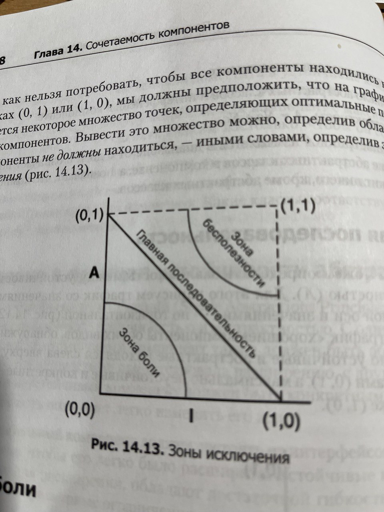

# Awesome Dev Book / Architecture / Чистая архитектура

***
[<<<Back](./INDEX.md)
***

## Сочетаемость компонентов

### Принцип ацикличности зависимостей

> Циклы в графе зависимостей компонентов недопустимы

Проблема: несколько разработчиков работают над одним компонентом и потом нужно "смержить" все, что доставляет боль.

Решение: Разделить проект на компоненты, которые могут выпускаться независимо. Компоненты - единицы работы с единственным ответственным.
Для того, чтобы добиться этого компоненты должны быть независимы и в них не должно быть циклических зависимостей. 

Связи компонентов визуализируются с помощью ациклического графа. По нему сразу можно увидеть, кого затронет то или иное изменение в компоненте.

Циклическая зависимость не значит, что два компонента связаны между собой напрямую циклически. Связь может возникать через несколько шагов.
Т.е. на графе зависимостей мы можем выйти из компонента и через какое-то число шагов вернуться обратно в этот же компонент.

Способы разрыва цикла зависимостей:

1. Применить DIP (Инверсия зависимостей)
2. Создать новый компонент, от которого зависят оба этих компонента

### Принцип устойчивых зависимостей

> Зависимости должны быть направлены в сторону устойчивости.

Некоторые компоненты изначально проектируются как изменчивые. 

Устойчивый компонент - тот, который очень сложно менять. Например, если от этого компонента зависит множество других.

Метрики устойчивости:

- Fan-In - количество входящих зависимостей (от него зависят)
- Fan-Out - количество исходящих зависимостей (он зависит)
- I - неустойчивость: FanOut / (FanIn + FanOut). 0 максимальная устойчивость, 1 максимальная неустойчивость

> Метрика I компонента, должна быть больше метрик I компонентов, от которых он зависит. Должна уменьшаться в направлении зависимостей.

Если все компоненты в системе будут устойчивыми - такую систему будет очень трудно менять.

### Принцип устойчивости абстракций

> Устойчивость компонента прямо пропорциональна его абстрактности

Устойчивый компонент должен быть абстрактным (интерфейсы), неустойчивый - конкретным (реализация).

Принцип устойчивости абстракций + Принцип устойчивости зависимостей = DIP (Инверсия зависимостей)

> Зависимости должны быть направлены в сторону абстрактности

**Мера абстрактности A:**

- Nc: число классов в компоненте
- Na: число абстрактных классов и интерфейсов в компоненте
- A: Na / Nc

0 - полное отсутствие абстракций
1 - ничего кроме абстракций

**Зона боли** - устойчивый и конкретный компонент. Трудно изменить и трудно поддерживать. (схема БД, либо конкретная библиотека вспомогательных функций)

