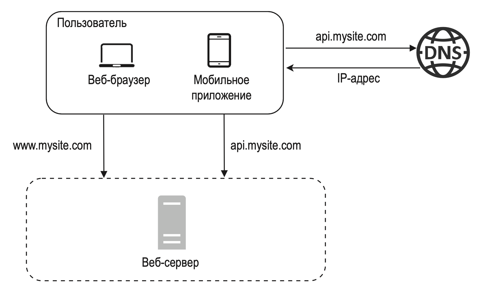
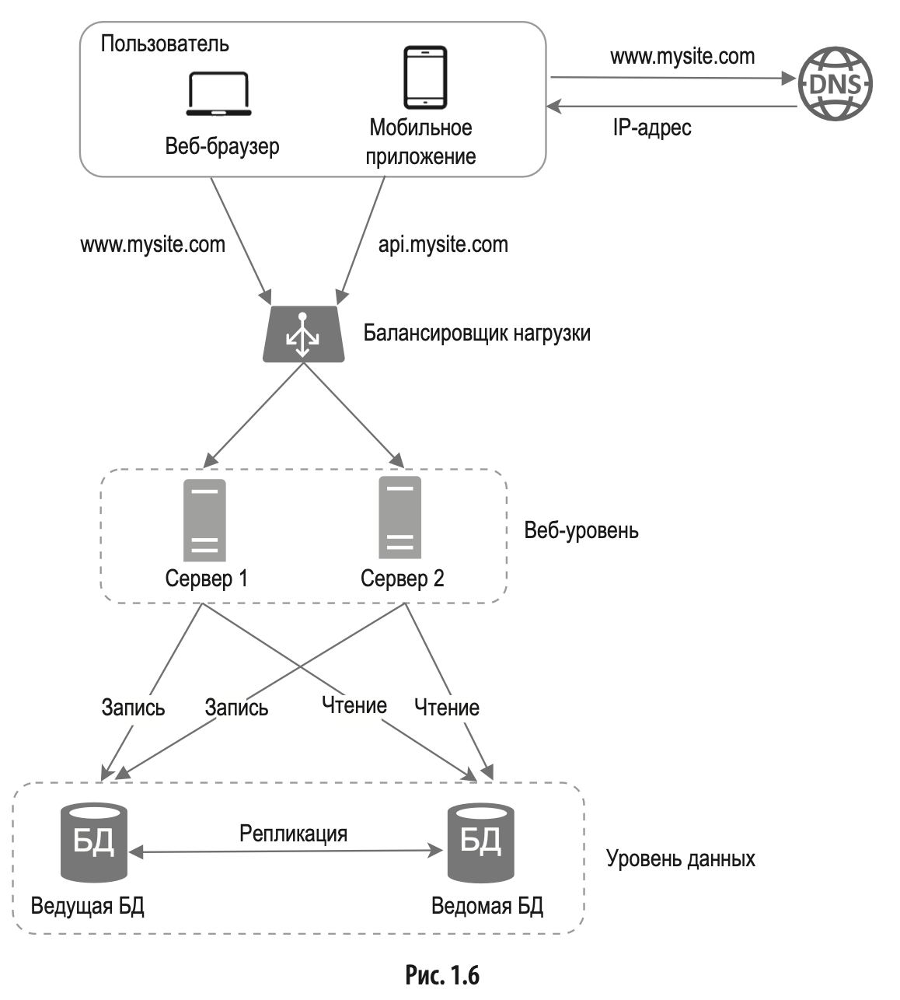
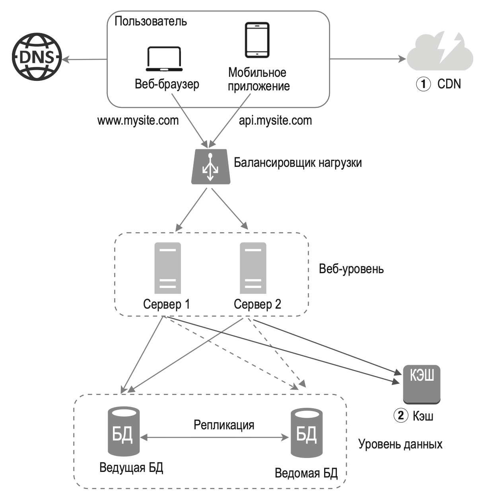
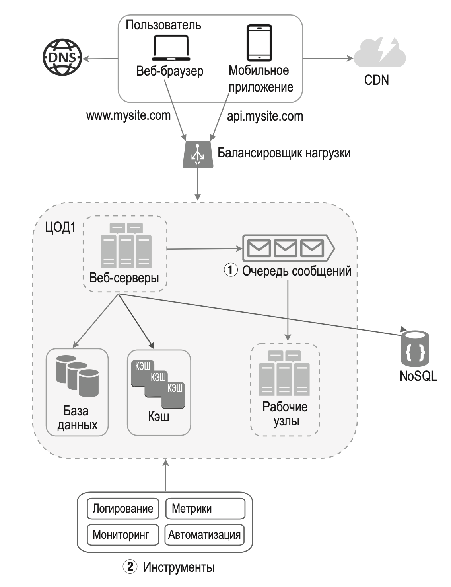

---
tags:
  - SystemDesign/General
aliases:
  - Поток запросов
---
# Поток запросов

1. Юзеры обращаются к сайту по доменному имени. 
2. ИП адрес возвращается браузеру или мобилке
3. Напрямую отправляются HTTP запросы по этому ИП адресу (веб-сервер)
4. Веб-сервер возвращает ответ (HTML, Json и тд)

## Поток с балансировщиком и реплицированной БД 

## Поток с добавленным CDN и Cache

## С шиной данных, метриками и тд

(для одного ДЦ, но можно раздублировать на несколько)

