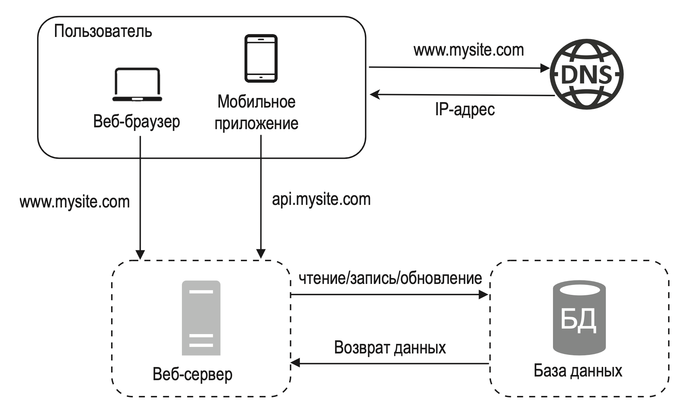

---
tags:
  - SystemDesign/DB
aliases:
  - Базы данных
---
# Базы данных

Если на начальных этапах, при небольшой нагрузке, вся инфра может быть на одном сервере (сам веб-сервер, БД и тд), то с увеличением нагрузки как минимум БД нужно уже выносить на другой сервер. 

Базы данных бывают реляционные и нереляционные. 

Реляционные БД хранят данные в таблицах и строках, связанных отношениями. Примеры: MySQL, Oracle, PostgreSQL и тд

Нереляционные БД (NoSQL) делятся на 4 категории: ket-value storage, графовые, столбцовые и документные. Чаще всего не поддерживают механизм отношений либо поддерживают на низком уровне (в mongo есть). Примеры: CouchDB, Neo4j, Cassandra, HBase, Amazon DynamoDB и т. д.

Какой тип БД использовать - зависит от потребностей. 

