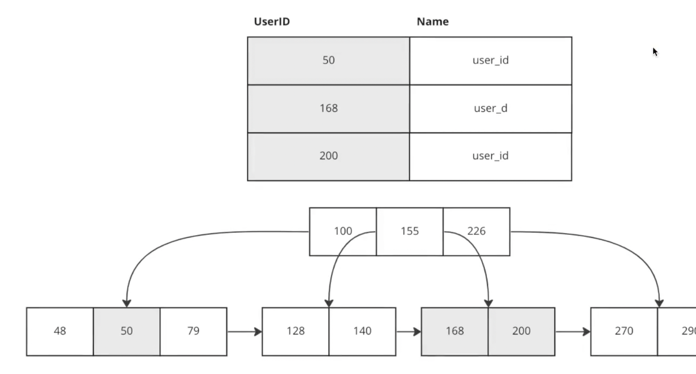
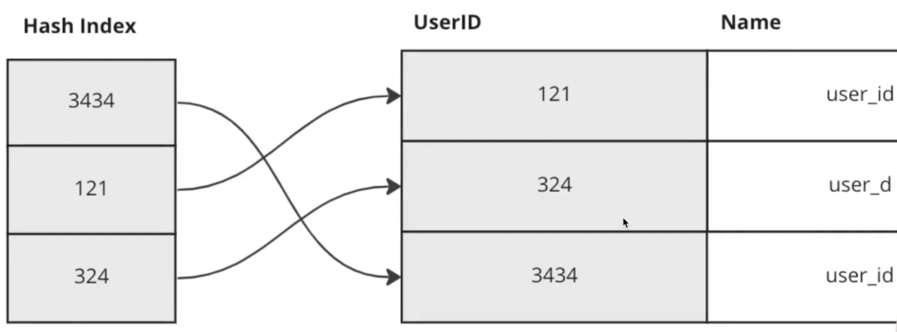
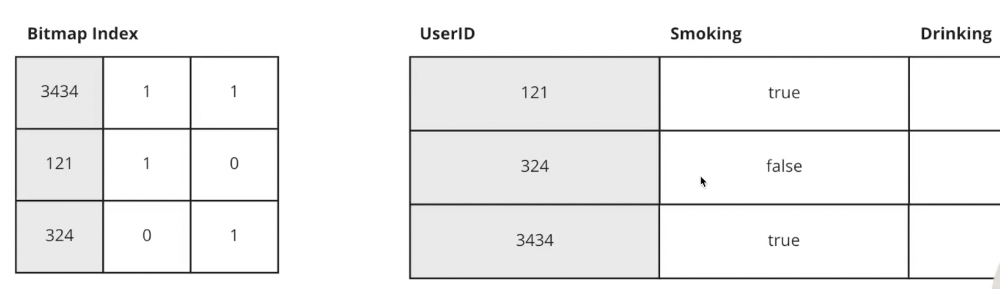
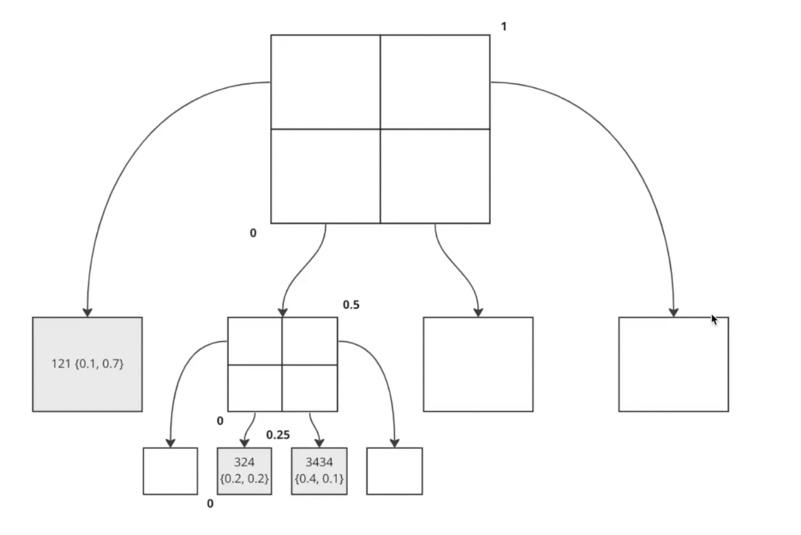
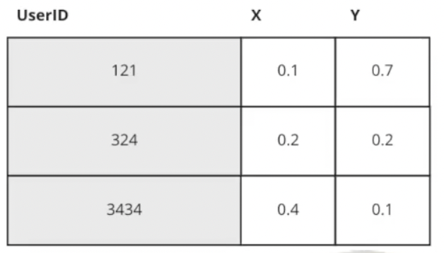
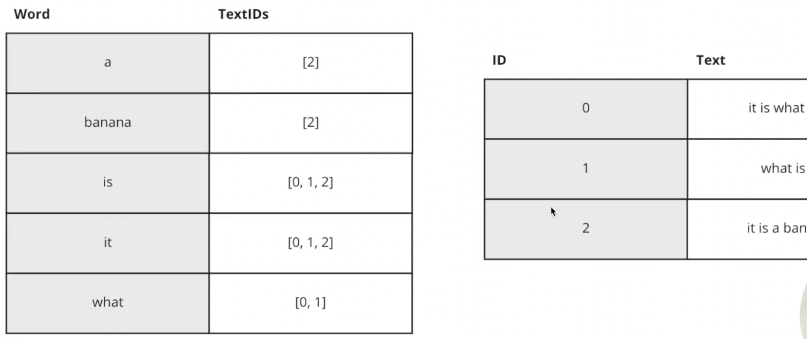

---
tags:
  - SystemDesign/DB
aliases:
  - Базы данных
---
# Базы данных

Если на начальных этапах, при небольшой нагрузке, вся инфра может быть на одном сервере (сам веб-сервер, БД и тд), то с увеличением нагрузки как минимум БД нужно уже выносить на другой сервер. 

Базы данных бывают реляционные и нереляционные. 

Реляционные БД хранят данные в таблицах и строках, связанных отношениями. Примеры: MySQL, Oracle, PostgreSQL и тд

Нереляционные БД (NoSQL) делятся на 4 категории: ket-value storage, графовые, столбцовые и документные. Чаще всего не поддерживают механизм отношений либо поддерживают на низком уровне (в mongo есть). Примеры: CouchDB, Neo4j, Cassandra, HBase, Amazon DynamoDB и т. д.

Какой тип БД использовать - зависит от потребностей. 

## Типы баз данных

### Реляционные БД

> MySQL, PostgreSQL

Таблицы, сложные отношение между данными в разных таблицах, ACID. 

### Документно-ориентированные 

> MongoDB. CouchDB

Нет языка SQL. Поля слабо-типизированные, неопределенное кол-во и состав столбцов. 

### Поисковые движки 

> elasticsearch, sphinx

"Надстройка" на документо-ориентированными БД. 

Заточены под поисковые запросы. Включены сложные специализированные алгоритмы. 

Очень часто используется как дополнительная БД - есть основная БД, где находятся все данные и рядом лежит эластик, куда скидываются "дубли" данных в каком-то виде и уже в эластике делают сложный поиск, фильтры и тд. 

### Графовые БД 

> Neo4j

### Key-value БД

> Memcached, Tarantool , redis

### Для хранения конфигураций 

> Apache ZooKeeper, etcd 

### Колоночные БД 

> Clickstream, Cassandra

Это НЕ про транзакции. Это про много пишу- много читаю. Для аналитической работы. 

### TimeSeries

> InfluxDB

### Blob Storage 

> ceph, amazon s3

Для хранения двоичных файлов, "сырых" файлов (код). Не очень любят модификации. 

## Как выбирать БД

- Транзакции 
- Формат данных
- Навык работы с технологией
- Характер обращения к данным 
- Сообщество и зрелость технологии
- Частота изменяемости форматы данных 

## Классы базы данных 

- OLAP (online analytical processing) - аналитическая информация
- OLTP (online transactional processing) - когда много маленьких транзакций
- HTAP (hybrid analytical / transactional processing) - гибрид
- Persistent DB  - хранит данные (движка) на диске (может использовать частично ОЗУ)
- In-Memory DB - сам движок в ОЗУ (может использоваться частично диски)
- Embedded DB - встроенные БД
- Single File DB

## Индексы

- ускоряют чтение
- замедляют запись
- требуют дополнительной памяти

### B-Tree

Самый популярный индекс в реляционных БД. Это дерево, но не обычный бинарное дерево: в каждом узле много различных значений. Так как диски любят последовательное значение, а эти блоки хранятся в одном блоке. 

Из плюсов: легко искать по интервалу

### Hash index

Из плюсов: очень быстрый поиск одного элемента O(1)
Из минусов: сложный поиск по интервалу значений

### Bitmap index

Довольно редкий кейс

Если много бинарных признаков.

### Spatial index

Индексирование в двумерном пространстве. (координаты). Если я хочу найти пользователя - по его координатам иду в нужный квадрат. 

Применяются часто в играх, геймдеве. 

### Reversed index

> elasticsearch

Строим обратный индекс - те список слов со ссылками на индексы положения в тексте, где они встречаются. 

### Разряженный индекс

Характеризуется тем, что каждый ключ ассоциируется с определенным указателем на блок в *сортированном* файле данных, а не с какой-то определенной записью. 

### Покрывающий индекс

Разрешают один или несколько схожих результатов запроса напрямую, без доступа к базовой таблице и без уточняющих запросов. (в индексе уже есть вся информация). 

### Кластерные и некластерные индексы

При наличии кластерного индекса строки таблицы упорядочены по значению ключа этого индекса. Если в таблице нет кластерного индекса, таблица называется кучей. Некластерный индекс для такой таблицы содержит только указатели на записи в таблице. 

## Транзакции

### ACID

Стандарт того, какие гарантии должна давать база данных, чтобы поддерживать транзакции. 

**Атомарность (A)**

Каждая транзакция БД является единым блоком, который использует подход "все или ничего" к выполнению. Если какой-то оператор в транзакции терпит неудачу - вся транзакция откатывается. 

**Согласованность (С)**

Различные утверждения относительно данных (инварианты) должны всегда быть справедливыми. Обеспечивается при помощи constraints на поля БД. 

**Изоляция транзакций (I)**

Каждая транзакция происходит до или после каждой другой транзакции, и представление базы данных, которое транзакция видит в своем начале, изменяется только самой транзакцией до ее завершения. Ни одна транзакция не дожна видеть промежуточный продукт другой транзакции.

### Уровни изоляции транзакций

**READ_UNCOMMITED** - могут происходить грязные чтения, неповторяющиеся чтения, фантомные чтения и потерянное обновление

**READ_COMMITED** - грязные чтения предотвращены, но могут возникать неповторяющиеся чтения, фантомные чтения и потерянные обновления

**REPEATABLE_READ** - грязные чтения, неповторяющиеся чтения и потерянное обновления предотвращены,  но могут возникать фантомные чтения

**SERIALIZABLE** - транзакции полностью изолированы - исключено влияние одной транзакции на другую в момент выполнения

**Устойчивость (D)** 

Гарантирует, что после фиксации транзакции в БД она постоянно сохраняется с помощью резервных копий и журналов транзакций. В случае сбоя эти механизмы могут использоваться для восстановления зафиксированных транзакций. 

### WAL (журнал) 

Изменения в файлах с данными должны записываться только после того, как эти изменения были занесены в журнал. Записывать страницы данных на диск после подтверждения каждой транзакции нет необходимости, потому что мы знаем, что если случится сбой, то у нас будет возможность восстановить данные с помощью журнала транзакций. 

### BASE

Как правило NoSQL БД предоставляют ограниченные версии атомарности и изоляции. 

**Basically Available** - Базы данных будут обеспечивать доступность данных, распространяя и реплицируя их по узлам кластера базы данных. 

**Soft State** - из-за отсутствия строгой согласованности значения данных будут меняться со временем. Модель BASE разрывается с концепцией БД, которая обеспечивает собственную согласованность (типы полей, ограничения, зависимости), делегируя эту ответственность разработчикам. 

**Eventual Consistency** - в конце концов мы увидим действительные данные, но есть вероятность того, что транзакция прочитает недействительные данные - т.е. временные, или частично обновленные, или устаревшие. Возможно данные станут согласованными при чтении в ленивом режиме. 

## Объекты базы данных 

- Хранимые процедуры
- Тригеры
- Materialized View (по сути кеширование внутри БД)
- Watch API (хз что это. Что-то типа лайв мониторинга за какими-то событиями в БД: вставка, апдей и тд)
- 