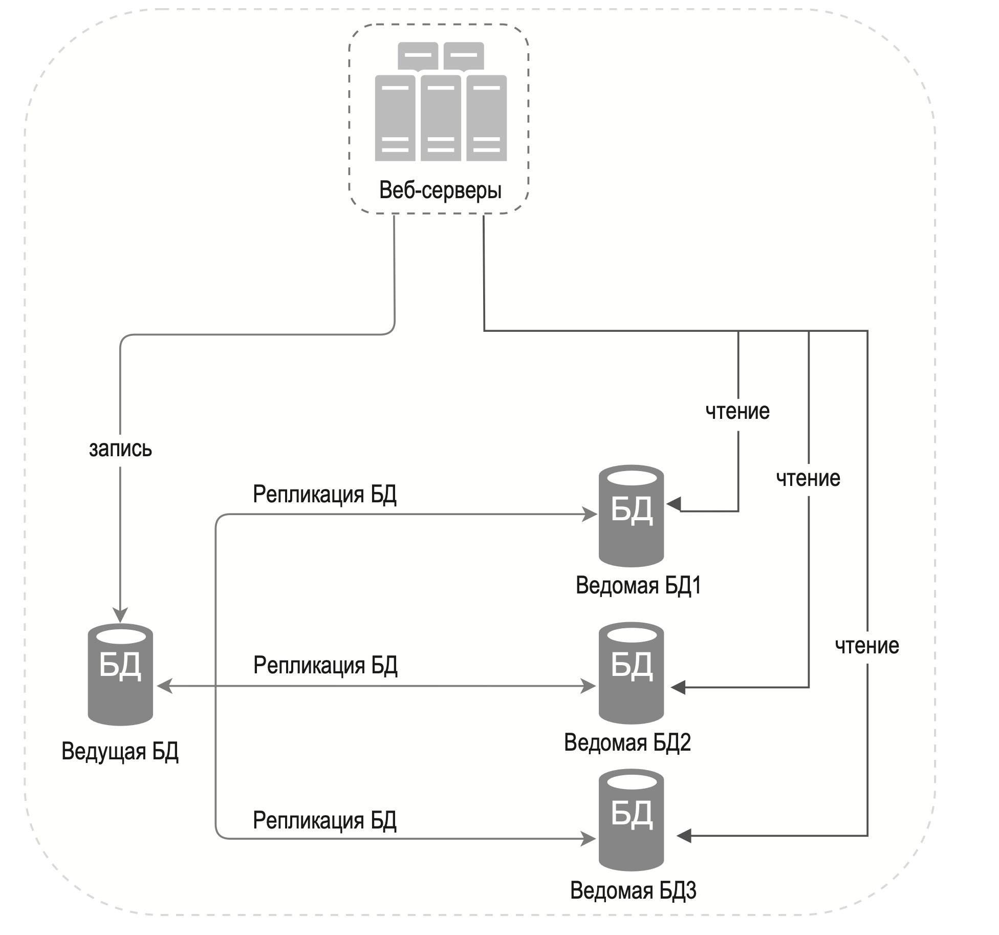

---
tags:
  - SystemDesign/DB/Replication
aliases:
  - Базы данных репликация
---
# Базы данных / Репликация

Для поддержки отказоустойчивости и резервирования. 

Преимущества репликации базы данных:
- Повышенная производительность. В модели «ведущий–ведомый» все операции записи и обновления происходят на ведущих узлах, а операции чтения распределяются между ведомыми
- Надежность. Если один из ваших серверов с базой данных сломается, данные не будут утеряны.
- Высокая доступность.

В случае master-slave конфигурации:
- Если имеется лишь одна slave БД и она выходит из строя, операции чтения будут направлены к ведущей. Если slave несколько, чтения будет отправлено к оставшимся
- Если master выйдет из строя - его заменит одна из slave
