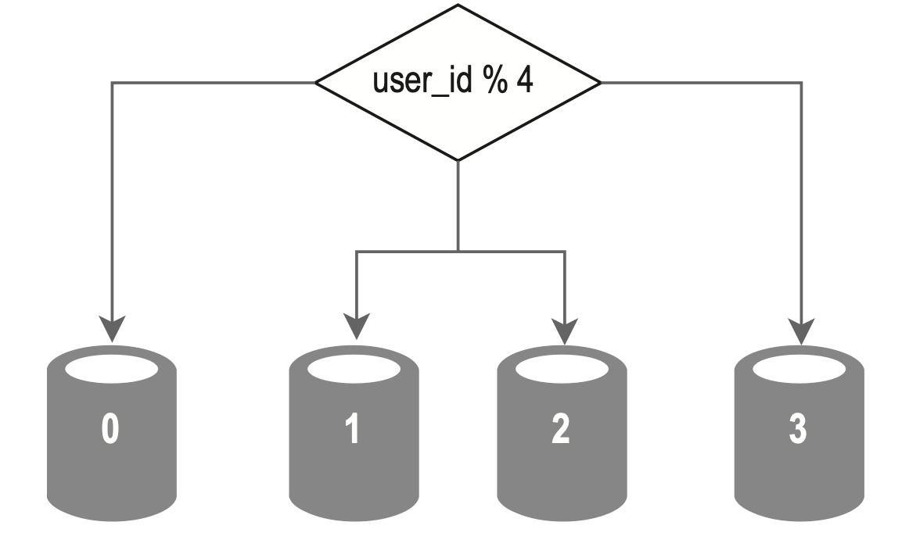

---
tags:
  - SystemDesign/DB/Sharding
aliases:
  - Базы данных шардирование
---
# Базы данных / Шардирование

Шардинг позволяет разделить крупные наборы данных на более мелкие и простые в использовании части, которые называют шардами. Все шарды имеют одну и ту же схему, но каждый из них хранит уникальные данные.

Пример ниже для: Сервер БД для сохранения пользовательской информации выбирается на основе ID пользователя. При каждом обращении к данным используется функция хеширования, которая находит подходящий шард.

При реализации стратегии сегментирования самый важный фактор — это выбор ключа. Ключ шардинга (или ключ раздела) состоит из одного или нескольких столбцов, на основе которых происходит распределение данных.

При выборе ключа шардинга один из важнейших критериев — возможность равномерного распределения данных.

Шардинг отлично подходит для масштабирования баз данных, но это далеко не идеальное решение. Оно усложняет систему и создает дополнительные трудности.

- **Повторное сегментирование данных**. Это может понадобиться, когда 1) отдельный шард полностью заполняется из-за стремительного развития системы или 2) некоторые шарды заполняются быстрее других из-за неравномерного распределения данных.
- **Проблема знаменитостей**. Слишком частое обращение к определенному шарду может вызвать перегрузку сервера.
- **Соединение и денормализация**. После сегментирования базы данных между несколькими серверами становится сложно выполнять операции соединения, охватывающие несколько шардов.

