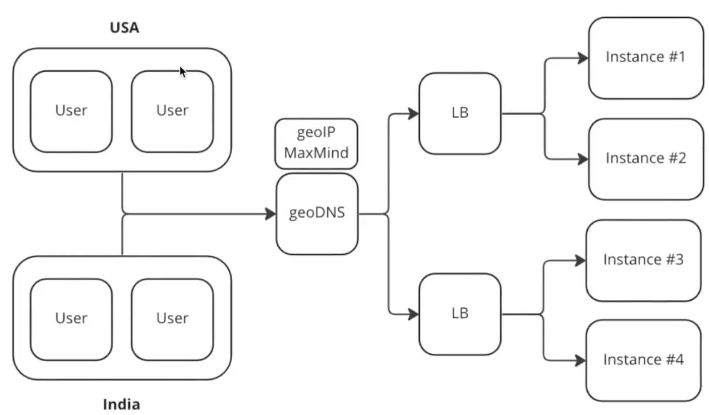

---
tags:
  - SystemDesign/Balancer
aliases:
  - Балансировщик нагрузки
---
# Балансировщик нагрузки

Один из примеров NGinx.

**Балансировщик нагрузки** равномерно распределяет входящий трафик между веб-серверами, которые указаны в его списке.

Внешние пользователи видят только ИП адреса балансировщика. Внутренние ИП доступен только для серверов из той же сети. 

## Клиентская балансировка

Не обязательно ставить nginx - можно просто в клиенте написать функционал, который будет знать обо всех нужных инстансах и по какому-то признаку балансировать нагрузку. 

Из плюсов - мы избегаем дополнительного "Хопа" (лэтенси). Но из минусов нам нужно самим следить за "живыми" инстансами, обновлять клиент соответствующим конфигом и тд. 

## Серверная балансировка

Между клиентом и нашими сервисами (инстансами) ставим отдельный сервис Load Balancer (самописный или какие-то готовые решения типа nginx), который будет балансировать нагрузку. 

## Виды балансировки 

### Random 

### Round Robin

Просто по порядку перебираем инстансы. 

### Weighted RR (взвешенный Round Robin)

В случае, когда у нас один из инстансов более производительный, на него отправляем большее кол-во запросов. 

### Sticky Sessions 

Те когда мы хотим закрепить за конкретным пользователем (клиентом) конкретный инстанс (например там уже есть какой-то кеш, создавать который довольно дорого). 

Довольно простой способ: брать хеш от юзера, брать остаток от деления по кол-ву инстансов и в зависимости от получившегося числа идти на нужный инстанс. 

### Least Connection | Response Time | Bandwidth 

Смотрит по признакам: 

- Где самое меньшее кол-во соединений?
- Где самое меньшее время ответа? 
- Где самая большая пропускная способность? 

### Power of two choices

Случайным образом выбираем два бэкенда из списка - и из этих двух выбираем один по какой-то лучшей метрике (least connection | session etc).

### Пример Nginx (Weighted RR)

### L4 | L7 Балансировка

L4 - работает на сетевом + транспортном уровне (IP + Ports) (Network Load Balancer)

L7 - на прикладном уровне (Application Load Balancer)

L4 оперируем только connections - имеет знание только об IP и портах. 
L7 - более умный. Имеет полную информацию о составе запроса и может принимать решения. 

L4 и L7 могут работать вместе. Например L4 по географии раскидывает IP на разные ДЦ, а L7 уже что-то более сложное решает. 

### DNS / GeoDNS балансировка 

Просто на DNS сервере за каким-то именем прячем N-ое кол-во IP адресов (ДЦ к примеру). В случае с гео - там еще будет установлено гео-расширение, которое позволит привязать IP с учетом гео-локации входящего запроса. 

