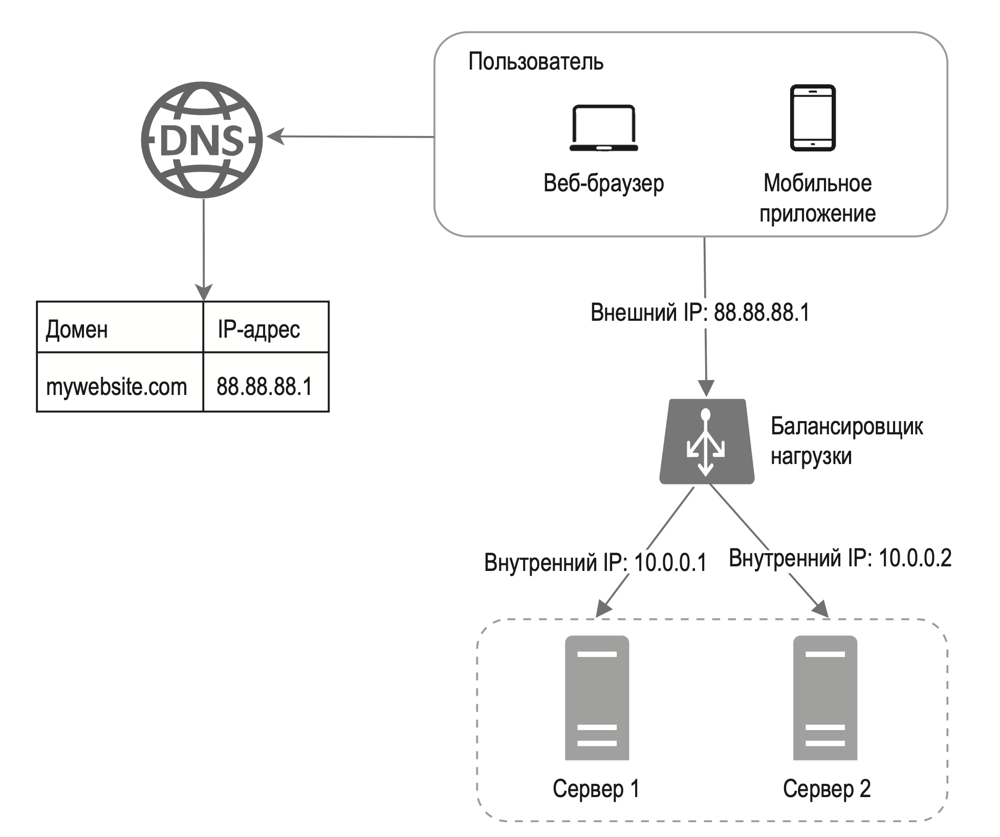

---
tags:
  - SystemDesign/Balancer
aliases:
  - Балансировщик нагрузки
---
# Балансировщик нагрузки

**Балансировщик нагрузки** равномерно распределяет входящий трафик между веб-серверами, которые указаны в его списке.

Внешние пользователи видят только ИП адреса балансировщика. Внутренние ИП доступен только для серверов из той же сети. 

