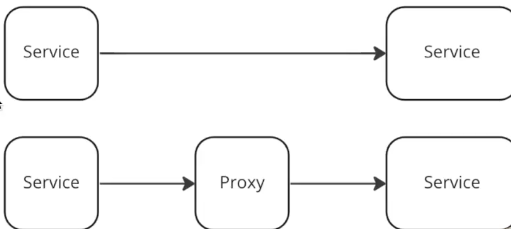
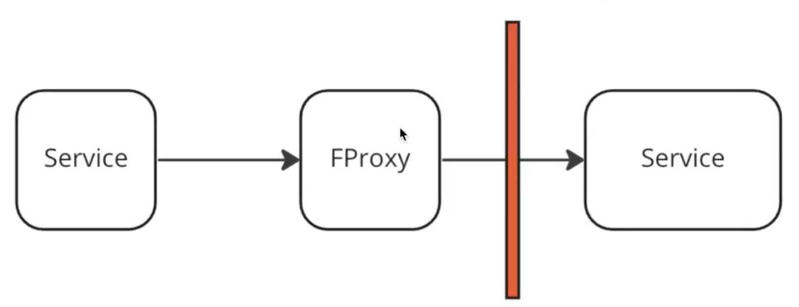
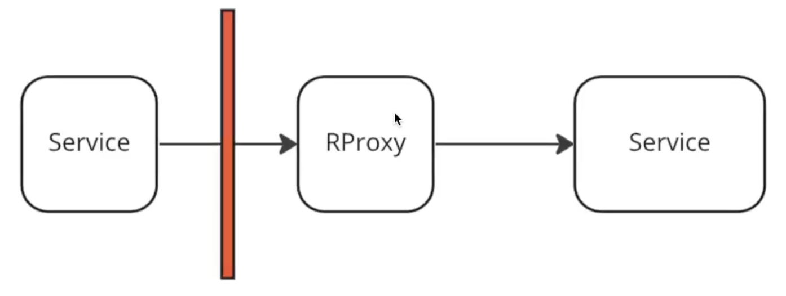

---
tags:
  - SystemDesign/Proxy
aliases:
  - Системный дизайн - Проксирование
---
# Проксирование

- взлом - защита
- кеширование данных
- ограничение трафика
- обход ограничений доступа
- анонимность пользователя
- сжатие и модификация данных

## Forward Proxy

Когда приложение знает, что я пойду через proxy. 

Например мы включаем ВПН сервис, чтобы достучаться до какого-то ресурса. Мы точно знаем что и как мы делаем. 

## Reverse Proxy 

Когда пользователь (клиентское приложение) не знает, что перед фактическим приложением есть прокси. 

> В принципе балансировщик и прокси взаимозаменяемы. Как в балансере может быть встроена логика проксирования, так и в прокси-сервере может быть встроена логика балансировщика

