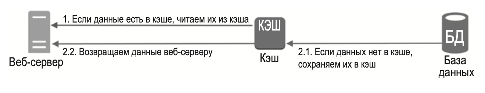

---
tags:
  - SystemDesign/Cache
aliases:
  - Кеширование
---
# Кеширование

При каждой загрузке новой веб-страницы выполняется один или несколько запросов к БД для извлечения данных. Многократное обращение к базе данных существенно влияет на производительность. Кэш может смягчить эту проблему.

## Уровень кеша

Уровень кэша — это слой временного хранилища данных, который по своей скорости работы намного опережает БД.

## Некоторые аспекты использования кэша

- Определитесь с тем, когда будет использоваться кэш.
- Выбор срока действия. Рекомендуется реализовать механизм, ограничивающий срок действия кэша.
- Согласованность. Это подразумевает синхронизацию данных в хранилище и кэше.
- Предотвращение сбоев. Наличие лишь одного сервера кэширования может оказаться потенциальной единой точкой отказа (single point of failure, SPOF)
- Политика вытеснения. Когда кэш полностью заполнен, любой запрос на добавление новых элементов может привести к удалению существующих. Существует несколько стратегий вытеснения
	- least-recently-used, LRU - Давно неиспользуемых
	- least-frequently-used, LFU - редко используемых
	- FIFO, first-in-first-out
