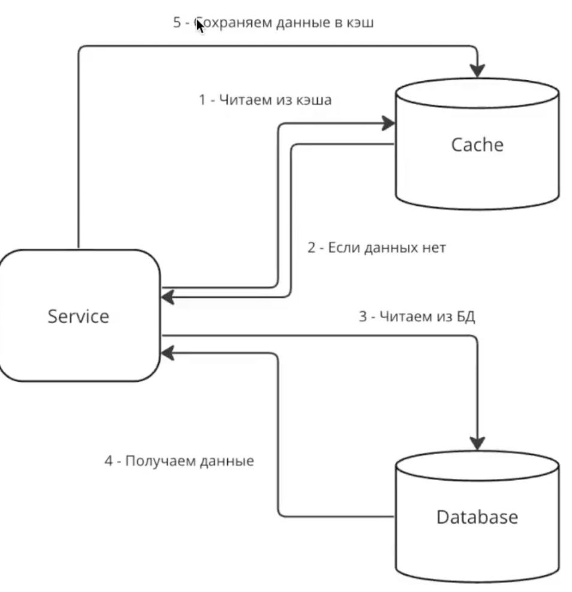
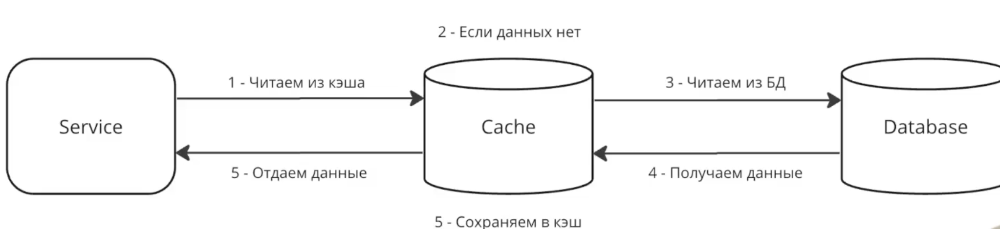
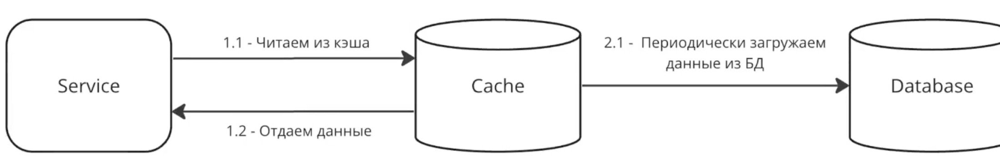
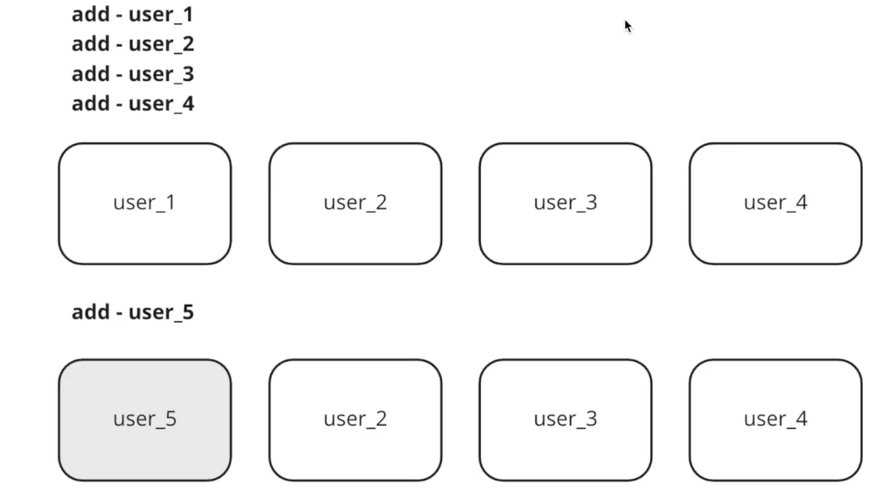
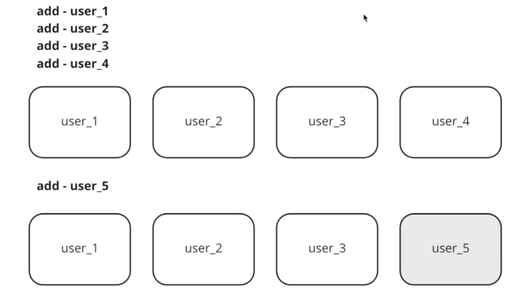
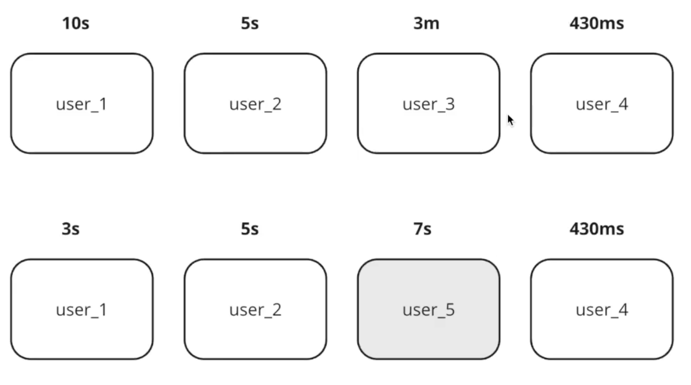
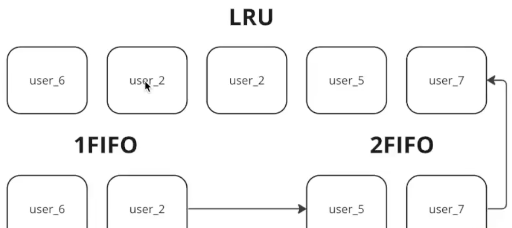
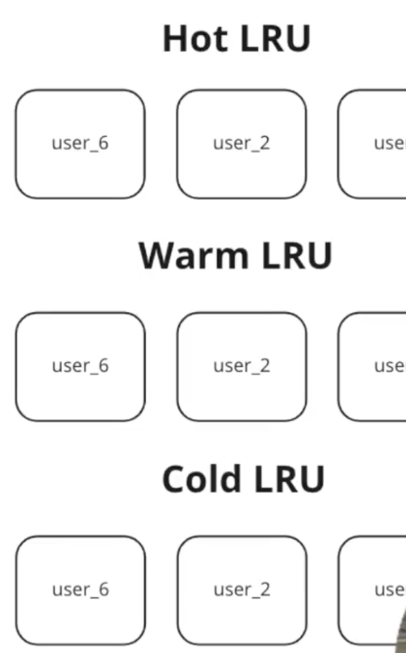

---
tags:
  - SystemDesign/Cache
aliases:
  - Кеширование
---
# Кеширование

- Сокращение response-time
- Снижение нагрузи на сторонние сервисы 
- Пере-использование ранее полученных данных или вычислений
- Стабилизация работы при кратковременных отказах 

При каждой загрузке новой веб-страницы выполняется один или несколько запросов к БД для извлечения данных. Многократное обращение к базе данных существенно влияет на производительность. Кэш может смягчить эту проблему.

## Уровень кеша

Уровень кэша — это слой временного хранилища данных, который по своей скорости работы намного опережает БД.

## Некоторые аспекты использования кэша

- Определитесь с тем, когда будет использоваться кэш.
- Выбор срока действия. Рекомендуется реализовать механизм, ограничивающий срок действия кэша.
- Согласованность. Это подразумевает синхронизацию данных в хранилище и кэше.
- Предотвращение сбоев. Наличие лишь одного сервера кэширования может оказаться потенциальной единой точкой отказа (single point of failure, SPOF)
- Политика вытеснения. Когда кэш полностью заполнен, любой запрос на добавление новых элементов может привести к удалению существующих. Существует несколько стратегий вытеснения
	- least-recently-used, LRU - Давно неиспользуемых
	- least-frequently-used, LFU - редко используемых
	- FIFO, first-in-first-out

## Основные термины

- Cache miss - не попал 
- Cache hit - попал 
- Hit Ratio - эффективность кеширования % 
- Горячий ключ - на какой ключ большая часть запросов
- Прогрев кеша - процент наполнения кеша 
- Инвалидация - удаления неактуальных данных из кеша

> Важно не забывать, что кешировать можно не только данных но и "ошибки" - отсутствие данных

> Нужно уметь держать нагрузку БЕЗ кеша. Задача кеша - ускорение ответа, а не выдерживание нагрузки

## Формула эффективности кеша

$$AverageTime = DBAccessTime * CacheMissRate + CacheAccessTime$$
Пусть: 
- DBAccessTime = 100ms
- CacheAccessTime = 20ms

При CacheMissRate > 0.8 - кеш вреден! Очень много промахов, и мы в дополнение к походу к БД добавляем бесполезные походы в кеш. (AverageTime при CacheMissRate = 0.8 равен 100мс - время похода в БД)

## Виды кеширования 

### Внутреннее кеширование

Когда кеш находится внутри сервиса. 

* + скорость
* + отсутствие сетевых запросов
* + нет расходов на marshall/unmarshal 
* - горизонтальное масштабирование (как обеспечить консистентность между инстансами)
* - прогрев кеша после падения / редеплоя

### Внешнее кеширование

Отдельный сервис (Redis и тд)

- + хранение большого объема данных
- + масштабирование
- + после падения сервиса (нижележащего) данные не теряются
- + простой прогрев и логика инвалидации
- - скорость

## Способы взаимодействия

### Cache Aside 
Приложение само координирует запросы в кеш и БД и решает куда и когда обращаться. 

### Cache Through (сквозное кеширование)

Все запросы от приложения проходят через Cache

Особенности: довольно сложно реализовать и поддерживать. Если кеш отказал - у нас все легло: сервис ничего не знает про БД. 

### Cache Ahead (Опережающее кеширование)

Запросы на чтение всегда идут только в кеш, никогда в БД напрямую. 

## Алгоритмы вытеснения данных

### Random 

### FIFO

### LIFO

### LRU (Least Recently Used)

Вытесняется тот, к кому дольше всего не было обращений.

### MRU (Most Recently Used)

Вытесняется тот, к которому было последнее обращение

### LFU (Least Frequently Used)

Меньше всего (количественно) обращений

### OPT Алгоритм Белади (теоретический)

Мы каким-то образом знаем какие данные и через какое время будут использованы и тот которые через больше всего времени будет использован - его вытесняем

### Second Chance

Очередь FIFO, только с битом использования. Для вытеснения делаем проход по очереди, если бит использования равен 0 - вытесняем, если равен 1 - меняем на 0 и идем дальше. Если не нашли ни одного равного 0, делаем проход заново (будет вытеснен тот, которому первому поменяли на 0).

> Вариация Clock - используем зацикленную очередь

### 2Q

Элементы запрошенные из FIFO1 никуда не двигаются. Вытесненные из FIFO1 перемещаются в FIFO2.

Элементы запрошенные из FIFO2 - перемещаются в LRU. Вытесненные из FIFO2 - удаляются. 

Изначально данные добавляются в FIFO1. 

### SLRU (разные уровни кешей)

Сперва кладем в первый уровень, при повторном запросе перекладываем во вторую, еще при одно - в третий. 

Добавляются в "холодную" очередь. Из нее вытесняются наружу. При обращении переходят на следующий уровень. Там вытесненение тоже "наружу". Ну и при обращении в "теплую" - перемещается в горячую. 

### TLRU (Time Aware LRU)

В дополнение к обычному алгоритму, еще есть вытеснение (удаление) по времени жизни (TTL)

