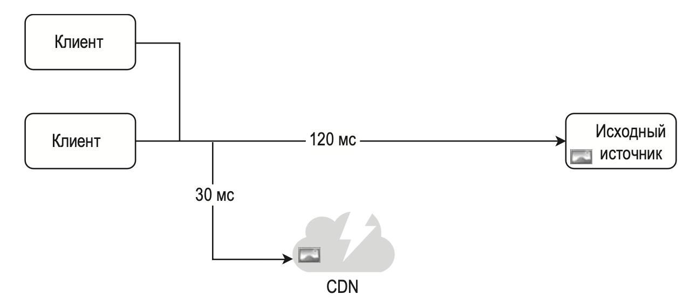

---
tags:
  - SystemDesign/CDN
aliases:
  - CDN
---
# СЕТЬ ДОСТАВКИ СОДЕРЖИМОГО (CDN)

CDN — это сеть географически распределенных серверов, которая используется для доставки статического содержимого. Серверы CDN кэшируют такие статические файлы, как изображения, видео, CSS, JavaScript и т. д.

## Принцип работы CDN

- Пользователь A пытается получить image.png с помощью URL-адреса изображения. Домен этого URL-адреса предоставляется провайдером CDN.
- Если в кэше сервера CDN нет image.png, он запрашивает этот файл из оригинального источника
- Источник возвращает серверу CDN файл image.png вместе с дополнительным HTTP-заголовком TTL (Time-to-Live — «время жизни»)
- CDN кэширует изображение и возвращает его пользователю A. Оно остается в кэше CDN, пока не истечет срок TTL.
- Пользователь Б отправляет запрос на получение того же файла.
- Если срок TTL еще не истек, изображение возвращается из кэша.

## Нюансы использования CDN

- Стоимость. Серверы CDN предоставляются сторонними компаниями, а перемещение данных в CDN и из CDN стоит денег.
- Подбор подходящего срока годности кэша.
- Возможность сбоев. Вы должны подумать о том, как ваши веб-сайты/приложения будут справляться с недоступностью CDN.
- Аннулирование файлов.
