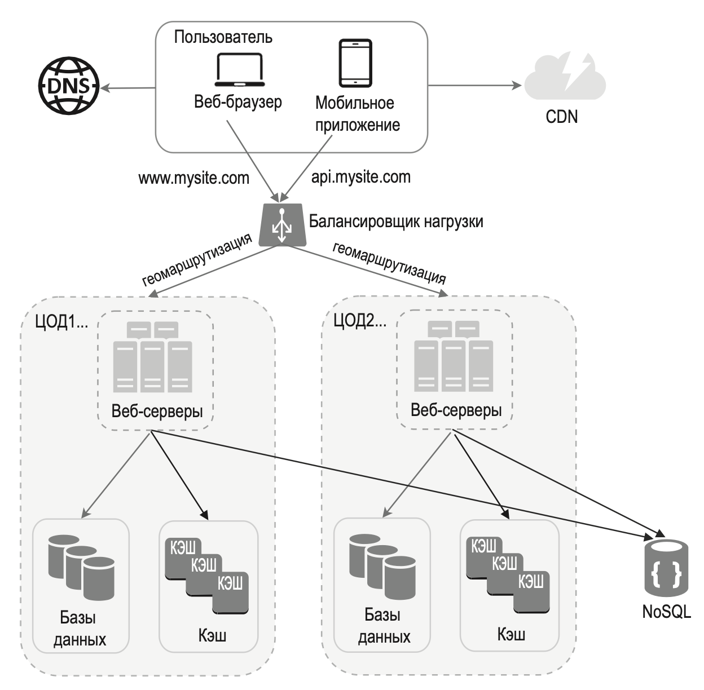

---
tags:
  - SystemDesign/Datacenters
aliases:
  - ЦОДы Datacenters
---
# ЦОДы Datacenters

В нормальных условиях пользователи, скажем, из России с помощью geoDNS направляются к ближайшему центру обработки данных с разделением трафика между регионами Центр - Восток в пропорции x % к (100 – x) %. Это называется географической маршрутизацией. geoDNS — это сервис, который сопоставляет доменные имена с IP-адресами в зависимости от местонахождения пользователя.

В случае любого серьезного нарушения работы одного из центров обработки данных мы перенаправляем весь трафик к исправному ЦОД.

Решаемые вопросы: 
- Перенаправление трафика. Необходимы эффективные инструменты для направления трафика к подходящему ЦОД.
- Синхронизация данных. Пользователи могут работать с разными локальными базами данных и кэшами в зависимости от региона.
- Тесты и развертывание. В конфигурации с несколькими ЦОД тестирование веб-сайта/приложения необходимо проводить в разных местах.

