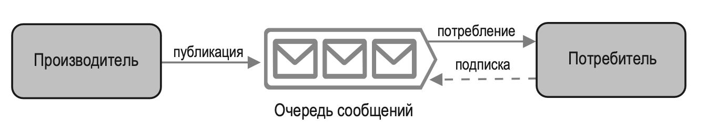
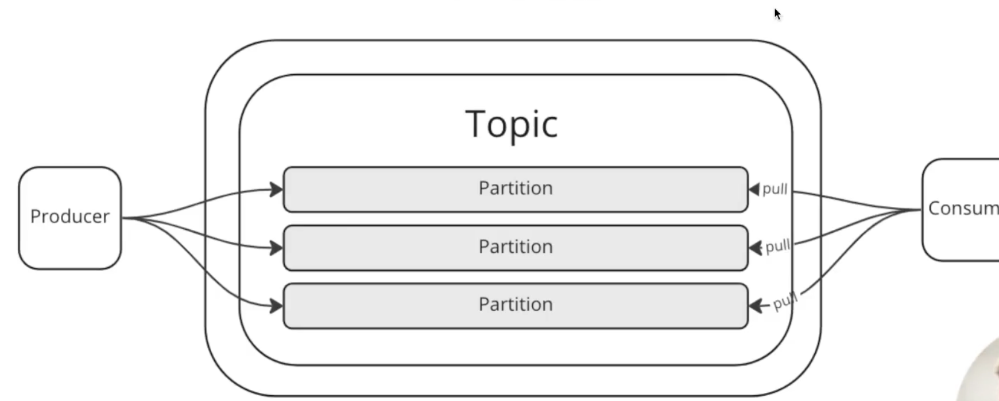

---
tags:
  - SystemDesign/Databus
aliases:
  - Очередь сообщений
---
# Очередь сообщений (Брокеры сообщений)

Очередь сообщений — это устойчивый компонент, который загружается в память и поддерживает асинхронное взаимодействие. Он служит буфером и распределяет асинхронные запросы. Очередь сообщений имеет простую базовую архитектуру. Сервисы ввода, так называемые производители/издатели, создают сообщения и публикуют их в очереди. Другие сервисы или серверы, которые называют потребителями/подписчиками, подключаются к очереди и выполняют действия, определенные в сообщениях.

## Особенности

- Буферизация (батч-обработка)
- Асинхронная связь
- Слабое связывание
- Масштабируемость
- Отказоустойчивость
- Понимание потоков данных

## Push/Pull модель

**Push** - когда я сам отправляю куда-то данные

**Pull** - когда я открываю порт и кто-то, периодически приходит ко мне за данными и забирает их

## Kafka

- Producer - писатель
- Consumer - читатель
- Broker - один узел Kafka 
- Topic - логическая очередь
- Partition - физическая часть очереди

В каждой партиции, для каждого консьюмера хранится offset - сколько данных консьюмер уже прочитал. После прочтения данные из Кафки не удаляются. Удаление данных происходит в зависимости от конфигурации. 

## Rabbit MQ

В отличии от Кафки - в кролике реализована push-модель. И после подтверждения получения сообщения консьюмером оно удаляется из очереди. 

## Data Retention 

Хранение данных определяет политики управления постоянными данными и записями для соблюдения юридических и бизнес-требований к архивированию данных. (Кафка это поддерживает). 

## Гарантии доставки 

- At least Once
- At most Once
- Exactly Once

