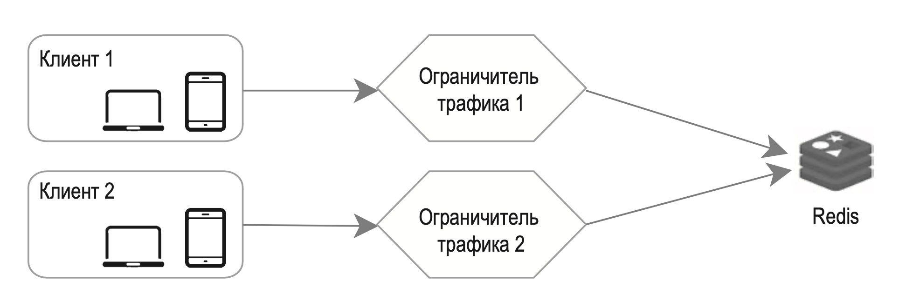
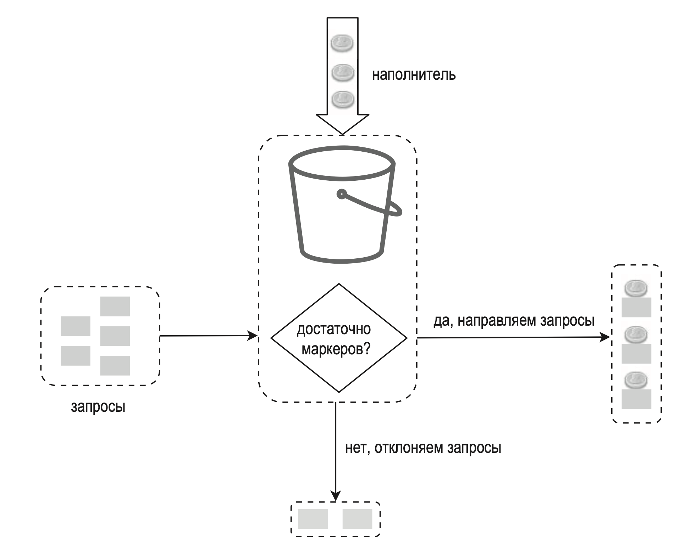

---
tags:
  - SystemDesign/RateLimit
aliases:
  - Системный дизайн - Ограничение запросов
---
# Ограничение трафик (Rate Limit)

В случае размещения на сервере:

Помимо клиентской и серверной реализаций существует и третий путь. Вместо того чтобы размещать ограничитель трафика на серверах, его можно оформить в виде промежуточного слоя, который фильтрует запросы к вашему API:

Жесткое и гибкое ограничение трафика:
- жесткое: количество запросов не может превысить лимит;
- гибкое: запросы могут ненадолго превысить лимит.

## Общая архитектура

Нам нужен счетчик, чтобы знать, сколько запросов отправлено одним пользователем, с одного IP-адреса и т. д. Если счетчик превышает лимит, запрос отклоняется.

Где следует хранить счетчики? Базу данных лучше не использовать ввиду медленного доступа к диску. Мы выбрали резидентный кэш, так как он быстрый и поддерживает стратегию удаления записей в зависимости от времени их создания. Одним из популярных решений для ограничения трафика является Redis. Это резидентное хранилище предлагает две команды: INCR и EXPIRE.

- INCR увеличивает хранимый счетчик на 1.
- EXPIRE устанавливает срок хранения счетчика, по истечении которого тот автоматически удаляется.

- Клиент шлет запрос промежуточному ограничителю трафика. 
- Промежуточный ограничитель трафика извлекает счетчик из соответствующего бакета Redis и проверяет, достигнут ли лимит.
	- Если лимит достигнут, запрос отклоняется. 
	- Если лимит не достигнут, запрос направляется серверам API. Тем временем система инкрементирует счетчик и сохраняет его обратно в Redis.

## Правила ограничения трафика 

Правила обычно записываются в конфигурационные файлы и сохраняются на диске.

## Превышение ограничений трафика

Когда запрос отклоняется, API возвращает клиенту HTTP-ответ с кодом 429 («слишком много запросов»). В зависимости от ситуации отклоненные запросы могут быть записаны в очередь, чтобы позже их можно было обработать.

### Заголовки ограничителя трафика

Ограничитель трафика возвращает клиентам следующие HTTP-заголовки:

- **X-Ratelimit-Remaining**. Количество допустимых запросов, которое остается в текущем интервале.
- **X-Ratelimit-Limit**. Количество вызовов, доступных клиенту в каждом временном интервале.
- **X-Ratelimit-Retry-After**. Количество секунд, которое должно пройти, прежде чем ваши запросы престанут отклоняться.

Если пользователь отправит слишком много запросов, клиенту будет возвращен код ошибки 429 и заголовок *X-Ratelimit-Retry-After*.

## Подробная архитектура

- Правила хранятся на диске. Рабочие узлы регулярно считывают их с диска и сохраняют в кэш.
- Когда клиент обращается к серверу, его запрос сначала проходит через промежуточный ограничитель трафика.
- Промежуточный ограничитель трафика загружает правила из кэша. Он извлекает из кэша Redis счетчики и временную метку последнего запроса. Ограничитель трафика принимает решение в зависимости от полученной информации:
	- если запрос не отклоняется, он направляется к серверам API; 
	- если запрос отклоняется, ограничитель трафика возвращает клиенту код ошибки 429. Тем временем запрос либо сбрасывается, либо направляется в очередь.

## Ограничитель трафика в распределенном окружении

Существует две проблемы:

- состояние гонки;
- сложность синхронизации.

### Состояние гонки

Очевидным решением для устранения состояния гонки являются блокировки. Но они существенно замедлят вашу систему. В таких случаях часто используют две стратегии: скрипт Lua или структуру данных «упорядоченные множества», доступную в Redis. 

### Сложность синхронизации

Для обработки запросов, которые генерируют миллионы пользователей, одного сервера с ограничителем трафика может не хватить. При использовании нескольких таких серверов требуется синхронизация.

Мы можем воспользоваться липкими сессиями. Это позволит клиенту отправлять запросы одному и тому же ограничителю трафика. Но этому решению не хватает ни масштабируемости, ни гибкости, поэтому использовать его не рекомендуется. Более разумный подход состоит в применении централизованных хранилищ данных, таких как Redis.

> Но остается вопрос - насколько сложная и нагруженная логика на самом лимитере, что он требует отдельных серверов, ведь редис то все равно один

## Оптимизация производительности

Ограничитель трафика обязательно должен быть распределен по разным центрам обработки данных, ведь чем дальше пользователь находится от ЦОД, тем выше латентность.

Данные должны синхронизироваться в соответствии с моделью отложенной согласованности.

## Мониторинг

После реализации ограничителя трафика необходимо собрать аналитические данные, чтобы проверить, насколько он эффективен. Нас в основном интересует эффективность:

- алгоритма ограничения трафика;
- правил ограничения трафика.

## Алгоритмы ограничения трафика

### Алгоритм маркерной корзины (token bucket)

[Пример реализации на GO](https://github.com/Isotere/awesome-dev-book/tree/master/code/go_lang/use_cases/rate_limiter2)

Алгоритм маркерной корзины работает следующим образом:

- Маркерная корзина — это контейнер с заранее определенной емкостью. В нее регулярно помещают маркеры. Когда она окончательно заполняется, маркеры больше не добавляются. Наполнитель ежесекундно помещает в корзину N маркеров. Когда корзина заполняется, последующие маркеры отбрасываются.

- Каждый запрос потребляет один маркер. При поступлении запроса мы проверяем, достаточно ли маркеров в корзине. 
	- если маркеров достаточно, мы удаляем по одному из них для каждого запроса, и запрос проходит дальше; 
	- если маркеров недостаточно, запрос отклоняется.

Алгоритм маркерной корзины принимает два параметра:

- размер корзины: максимальное количество маркеров, которое может в ней находиться;
- частота пополнения: количество маркеров, ежесекундно добавляемых в корзину.

> Каждому пользователю, получается, нужно выделить свою корзину. Если типов ограничений несколько - то каждому пользователю нужно столько же кол-во корзин

Преимущества:

- легкая реализация;
- эффективное потребление памяти;
- маркерная корзина может справиться с короткими всплесками трафика; пока в корзине остаются маркеры, запрос обрабатывается.

Недостатки:

- несмотря на то что алгоритм принимает лишь два параметра (размер корзины и частота пополнения), подобрать подходящие значения может быть непросто.

### Алгоритм дырявого ведра (leaking bucket)

Алгоритмы дырявого ведра и маркерной корзины очень похожи, только первый обрабатывает запросы с фиксированной скоростью. Обычно его реализуют с использованием очереди типа FIFO. Этот алгоритм работает так:

- при поступлении запроса система проверяет, заполнена ли очередь. Запрос добавляется в очередь при наличии места;
- в противном случае запрос отклоняется;
- запросы извлекаются из очереди и обрабатываются через равные промежутки времени.

Алгоритм дырявого ведра принимает два параметра:

- размер ведра: равен размеру очереди; очередь хранит запросы, которые обрабатываются с постоянной скоростью;
- скорость утечки: определяет, сколько запросов можно обработать за определенный промежуток времени (обычно за 1 секунду).

Преимущества:

- эффективное потребление памяти при ограниченном размере очереди;
- запросы обрабатываются с постоянной скоростью, поэтому этот алгоритм подходит для задач, которые требуют стабильной скорости обработки.

Недостатки:

- всплеск трафика наполняет очередь старыми запросами, и, если их вовремя не обработать, новые запросы будут отклоняться;
- несмотря на то что алгоритм принимает лишь два параметра, подобрать подходящие значения может быть непросто.

### Счетчик фиксированных интервалов (fixed window counter)

Счетчик фиксированных интервалов работает так:

- Алгоритм делит заданный период времени на одинаковые интервалы и назначает каждому из них счетчик.
- Каждый запрос инкрементирует счетчик на 1.
- Как только счетчик достигнет заранее заданного лимита, новые запросы начинают отклоняться, пока не начнется следующий интервал.

Основная проблема этого алгоритма в том, что всплески трафика на границе временных интервалов могут привести к тому, что система может превысить квоту и принять больше запросов.

Преимущества:

- эффективное потребление памяти;
- понятность;
- сброс квоты доступных запросов в конце временного интервала подходит для ряда задач.

Недостатки:

- всплески трафика на границе временных интервалов могут привести к приему запросов, количество которых превышает квоту.

### Журнал скользящих интервалов (sliding window log)

Как уже упоминалось ранее, у счетчика фиксированных интервалов есть серьезная проблема: на границах интервала может быть принято больше запросов. С этим помогает справиться журнал скользящих интервалов. Вот как он работает.

- Алгоритм следит за временными метками запросов. Временные метки обычно хранятся в кэше, например, в упорядоченных множествах Redis.
- Когда поступает новый запрос, все просроченные запросы отбрасываются. Просроченными считают запросы раньше начала текущего временного интервала.
- Временные метки новых запросов заносятся в журнал.
- Если количество записей в журнале не превышает допустимое, запрос принимается, а если нет — отклоняется.

Преимущества:

- ограничение трафика, реализованное с помощью этого алгоритма, получается очень точным; на любом скользящем интервале запросы не превышают заданный лимит.

Недостатки:

- этот алгоритм потребляет много памяти, потому что даже в случае отклонения запроса соответствующая временная метка записывается в журнал.

### Счетчик скользящих интервалов (sliding window counter)

Счетчик скользящих интервалов — это гибридный подход, сочетающий в себе два предыдущих алгоритма. Его можно реализовать двумя разными способами. Одну из реализаций мы рассмотрим далее, а ссылка на описание другой будет дана в конце этого раздела.

Предположим, ограничитель трафика допускает не больше 7 запросов в минуту. У нас 5 запросов за предыдущий интервал и 3 в текущем. На отметке в 30 % от текущего интервала количество запросов на скользящем интервале вычисляется по следующей формуле:

- запросы на текущем интервале + запросы на предыдущем интервале * процент предыдущего интервала, который занимает скользящий интервал;
- используя эту формулу, мы получаем 3 + 5 * 0,7% = 6,5 запроса. В зависимости от ситуации это число можно округлить к большему или меньшему значению. В нашем примере оно округляется до 6.

Преимущества:

- сглаживание всплесков трафика: текущая частота запросов зависит от той, которая использовалась на предыдущем интервале;
- экономия памяти.

Недостатки:

- работает только для нежестких ретроспективных интервалов; частота получается приблизительной, так как подразумевается, что запросы на предыдущем интервале распределены равномерно. Но это может быть не настолько серьезной проблемой, как кажется на первый взгляд: согласно экспериментам, проведенным компанией Cloudflare, из 400 миллионов запросов только 0,003 % были ошибочно отклонены или приняты сверх квоты.

## Дополнительная информация

- Rate-limiting strategies and techniques: https://cloud.google.com/solutions/rate-limiting-strategies-techniques
- Throttle API requests for better throughput: https://docs.aws.amazon.com/apigateway/latest/developerguide/api-gateway-request-throttling.html
- Stripe rate limiters: https://stripe.com/blog/rate-limiters
- Better Rate Limiting With Redis Sorted Sets: https://engineering.classdojo.com/blog/2015/02/06/rolling-rate-limiter/
- System Design — Rate limiter and Data modelling: https://medium.com/@saisandeepmopuri/system-design-rate-limiter-and-data-modelling-9304b0d18250
- Scaling your API with rate limiters: https://gist.github.com/ptarjan/e38f45f2dfe601419ca3af937fff574d#request-rate-limiter
- Rate Limit Requests with Iptables: https://blog.programster.org/rate-limit-requests-with-iptables