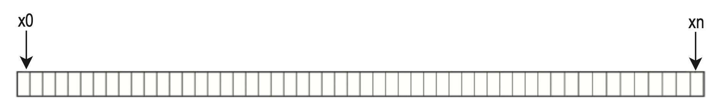
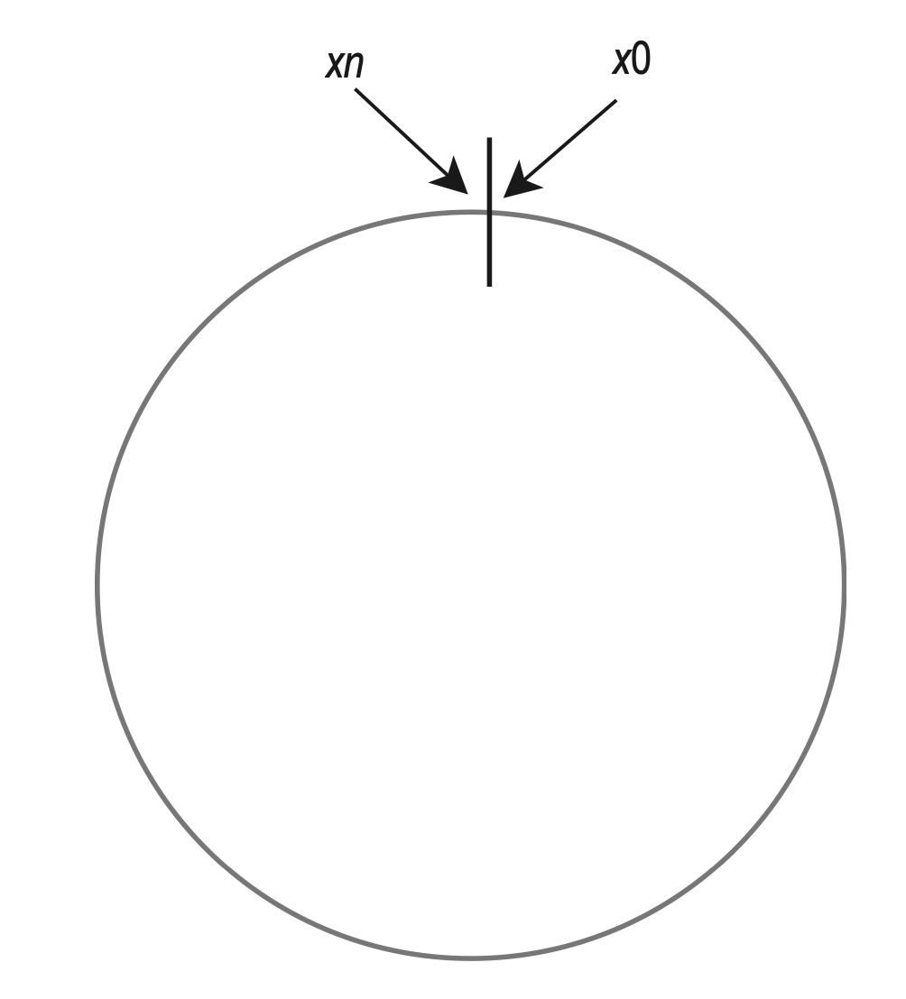
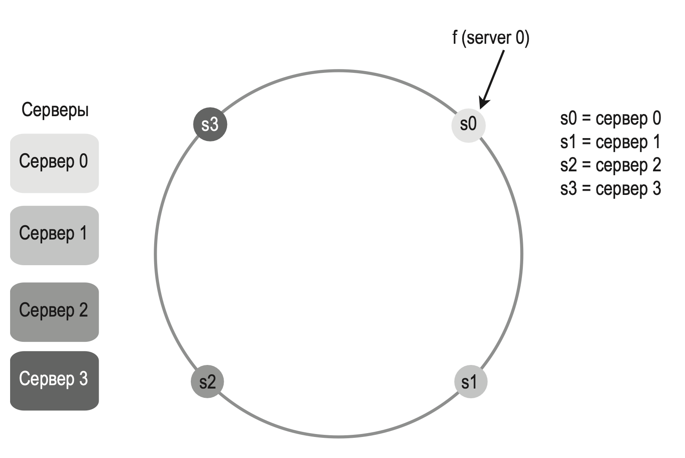
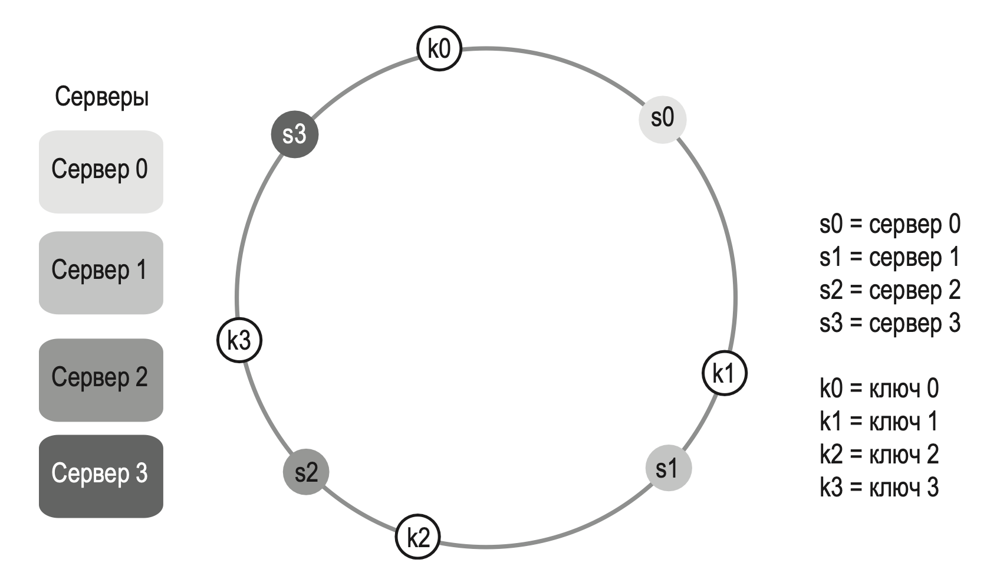
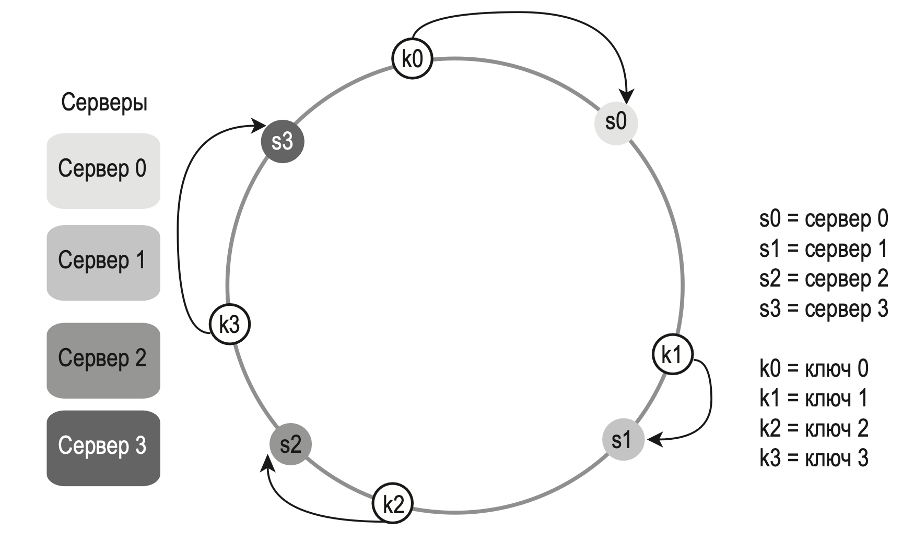
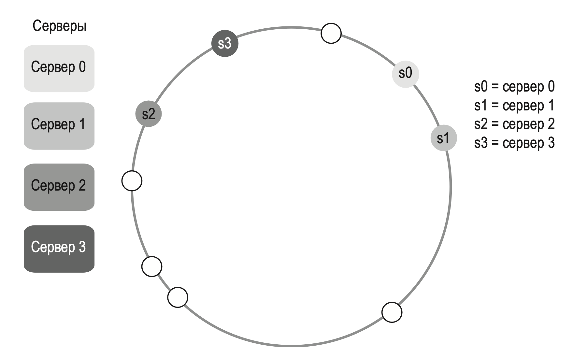
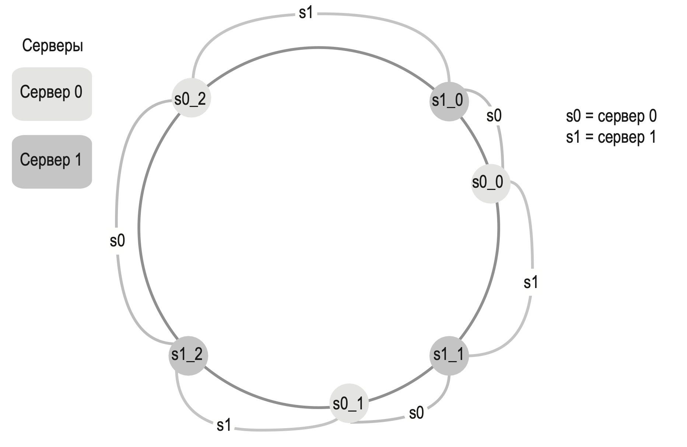

---
tags:
  - SystemDesign/ConsistentHashing
aliases:
  - Системный дизайн - Согласованное хеширование
---
# Согласованное хеширование

Для обеспечения горизонтального масштабирования запросы/данные должны распределяться между серверами эффективно и равномерно. Для этого зачастую используется *согласованное хеширование*.

## ПРОБЛЕМА ПОВТОРНОГО ХЕШИРОВАНИЯ

Если у вас есть n кэширующих серверов, балансирование нагрузки обычно обеспечивается с помощью следующего метода хеширования:

$$
serverIndex = hash(key) \% N,
$$

> где N — размер пула серверов.

Такой подход работает хорошо, когда пул серверов имеет фиксированный размер, а данные распределены равномерно. Но при добавлении новых или удалении существующих серверов возникают проблемы.

Это означает, что при выпадении из пула сервера 1 большинство клиентов начнут извлекать закэшированные данные не из тех серверов. Это приводит к целой лавине кэш-промахов. Согласованное хеширование — эффективный метод борьбы с этой проблемой.

> Согласованное хеширование (англ. consistent hashing) — особый вид хеширования, отличающийся тем, что когда хеш-таблица перестраивается, только K/n ключей в среднем должны быть переназначены, где K — число ключей и n — число слотов. В противоположность этому, в большинстве традиционных хеш-таблиц изменение количества слотов вызывает переназначение почти всех ключей

## Пространство и кольцо хеширования

Предположим, что в качестве хеш-функции $f$ используется SHA-1, а ее выходной диапазон имеет вид $x_0, x_1, x_2, x_3, …, x_n$. В криптографии пространство хеширования SHA-1 находится между $0$ и $2^{160} – 1$. Это означает, что $x_0$ соответствует $0, x_n$ соответствует $2^{160} – 1$, а все остальные промежуточные значения находятся между $0$ и $2^{160} – 1$.

Соединив концы вместе получим: 

## Хеш-серверы

Используя ту же хеш-функцию $f$, мы наносим серверы на кольцо с учетом их IP-адресов или имен.

## Хеш-ключи

Стоит упомянуть, что эта хеш-функция отличается от той, которая использовалась в «проблеме повторного хеширования», и что здесь нет операции взятия остатка.

## Поиск серверов

Чтобы определить, на каком сервере хранится ключ, мы идем по часовой стрелке, начиная с позиции ключа на кольце, пока не найдем сервер.

## Добавление сервера

Исходя из логики, описанной выше, добавление нового сервера потребует перераспределения лишь небольшой части ключей.

## Удаление сервера

При использовании согласованного хеширования удаление сервера потребует перераспределения лишь небольшой части ключей.

## Две проблемы базового подхода

- серверы и ключи наносятся на кольцо с использованием равномерно распределенной хеш-функции;
- чтобы определить, какому серверу принадлежит ключ, нужно пройти по часовой стрелке от позиции ключа к ближайшему серверу на кольце.

У этого подхода есть две проблемы. Первая: учитывая, что серверы могут добавляться и удаляться, их отрезки на кольце не могут иметь фиксированный размер.

Вторая проблема состоит в том, что распределение ключей на кольце может быть неравномерным.

Для решения этих проблем используется методика, известная как виртуальные узлы или реплики.

### Виртуальные узлы

Виртуальный узел ссылается на настоящий; каждый сервер представлен на кольце несколькими виртуальными узлами. 

Чтобы узнать, на каком сервере хранится ключ, мы переходим в его позицию на кольце и двигаемся по часовой стрелке к ближайшему виртуальному узлу.

Чем больше виртуальных узлов, тем равномернее становится распределение ключей. Это вызвано уменьшением стандартного отклонения, благодаря которому данные распределяются более сбалансированно.

## Дополнительные ссылки

- Согласованное хеширование: https://ru.wikipedia.org/wiki/Согласованное_хеширование
- Consistent Hashing: https://tom-e-white.com/2007/11/consistent-hashing.html
- Dynamo: Amazon’s Highly Available Key-value Store: https://www.allthingsdistributed.com/files/amazon-dynamo-sosp2007.pdf
- How Discord Scaled Elixir to 5,000,000 Concurrent Users: https://blog.discord.com/scaling-elixir-f9b8e1e7c29b
- CS168: The Modern Algorithmic Toolbox Lecture #1: Introduction and Consistent Hashing: http://theory.stanford.edu/~tim/s16/l/l1.pdf
- Maglev: A Fast and Reliable Software Network Load Balancer: https://static.googleusercontent.com/media/research.google.com/en//pubs/archive/44824.pdf

