---
tags:
  - SystemDesign/Examples/KeyValueSorage
  - SystemDesign/Dictionary/CAP
aliases:
  - Системный дизайн - Примеры - Хранилище Ключ Значение
---
# ХРАНИЛИЩЕ ТИПА «КЛЮЧ–ЗНАЧЕНИЕ»

Хранилище типа «ключ–значение» — это нереляционная база данных. Каждый уникальный идентификатор хранится в виде ключа и имеет от
дельное значение.

В паре «ключ–значение» ключ должен быть уникальным, а соответствующее значение может быть получено через ключ. Ключами могут выступать как обычный текст, так и хешированные значения. Короткие ключи обеспечивают лучшую производительность.

Значение в паре может быть строкой, списком, объектом и т. д.

## ПОНЯТЬ ЗАДАЧУ И ОПРЕДЕЛИТЬ МАСШТАБ РЕШЕНИЯ

Спроектируем хранилище типа «ключ–значение», обладающее следующими характеристиками:

- малый размер пар «ключ–значение»: меньше 10 Кб;
- возможность хранения объемных данных;
- высокая доступность — система должна быстро отвечать даже во время сбоев;
- хорошая масштабируемость — система должна масштабироваться для поддержки объемных наборов данных;
- автоматическое масштабирование — серверы должны автоматически добавляться/удаляться в зависимости от трафика;
- регулируемая согласованность;
- низкая латентность.

## ХРАНИЛИЩЕ ТИПА «КЛЮЧ–ЗНАЧЕНИЕ» НА ОДНОМ СЕРВЕРЕ

Очевидное решение заключается в хранении пар в хеш-таблице, содержимое которой находится в памяти. Уменьшить объем используемой памяти можно следующими способами: 

- сжимать данные;
- хранить в памяти только часто используемые данные, а все остальное записывать на диск.

Для поддержки крупных данных хранилище типа «ключ–значение» должно быть распределенным.

## РАСПРЕДЕЛЕННОЕ ХРАНИЛИЩЕ ТИПА «КЛЮЧ–ЗНАЧЕНИЕ»

Распределенное хранилище типа «ключ–значение» иногда называют распределенной хеш-таблицей. Оно распределяет пары «ключ–значение» между множеством серверов. При проектировании распределенной системы необходимо понимать теорему CAP (Consistency, Availability, Partition Tolerance — «согласованность, доступность, устойчивость к секционированию»).

### Теорема CAP

Теорема CAP гласит, что распределенная система может обеспечивать не больше двух из следующих трех свойств: согласованность,  доступность и устойчивость к секционированию. Дадим несколько определений.

- **Согласованность**. Означает, что все клиенты одновременно видят одни и те же данные, к какому бы узлу они ни подключились. 
- **Доступность**. Означает, что любой клиент, запрашивающий ­ данные, получает ответ, даже если некоторые из узлов недоступны.
- **Устойчивость к секционированию**. Секционирование свидетельствует о нарушении связи между двумя узлами. Устойчивость к секционированию означает, что система продолжает работать вопреки нарушению связи в сети.

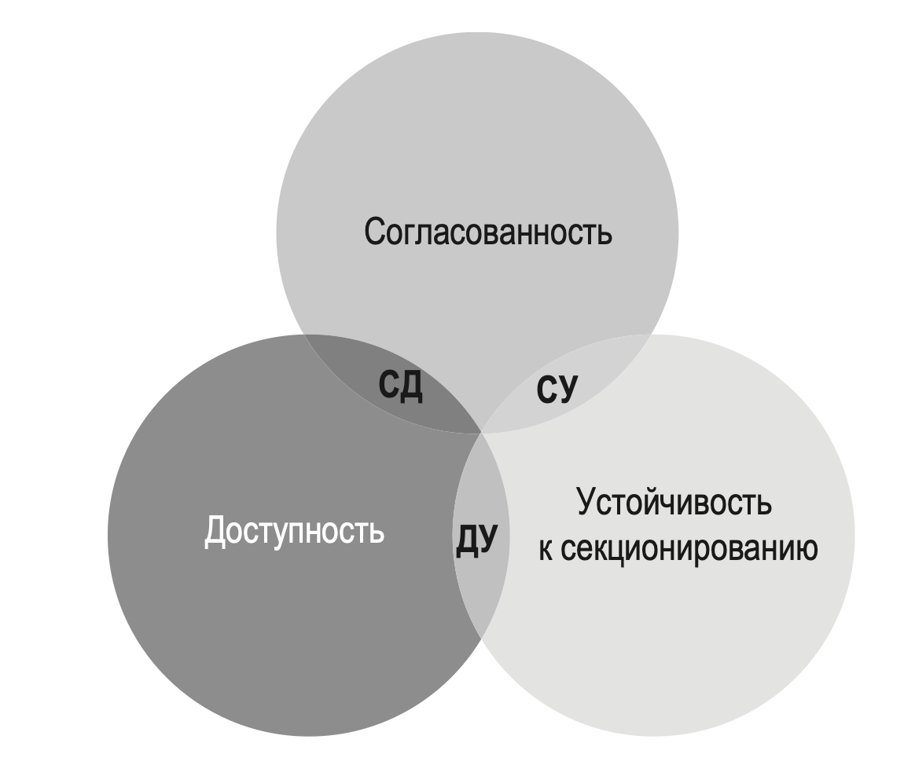

Согласно теореме CAP, одним из этих свойств необходимо пожертвовать, чтобы обеспечить поддержку двух других.

Хранилища типа «ключ–значение» классифицируются в зависимости от того, какие две характеристики CAP они поддерживают:

- **Системы CP** (*согласованность и устойчивость к секционированию*). Жертвуют доступностью.

- **Системы AP** (*доступность и устойчивость к секционированию*). Жертвуют согласованностью.

- **Системы CA** (*согласованность и доступность*). Жертвуют устойчивостью к секционированию. Поскольку сетевые сбои неизбежны, распределенные системы должны справляться с разделением сети. В связи с этим системы CA не существуют в реальных условиях.

### Реальные распределенные системы

В распределенной системе разделение неизбежно, и, когда оно происходит, мы должны сделать выбор между согласованностью и доступностью. 

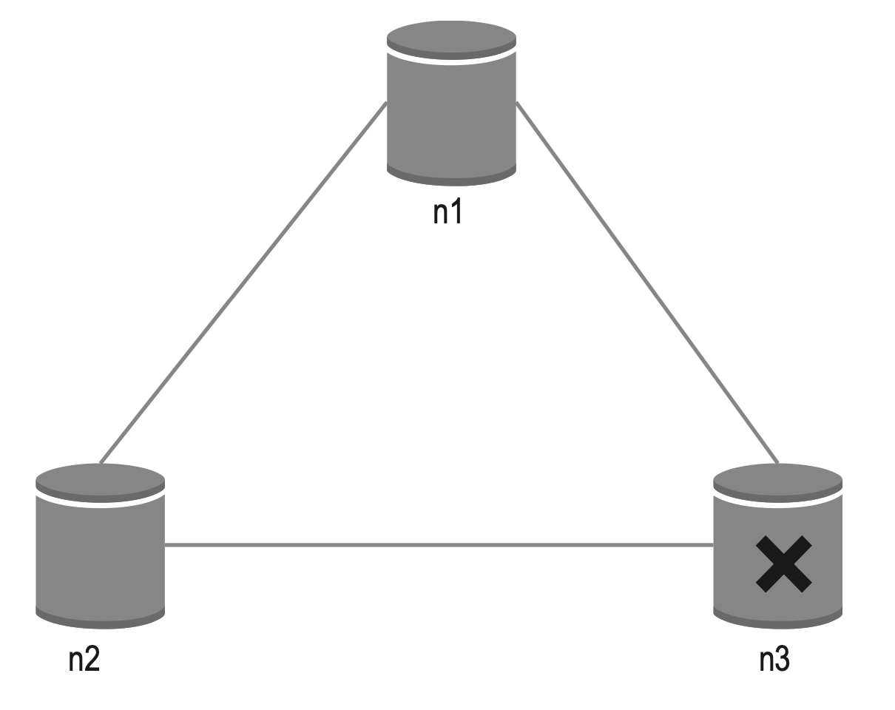

Если мы предпочтем согласованность вместо доступности (система CP), нам придется заблокировать все операции записи на узлах n1 и n2, чтобы избежать рассинхронизации данных между этими тремя серверами. Этим мы сделаем систему недоступной.

Если же мы отдадим предпочтение доступности перед согласованностью (система AP), система продолжит принимать операции чтения, несмотря на то что она может вернуть устаревшие данные. Что касается операций записи, то они останутся доступными на узлах n1 и n2, а после устранения сетевых неполадок данные будут синхронизированы с n3.

Выбор правильных CAP, которые подходят для вашей задачи, — важный этап создания распределенного хранилища типа «ключ–значение».

## Компоненты системы

Основные компоненты и методики, которые используются для создания хранилища типа «ключ–значение»:

- секционирование данных;
- репликация данных;
- согласованность;
- устранение несогласованности;
- обработка сбоев;
- диаграмма архитектуры системы;
- маршрут записи;
- маршрут чтения.

### Секционирование данных

В крупных приложениях все данные не могут поместиться на одном сервере. Проще всего было бы разделить их на части (секции) меньшего размера и хранить на разных серверах. При секционировании данных необходимо решить две проблемы:

- равномерно распределить их между разными серверами;
- минимизировать их перемещение при добавлении или удалении узлов.

Подойдет [согласованное хеширование](../0120_Consistent_hashing.md).

Использование согласованного хеширования для секционирования данных имеет следующие преимущества:

- **Автоматическое масштабирование**. Серверы можно добавлять и удалять автоматически в зависимости от загрузки.

- **Гетерогенность**. Количество виртуальных узлов сервера пропорционально его емкости. Например, серверам с большей емкостью назначают больше виртуальных узлов.

### Репликация данных

Чтобы достичь высокой доступности и надежности, данные должны асинхронно реплицироваться по N серверам, причем параметр N можно настраивать.

Для повышения надежности системы реплики размещаются в разных ЦОД, между которыми установлены высокоскоростные сетевые соединения.

### Согласованность

Так как данные реплицируются по нескольким узлам, они должны синхронизироваться между репликами.

- N = количество реплик.
- W = кворум записи размера W. Операция записи считается успешной, только если она подтверждена W репликами.
- R = кворум чтения размера R. Чтобы операцию записи можно было считать успешной, необходимо дождаться ответа как минимум от R реплик.

Выбор значений для W, R и N — это типичный компромисс между латентностью и согласованностью.

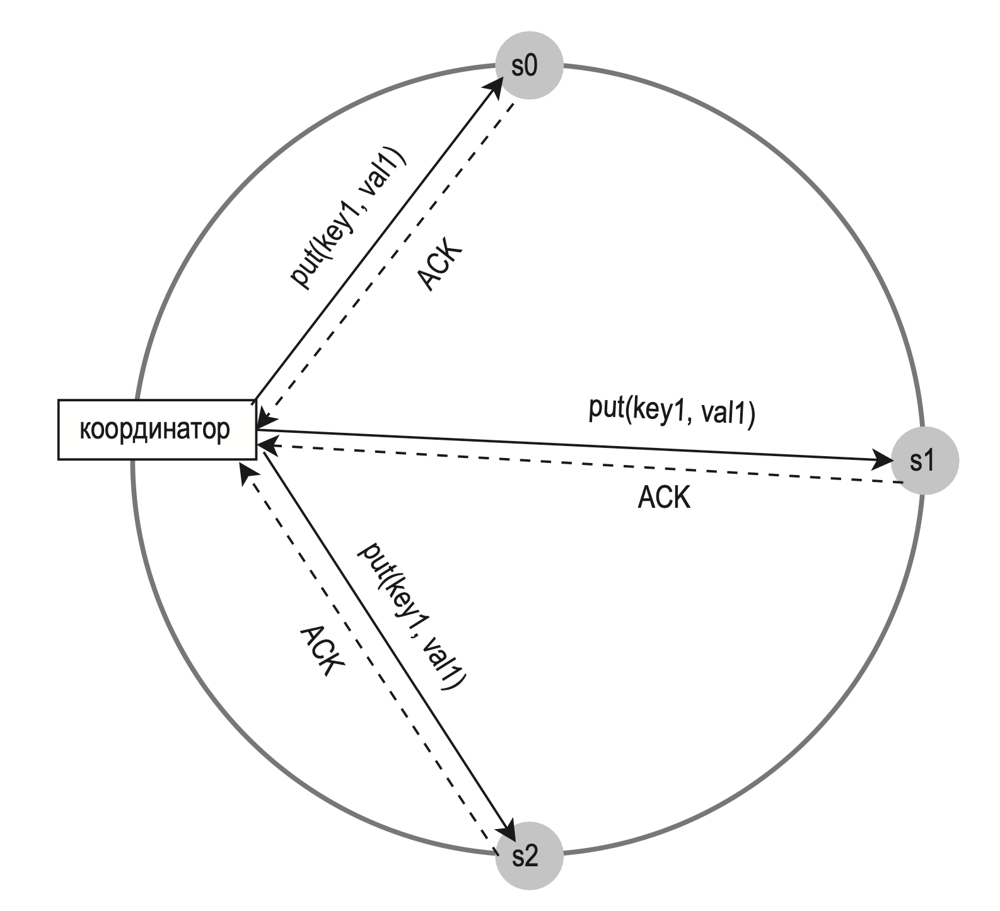
$W + R > N$ гарантирует строгую согласованность, поскольку в системе должен быть как минимум один узел с тем же минимальным набором данных.

Вот несколько возможных вариантов:

- если $R = 1$ и $W = N$, система оптимизирована для быстрого чтения;
- если $W = 1$ и $R = N$, система оптимизирована для быстрой записи;
- если $W + R \gt N,$ гарантируется строгая согласованность (обычно $N = 3, W = R = 2$);
- если $W + R \le N$, строгая согласованность не гарантируется.

### Модели согласованности

Модель согласованности — еще один важный фактор, который следует учитывать при проектировании хранилища типа «ключ–значение». Она определяет степень согласованности данных:

- Строгая согласованность. Любая операция чтения возвращает значение, соответствующее результату самой последней операции записи. Клиент всегда получает актуальные данные.
- Слабая согласованность. Последующие операции чтения могут и не вернуть самое последнее значение.
- Согласованность в конечном счете. Это разновидность слабой согласованности. Рано или поздно все обновления распространяются по системе и все реплики становятся согласованными.

### Устранение несогласованности: версионирование

Репликация обеспечивает высокую доступность, но при этом делает реплики несогласованными. Для решения этой проблемы применяются версионирование и векторные часы. Версионирование — это когда каждое обновление данных приводит к появлению их новой неизменяемой версии.

Векторные часы — это пара [сервер, версия], связанная с элементом данных. С ее помощью можно проверить, какая из двух версий более новая и есть ли между ними конфликт.

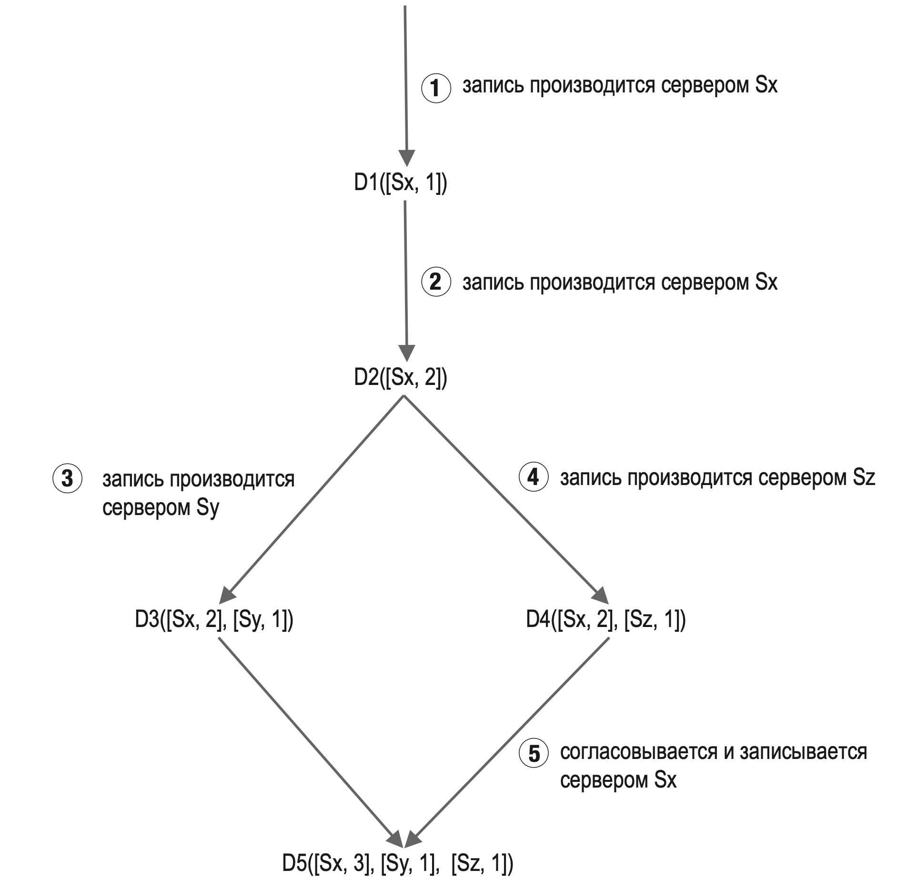

1. Клиент записывает в систему элемент данных D1, и запись обрабатывается сервером Sx, у которого теперь есть векторные часы D1[(Sx, 1)]
2. Другой клиент считывает последнюю версию D1, обновляет ее до D2 и записывает обратно. D2 происходит от элемента D1 и поэтому записывается вместо него. Предполагается, что запись обрабатывается тем же сервером Sx, векторные часы которого теперь выглядят как D2([Sx, 2]).
3. Еще один клиент считывает последнюю версию D2, обновляет ее до D3 и записывает обратно. Предполагается, что запись обрабатывается тем же сервером Sy, векторные часы которого теперь выглядят как D3([Sx, 2], [Sy, 1])).
4. Еще один клиент считывает последнюю версию D2, обновляет ее до D4 и записывает обратно. Предполагается, что запись обрабатывается тем же сервером Sz, векторные часы которого теперь выглядят как D4([Sx, 2], [Sz, 1])).
5. Следующий клиент, который считывает D3 и D4, обнаруживает конфликт, вызванный тем, что элемент данных D2 был изменен двумя серверами: Sy и Sz. Клиент разрешает этот конфликт и отправляет на сервер обновленные данные. Предполагается, что запись обрабатывается тем же сервером Sx, который теперь имеет значение D5([Sx, 3], [Sy, 1], [Sz, 1]).

Векторные часы могут разрешать конфликты, но у них есть два заметных недостатка. Во-первых, они усложняют клиент, так как в нем должна быть реализована логика разрешения конфликтов.

Во-вторых, пары [сервер, версия] в векторных часах могут очень быстро накапливаться. Чтобы это исправить, мы можем указать максимальную длину, при превышении которой самая старая пара удаляется. Это может снизить эффективность процесса согласования, так как больше нельзя будет точно сказать, является ли версия потомком.

### Обработка сбоев

В любых крупномасштабных системах сбои являются не только неизбежным, но и довольно распространенным явлением. Их обработка имеет большое значение.

#### Обнаружение сбоев

В распределенной системе о поломке сервера нельзя судить только по сигналам с другого сервера. Обычно для этого требуется подтверждение от двух независимых источников.

Оптимальное решение состоит в использовании децентрализованных методов обнаружения сбоев, таких как протокол сплетен (gossip protocol). Он работает следующим образом:

- Каждый узел хранит список узлов-участников, состоящий из идентификаторов и счетчиков пульсации.
- Каждый узел периодически инкрементирует счетчик пульсации.
- Каждый узел периодически шлет пульс группе произвольных узлов, которые в свою очередь передают его другой группе.
- При получении пульса узлы обновляют список участников до последней версии.
- Если счетчик пульсации не увеличивается на протяжении заранее определенного периода, участник считается недоступным.

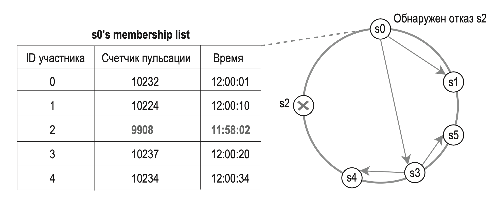

#### Обработка временных сбоев

После обнаружения сбоя по протоколу сплетен система должна задействовать определенные механизмы, чтобы обеспечить доступность. Если используется строгий кворум, операции чтения и записи могут быть заблокированы.

Для повышения доступности используется методика, известная как нестрогий кворум. Вместо обеспечения кворума система выбирает на кольце хеширования первые W исправных серверов для записи и первые R исправных серверов для чтения. Недоступные серверы игнорируются.

Когда сеть возобновит нормальную работу, изменения будут переданы ранее недоступному серверу, чтобы восстановить согласованность данных. Этот процесс называют *прозрачной передачей*.

#### Обработка бессрочных сбоев

Прозрачная передача используется при временных сбоях. Чтобы справиться с бессрочным сбоем, нужно реализовать протокол для предотвращения энтропии, который будет синхронизировать реплики. Это подразумевает сравнение элементов данных, хранящихся на репликах, и обновление каждой реплики до самой новой версии. Для обнаружения несогласованности и минимизации объема передаваемых данных используется дерево Меркла.

> Хеш-деревом, деревом Меркла (Merkle tree), называют полное двоичное дерево, в листовые вершины которого помещены хеши от блоков данных, а внутренние вершины содержат хеши от сложения значений в дочерних вершинах. Хеш-деревья обеспечивают эффективную и безопасную проверку содержимого крупных структур данных

Шаг 1: разделить диапазон ключей на бакеты (в нашем примере их 4). Бакет выступает корневым узлом, что позволяет ограничить глубину дерева.

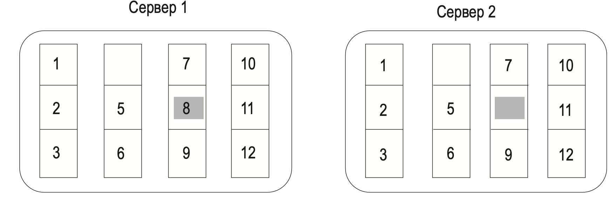

Шаг 2: после создания бакетов захешировать для каждого из них ключ с помощью одного и того же метода хеширования

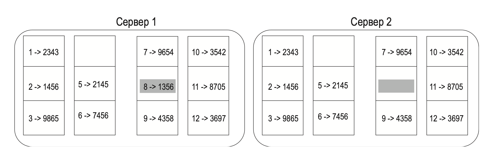

Шаг 3: создать по одному хеш-узлу для каждого бакета

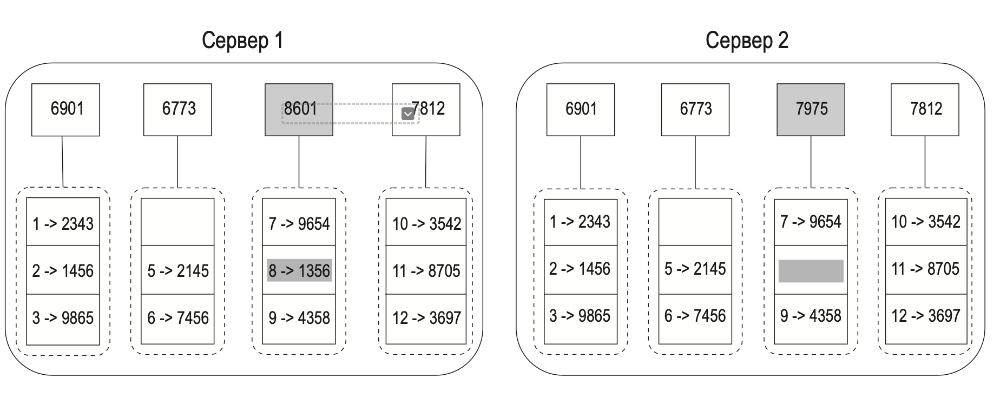

Шаг 4: построить дерево снизу вверх до самого корня путем вычисления дочерних хешей

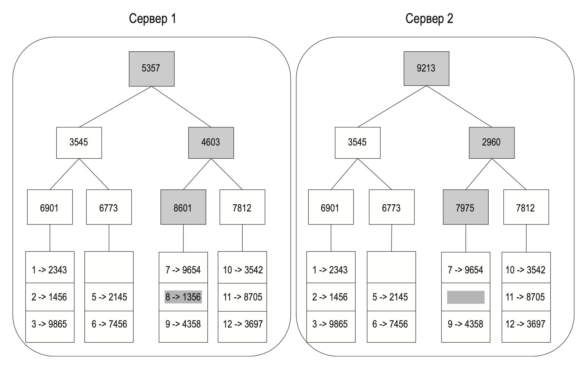
Сравнение двух деревьев Меркла начинается с их корневых хешей. Если корневые хеши совпадают, серверы содержат одни и те же данные. В противном случае сравниваются дочерние хеши слева направо. В процессе осмотра дерева мы определяем несогласованные бакеты и синхронизируем только их.

При использовании деревьев Меркла количество данных, которые нужно синхронизировать, прямо пропорционально отличиям между двумя репликами и не зависит от того, сколько всего данных в них хранится.

#### Обработка неполадок уровня ЦОД

Чтобы создать систему, способную с ними справиться, данные необходимо реплицировать по нескольким ЦОД.

### Диаграмма архитектуры системы

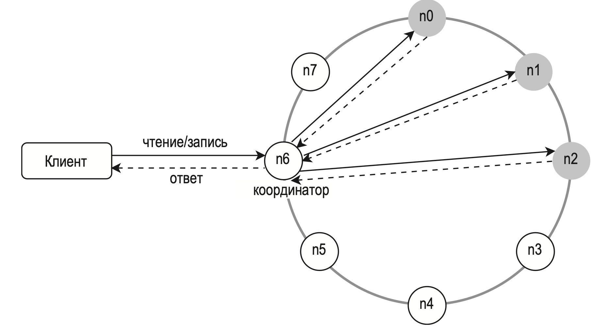

Основные особенности этой архитектуры:

- Клиенты взаимодействуют с хранилищем типа «ключ–значение» через простые API: get(ключ) и put(ключ, значение).
- Координатор — это узел, который выступает прокси-сервером между клиентом и хранилищем.
- Узлы распределяются по кольцу с использованием согласованного хеширования.
- Система полностью децентрализована, поэтому добавление и удаление узлов можно проводить автоматически.
- Данные реплицируются по разным узлам.
- Нет единой точки отказа, так как у каждого узла один и тот же набор обязанностей.

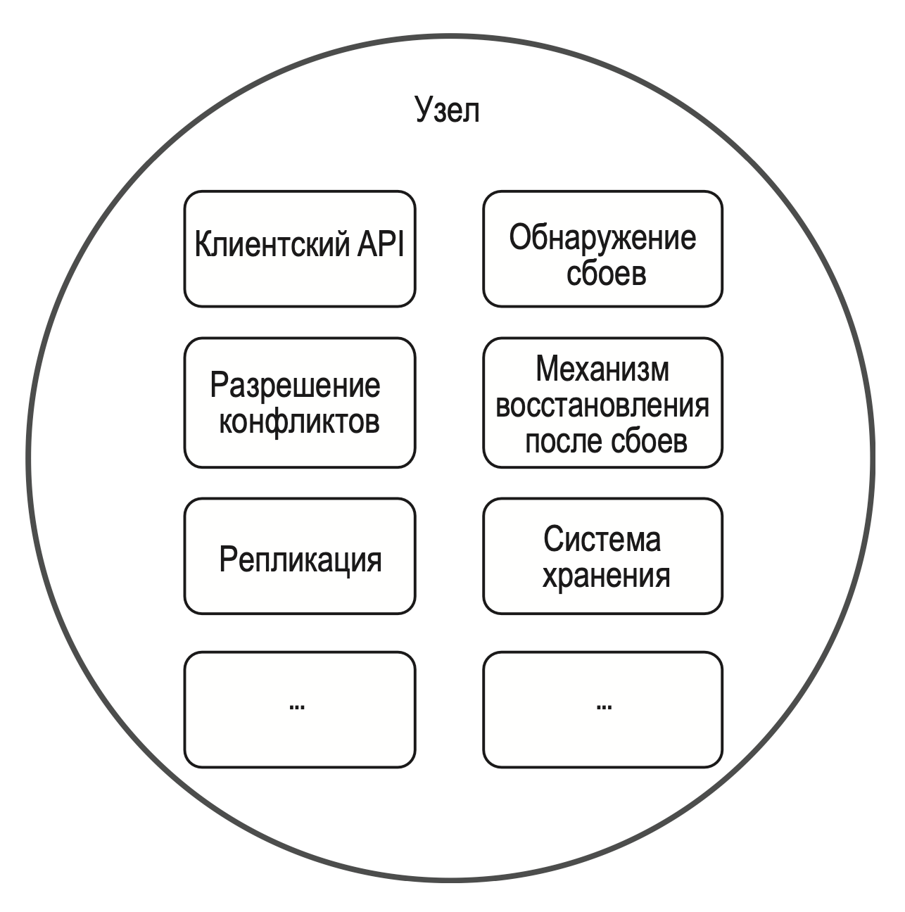

### Маршрут записи

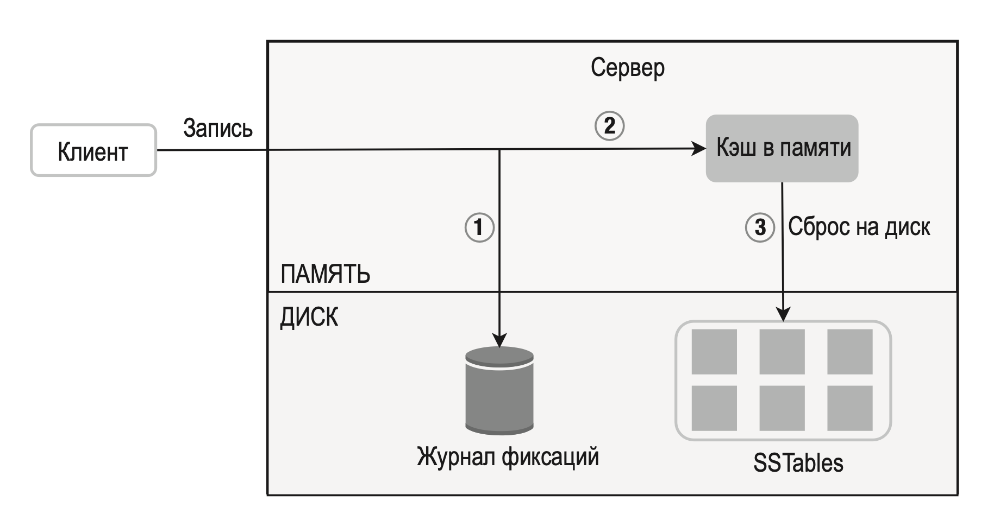

1. Запрос на запись сохраняется в файл с логом коммитов.
2. Данные записываются в кэш, размещенный в памяти.
3. Когда кэш полностью заполняется или достигает определенного лимита, данные сбрасываются на диск в SSTable. 

> SSTable (sorted-string table — «таблица с сортированием строк») — это упорядоченный список пар <ключ, значение>. 

### Маршрут чтения

Когда запрос на чтение направляется к определенному узлу, система сначала проверяет, находятся ли требуемые данные в кэше. Если это так, система возвращает их клиенту.

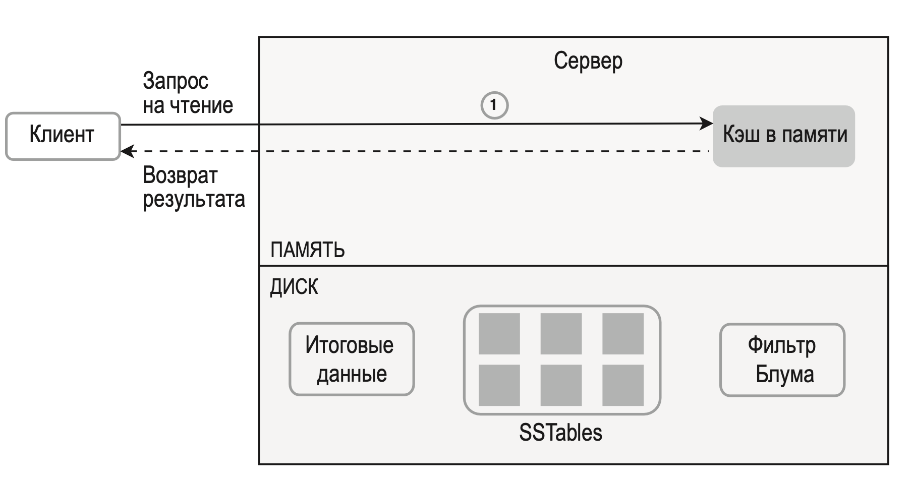

Если в памяти данных нет, они берутся с диска. Нам нужен эффективный способ поиска таблицы SSTable, в которой содержится ключ. Для этого часто используется фильтр Блума.

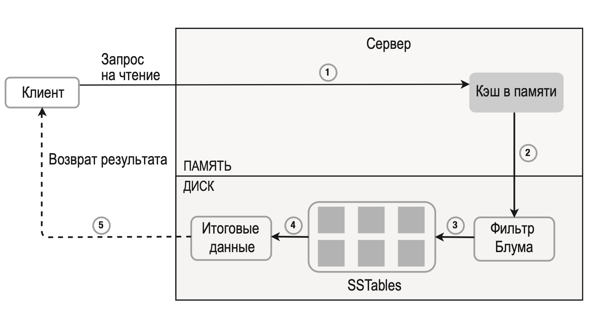

1. Сначала система проверяет, есть ли данные в памяти, и если это не так, выполняется второй пункт.
2. Система проверяет фильтр Блума.
3. Фильтр Блума позволяет определить, в какой из таблиц SSTable может находиться ключ.
4. SSTable возвращает итоговый набор данных.
5. Итоговый набор данных возвращается клиенту.

## Итоги

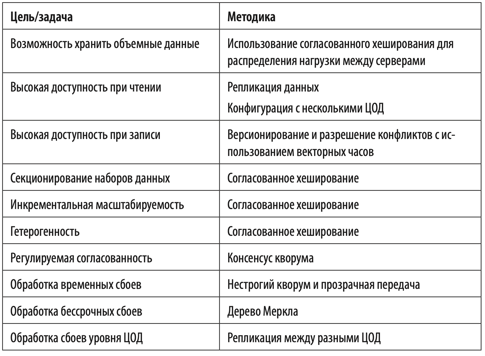

## Дополнительные материалы

- memcached: https://memcached.org/
- Redis: https://redis.io/
- Dynamo: Amazon’s Highly Available Key-value Store: https://www.allthingsdistributed.com/files/amazon-dynamo-sosp2007.pdf
- Cassandra: https://cassandra.apache.org/
- Bigtable: A Distributed Storage System for Structured Data: https://static.googleusercontent.com/media/research.google.com/en//archive/bigtable-osdi06.pdf
- Дерево Меркла: https://ru.wikipedia.org/wiki/Дерево_хешей
- Cassandra architecture: https://cassandra.apache.org/doc/latest/architecture/
- Фильтр Блума: https://ru.wikipedia.org/wiki/Фильтр_Блума

