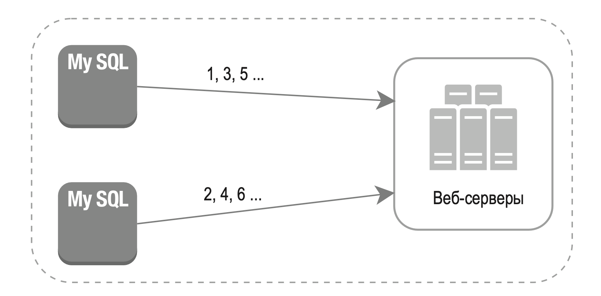
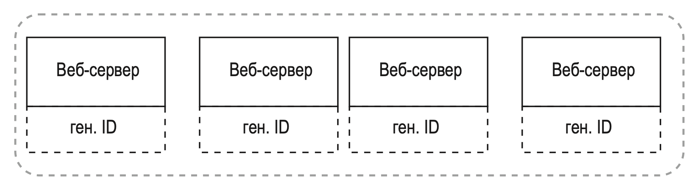
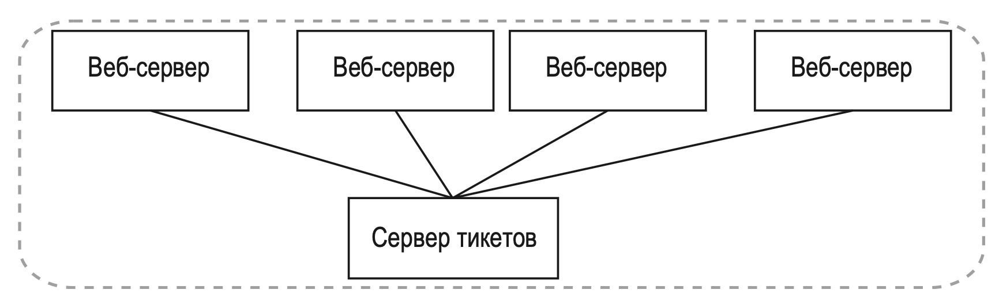
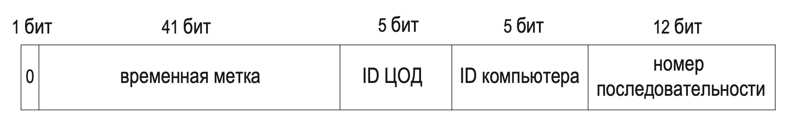

---
tags:
  - SystemDesign/Examples/GUIDGen
aliases:
  - Системный Дизайн - Примеры - Генератор GUID
---
# ГЕНЕРАТОР УНИКАЛЬНЫХ ИДЕНТИФИКАТОРОВ В РАСПРЕДЕЛЕННЫХ СИСТЕМАХ

## ШАГ 1: ПОНЯТЬ ЗАДАЧУ И ОПРЕДЕЛИТЬ МАСШТАБ РЕШЕНИЯ

| Какие характеристики должны быть у уникальных ID?               | ID должны быть уникальными и подлежать сортировке                                                                                             |
| --------------------------------------------------------------- | --------------------------------------------------------------------------------------------------------------------------------------------- |
| Инкрементируется ли ID на 1 при добавлении каждой новой записи? | ID инкрементируется по времени, но необязательно на 1. Идентификаторы, созданные вечером, больше тех, которые были получены утром того же дня |
| ID имеют только числовые значения?                              | Да, именно так                                                                                                                                |
| Какие требования к длине ID?                                    | ID должны умещаться в 64 бита                                                                                                                 |
| Какой масштаб системы?                                          | Система должна быть способна генерировать 10 000 ID в секунду                                                                                 |
|                                                                 |                                                                                                                                               |

## ШАГ 2: ПРЕДЛОЖИТЬ ОБЩЕЕ РЕШЕНИЕ И ПОЛУЧИТЬ СОГЛАСИЕ

Есть разные методы генерации уникальных ID в распределенных системах.

- репликация с несколькими источниками;
- универсальный уникальный идентификатор (universally unique identifier, UUID);
- сервер тикетов;
- Twitter snowflake ID — подход «снежного кома» Twitter.

### Репликация с несколькими источниками

Здесь используется свойство баз данных auto_increment. ID увеличивается не на 1, а на число k, равное количеству используемых БД.

У этой стратегии есть серьезные недостатки:

- сложность масштабирования в конфигурации с несколькими центрами обработки данных;
- ID не увеличиваются хронологически в пределах нескольких серверов;
- плохая масштабируемость при добавлении или удалении сервера.

### UUID

UUID — это 128-битное число, которое используется для идентификации данных в компьютерных системах. UUID имеют очень низкую вероятность повторения.

> После генерации 1 миллиарда UUID в секунду на протяжении примерно 100 лет вероятность получения одного дубликата достигает 50%

UUID может выглядеть как 09c93e62-50b4-468d-bf8a-c07e1040bfb2.

Преимущества:

- простота генерации. Не нужно никакой координации между серверами, что исключает проблемы с синхронизацией;
- систему легко масштабировать, так как каждый сервер отвечает за генерацию идентификаторов, которые он потребляет. Генератор может легко масштабироваться вместе с веб-серверами.

Недостатки:

- ID имеют длину 128 бит, а нам нужно 64 бита;
- ID не увеличиваются со временем;
- ID могут быть нечисловыми.

### Сервер тикетов

Их разработала компания Flicker для получения распределенных первичных ключей.

Суть в том, что мы используем функцию auto_increment в отдельно взятом сервере баз данных (сервере тикетов).

Преимущества:

- числовые ID;
- этот метод легко реализовать, и он подходит для небольших и средних приложений.

Недостатки:

- единая точка отказа. Сервер тикетов существует в единственном экземпляре, и если он выйдет из строя, проблемы возникнут у всех систем, которые на него полагаются. Чтобы этого избежать, можно предусмотреть несколько серверов тикетов, но это вызовет новые трудности, такие как синхронизация данных.

### Twitter snowflake ID

Разделяй и властвуй — вот что нам нужно. Вместо того чтобы генерировать идентификатор напрямую, мы разделяем его на части.

- Бит знака: 1 бит. Всегда равен 0 и зарезервирован на будущее. С его помощью потенциально можно различать знаковые и беззнаковые числа.
- Временная метка: 41 бит. Количество миллисекунд, прошедших с начала эпохи Unix или какого-то другого момента. В Twitter snowflake начальной точкой по умолчанию является Ноя 04, 2010, 01:42:54 UTC, что эквивалентно 1288834974657. Мы воспользуемся этим значением.
- ID ЦОД: 5 бит, что дает нам 2 ^ 5 = 32 центра обработки данных. 
- ID компьютера: 5 бит, что дает нам 2 ^ 5 = 32 компьютера в каждом ЦОД.
- Номер последовательности: 12 бит. При генерации каждого ID на отдельно взятом компьютере или процессе номер последовательности инкрементируется на 1. Каждую миллисекунду этот номер обнуляется.

## ШАГ 3: ПОДРОБНОЕ ПРОЕКТИРОВАНИЕ

Остановились на подходе, основанном на генераторе snowflake ID от Twitter.

ID центра обработки данных и компьютера выбираются в момент запуска системы и обычно не меняются во время выполнения. Любые обновления этих идентификаторов требуют тщательного анализа, так как неосторожное внесение изменений может привести к конфликтам.

### Временная метка

Самую важную часть идентификатора составляет 41-битная временная метка. Поскольку метки увеличиваются со временем, ID можно сортировать в хронологическом порядке.

Максимальная временная метка, которую можно представить с помощью 41 бита, равна 2 ^ 41 - 1 = 2199023255551 миллисекундам (мс), что дает нам ~69 лет.

### Номер последовательности

Номер последовательности занимает 12 бит, что дает нам 2 ^ 12 = 4096 комбинаций.

## ШАГ 4: ПОДВЕДЕНИЕ ИТОГОВ

Дополнительные вопросы:

- Синхронизация часов. В нашей архитектуре предполагается, что у серверов, генерирующих ID, часы синхронизированы. Это может быть не так, если мы используем многоядерный компьютер или конфигурацию с несколькими серверами. Самым популярным ее решением является протокол NTP (Network Time Protocol — «протокол сетевого времени»). 
- Оптимизация длины отдельных частей. Например, выделение большего числа битов для временной метки за счет уменьшения номера последовательности хорошо подходит для приложений, которые долго работают и имеют низкую степень параллелизма.
- Высокая доступность. Поскольку генератор ID является незаменимой системой, он должен быть высокодоступным.

## Дополнительные материалы

- UUID: https://ru.wikipedia.org/wiki/UUID
- Ticket Servers: Distributed Unique Primary Keys on the Cheap: https://code.flickr.net/2010/02/08/ticket-servers-distributed-unique-primary-keys-on-the-cheap/
- Announcing Snowflake: https://blog.twitter.com/engineering/en_us/a/2010/announcing-snowflake.html
- Протокол NTP: https://ru.wikipedia.org/wiki/NTP

