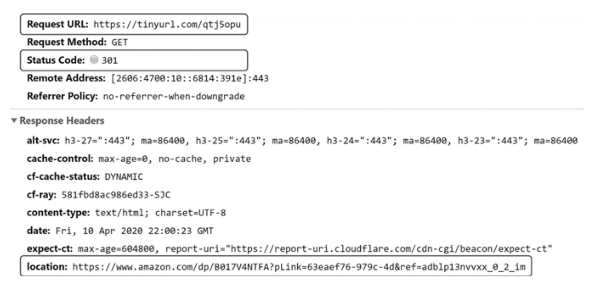
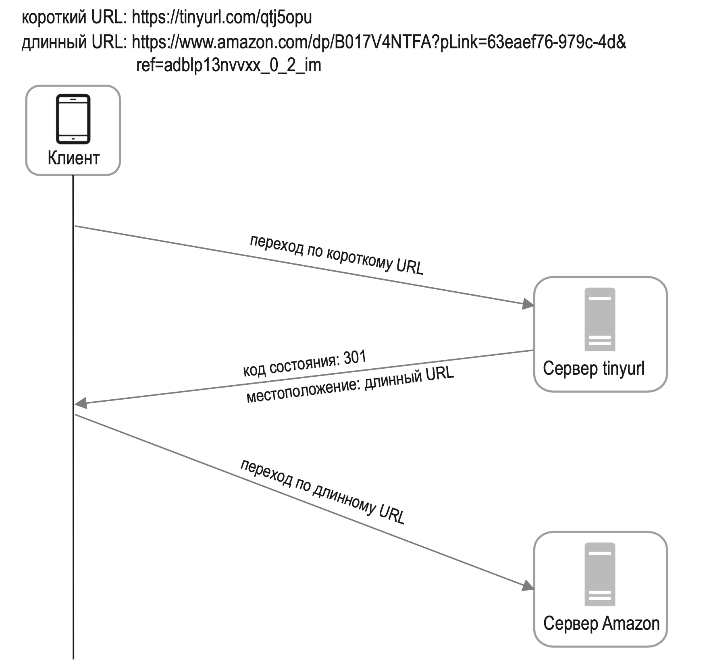
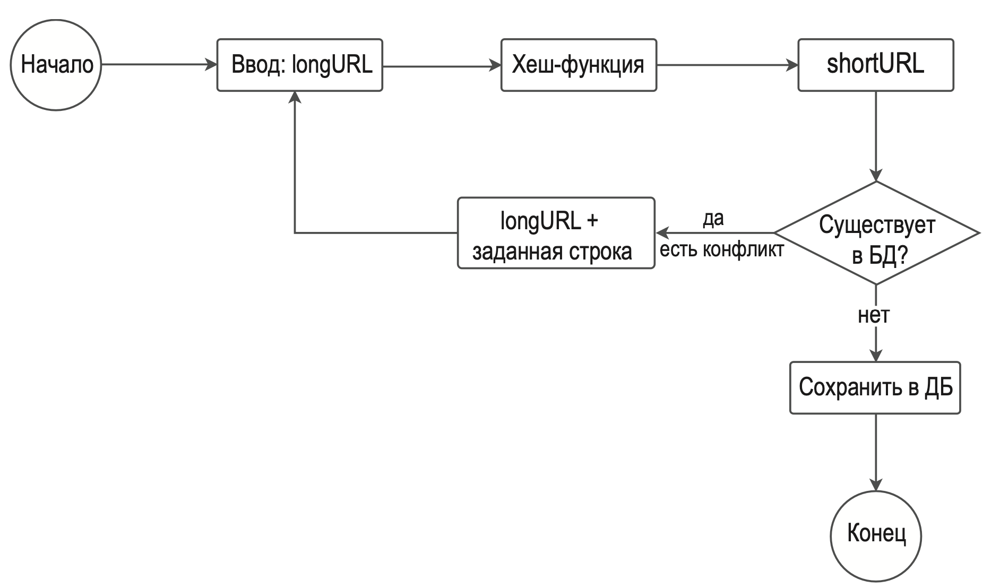
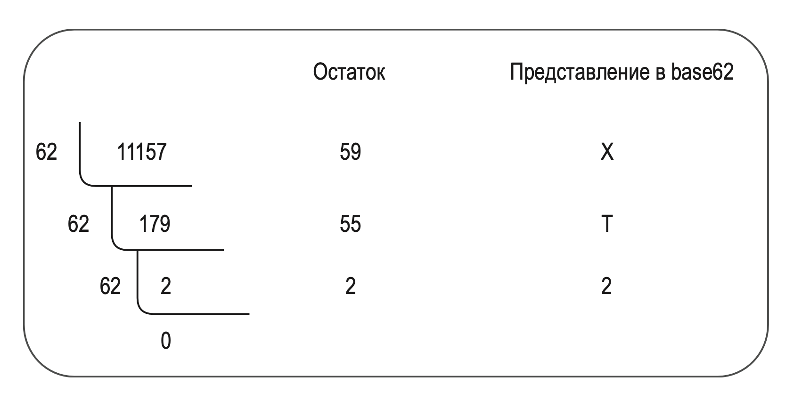
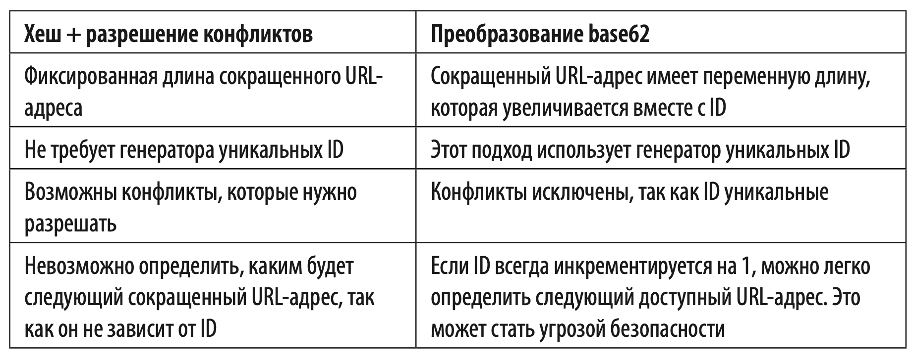
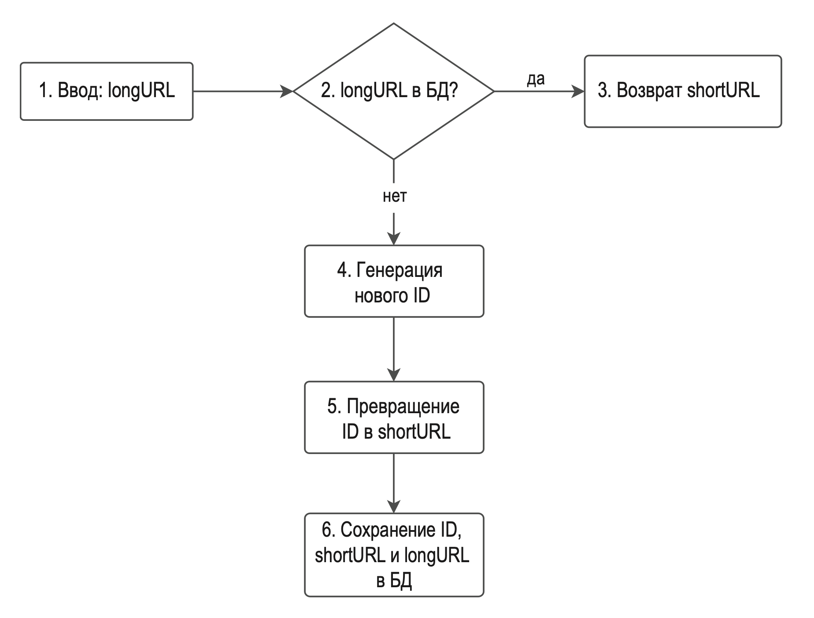
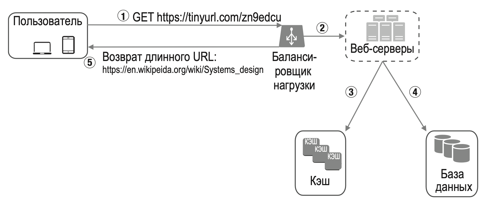

---
tags:
  - SystemDesign/Examples/TinyURL
aliases:
  - Системный дизайн - Примеры - Сокращатель URL
---
# СИСТЕМА ДЛЯ СОКРАЩЕНИЯ URL-АДРЕСОВ

## ШАГ 1: ПОНЯТЬ ЗАДАЧУ И ОПРЕДЕЛИТЬ МАСШТАБ РЕШЕНИЯ

| Можете ли привести пример работы сервиса для сокращения URL-адресов? | Допустим, https://www.systeminterview.com/q=chatsystem&c=loggedin&v=v3&l=long — это исходный URL-адрес. Ваш сервис должен создать ссылку покороче: https://tinyurl.com/y7keocwj. Клик по этой ссылке должен перенаправлять к исходному URL-адресу |
| -------------------------------------------------------------------- | ------------------------------------------------------------------------------------------------------------------------------------------------------------------------------------------------------------------------------------------------- |
| Какой объем трафика?                                                 | 100 миллионов сгенерированных URL-адресов в день                                                                                                                                                                                                  |
| Какая длина должна быть у сокращенного URL-адреса?                   | Как можно короче                                                                                                                                                                                                                                  |
| Какие символы допускаются в сокращенном URL-адресе?                  | Сокращенный URL-адрес может содержать цифры (0–9) и буквы (a–z, A–Z)                                                                                                                                                                              |
| Допускается ли удаление или обновление сокращенного URL-адреса?      | Чтобы не усложнять, предположим, что сокращенный URL-адрес не подлежит удалению или обновлению                                                                                                                                                    |

Типичные сценарии использования:

1. Сокращение URL-адресов: дается длинный URL-адрес => возвращается намного более короткий URL-адрес.
2. Перенаправление URL-адресов: дается сокращенный URL-адрес => пользователь перенаправляется к исходному URL-адресу.
3. Высокая доступность, масштабируемость и устойчивость к сбоям.

### Приблизительные оценки

- Операции записи: генерируется 100 миллионов URL-адресов в день.
- Операций записи в секунду: $100 миллионов / 24 / 3600 = 1160.$
- Операции чтения: если предположить, что операции чтения и записи имеют соотношение 10 к 1, за одну секунду будет выполняться $1160 * 10 = 11 600$ операций чтения.
- Если предположить, что сервис для сокращения URL-адресов проработает 10 лет, мы должны поддерживать хранение $100\ миллионов * 365 * 10 = 365\ миллиардов$ записей.
- Пусть длина среднего URL-адреса составляет 100 символов.
- Требования к хранилищу в ближайшие 10 лет: $365\ миллиардов * 100B * 10\ лет = 365TB$.

## ШАГ 2: ПРЕДЛОЖИТЬ ОБЩЕЕ РЕШЕНИЕ И ПОЛУЧИТЬ СОГЛАСИЕ

### Конечные точки API

Конечные точки API обеспечивают взаимодействие между клиентами и серверами. Наш API будет в стиле REST.

Две основные конечные точки:

1. Сокращение URL-адреса. Чтобы создать новый сокращенный URL-адрес, клиент отправляет POST-запрос с одним параметром: исходным длинным URL-адресом. Конечная точка выглядит так: POST api/v1/data/shorten 
	1. параметр запроса: {longUrl: longURLString}; 
	2. возвращается shortURL.
2. Перенаправление URL-адреса. Чтобы перенаправить сокращенную ссылку к соответствующему длинному URL-адресу, клиент отправляет GET-запрос. Конечная точка выглядит так: GET api/v1/shortUrl 
	1. возвращается longURL для HTTP-перенаправления.

### Перенаправление URL-адресов

схема: 

- **Перенаправление 301**. Код состояния 301 означает, что запрошенный URL-адрес «навсегда» перемещен по длинному URL-адресу. Так как перенаправление постоянное, браузер кэширует ответ и последующие запросы по тому же адресу не будут направляться к нашему сервису. Вместо этого браузер сразу откроет сокращенный URL-адрес.
- **Перенаправление 302**. Код состояния 302 означает, что URL-адрес «временно» перемещен по длинному URL-адресу. То есть последующие запросы того же URL-адреса будут сначала отправляться нашему сервису, а затем перенаправляться к серверу длинного URL-адреса.

Самый очевидный способ реализации перенаправления URL-адресов заключается в использовании хеш-таблиц.

- получаем longURL: longURL = hashTable.get(shortURL);
- получив longURL, выполняем перенаправление.

### Сокращение URL-адресов

Мы должны найти функцию $f(x)$, которая привязывает длинный URL-адрес к hashValue.

К функции хеширования предъявляются следующие требования:

- каждое значение longURL должно иметь один хеш hashValue;
- каждое значение hashValue должно указывать обратно на longURL.

## ШАГ 3: ПОДРОБНОЕ ПРОЕКТИРОВАНИЕ

### Модель данных

В реальных системах подход с хеш-таблицами непрактичен, поскольку ресурсы памяти ограничены и дороги. Пары <shortURL, longURL> лучше хранить в реляционной базе данных.

### Функция хеширования

hashValue состоит из символов [0-9, a-z, A-Z], число которых равно $10 + 26 + 26 = 62$. Чтобы определить длину hashValue, нужно найти наименьшее n, при котором $62^n ≥ 365$ миллиардов.

3,5 триллиона (когда $n = 62 ^ 7$) более чем достаточно для хранения 365 миллиардов URL-адресов, поэтому длина hashValue будет равна 7.

#### Хеш + разрешение конфликтов

Сравнение хешей, полученных с помощью разных функций из URL-адреса https://en.wikipedia.org/wiki/Systems_design.

| Хеш-функция | Значение хеша (шестнадцатеричное)        |
| ----------- | ---------------------------------------- |
| CRC32       | 5cb54054                                 |
| MD5         | 5a62509a84df9ee03fe1230b9df8b84e         |
| SHA-1       | 0eeae7916c06853901d9ccbefbfcaf4de57ed85b |

Самое короткое CRC32, но там больше чем надо. Если просто взять первые 7 символов - можем получить конфликты. Чтобы избавиться от конфликтов - можем добавлять рекурсивно заданную строку: 

Этот метод может избавить нас от конфликтов, но обращаться к базе данных при каждом запросе, чтобы проверить наличие в ней shortURL, довольно расточительно. Для улучшения производительности можно использовать фильтр Блума.

#### Преобразование base62

Еще одним распространенным методом сокращения URL-адресов является преобразование значения в другую систему счисления. Поскольку для hashValue используется набор из 62 символов, мы выберем алгоритм base62.

- base62 — это способ кодирования с использованием 62 символов. Они соотносятся как 0-0, ..., 9-9, 10-a, 11-b, ..., 35-z, 36-A, …, 61-Z, где «a» соответствует 10, «Z» соответствует 61 и т. д.
- $11157_{10} = 2 * 62^2 + 55 * 62^1 + 59 * 62^0 = [2, 55, 59] -> [2, T, X]$ в представлении base62.
- Таким образом, сокращенный URL-адрес выглядит как https://tinyurl.com/2TX.

#### Сравнение двух подходов

### Тщательный анализ сокращения URL-адресов

1. longURL подается на вход.
2. Система проверяет, есть ли longURL в базе данных.
3. Если да, это означает, что значение longURL уже было преобразовано в shortURL. В этом случае мы извлекаем shortURL из базы данных и возвращаем его клиенту.
4. Если нет, longURL является новым адресом и для него генерируется новый уникальный ID (первичный ключ).
5. Преобразуем ID в shortURL методом base62.
6. Создаем в БД новую запись с ID, shortURL и longURL.

### Тщательный анализ перенаправления URL-адресов

Так, как чтение >> записи - используем кеш. 

1. Пользователь кликает по короткой ссылке https://tinyurl.com/zn9edcu.
2. Балансировщик нагрузки направляет запрос к веб-серверам.
3. Если shortURL уже есть в кэше, то сразу возвращается longURL.
4. Если shortURL нет в кэше, то longURL извлекается из базы данных. Если этого адреса нет в БД, пользователь, скорее всего, ввел его неправильно.
5. Пользователю возвращается longURL.

## ШАГ 4: ПОДВЕДЕНИЕ ИТОГОВ

Дополнительные вопросы: 

- Ограничитель трафика. Мы можем столкнуться с потенциальной проблемой безопасности: злоумышленники могут послать чрезмерно большое количество запросов на сокращение URL-адреса.
- Ограничитель трафика помогает фильтровать запросы с учетом IP-адреса или других правил. 
- Масштабирование веб-серверов. Поскольку веб-уровень не хранит свое состояние, его легко масштабировать, добавляя или удаляя веб-серверы.
- Масштабирование базы данных. Репликация и сегментирование базы данных являются распространенными методиками.
- Аналитика. Данные играют все более важную роль в успехе бизнеса. Интеграция аналитической системы в сервис для сокращения URL-адресов поможет получить такие ценные сведения, как количество пользователей, перешедших по ссылке, точное время перехода и т. д.
- Доступность, согласованность и надежность. Эти характеристики являются ключом к успеху любой крупной системы.

## Дополнительные материалы

- Руководство по REST: https://www.restapitutorial.com/index.html
- Фильтр Блума: https://ru.wikipedia.org/wiki/Фильтр_Блума

