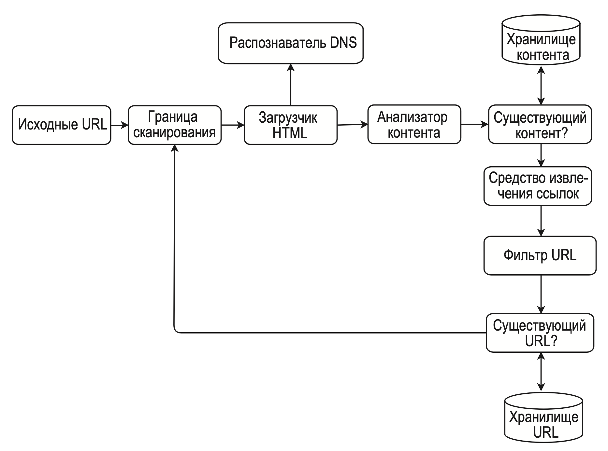
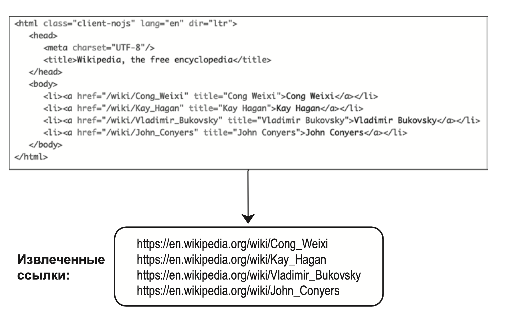
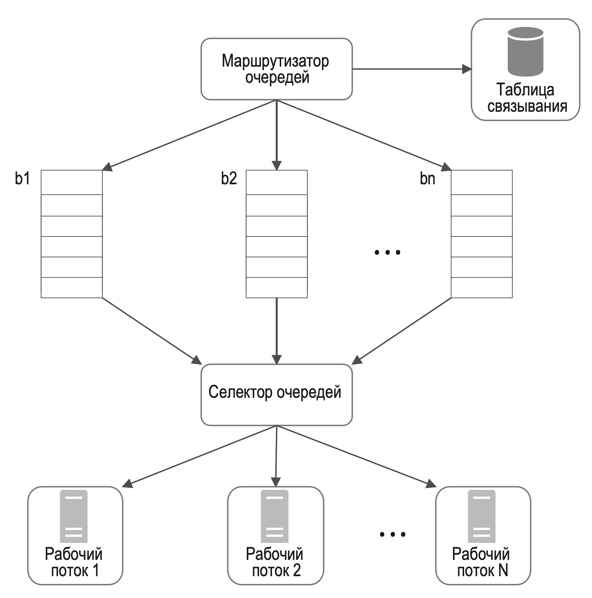
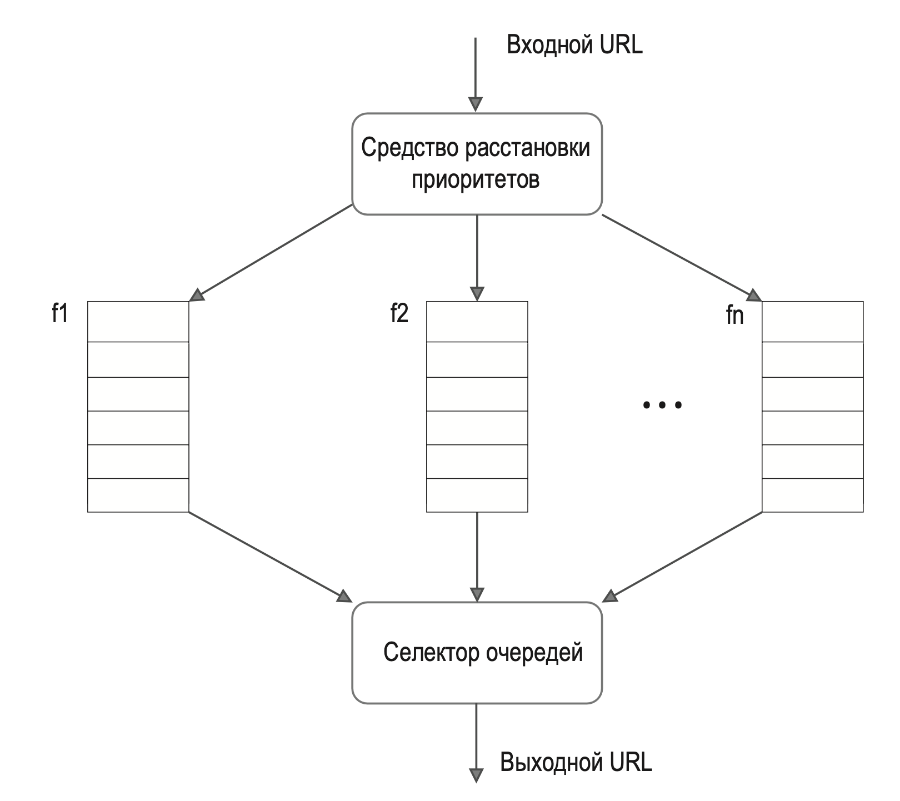
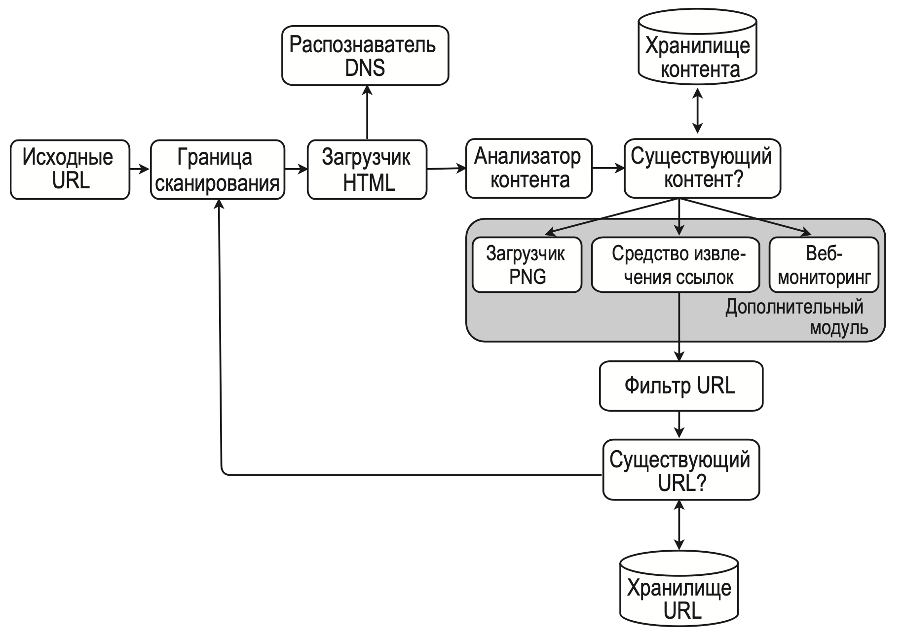

---
tags:
  - SystemDesign/Examples/SearchCrawler
aliases:
  - Системный дизайн - Примеры - Поисковой робот
---
# Поисковой робот

Сложность разработки поискового робота зависит от того, какой масштаб он должен поддерживать.

## ШАГ 1: ПОНЯТЬ ЗАДАЧУ И ОПРЕДЕЛИТЬ МАСШТАБ РЕШЕНИЯ

Поисковый робот работает по простому принципу:

1. На вход подается список URL-адресов, после чего загружаются соответствующие веб-страницы.
2. Из веб-страниц извлекаются URL-адреса.
3. Новые URL-адреса добавляются в список для дальнейшей загрузки.

Эти три шага повторяются заново.

| Вопрос                                                                                                                                  | Ответ                              |
| --------------------------------------------------------------------------------------------------------------------------------------- | ---------------------------------- |
| Каково основное назначение поискового робота? Он используется для индексации в поисковой системе, сбора данных или для чего-то другого? | Для индексации в поисковой системе |
| Сколько веб-страниц поисковый робот собирает в месяц?                                                                                   | 1 миллиард страниц                 |
| Какого рода контент мы ищем? Только HTML или другие ресурсы вроде PDF-файлов и изображений?                                             | Только HTML                        |
| Следует ли учитывать недавно добавленные или отредактированные веб-страницы?                                                            | Да                                 |
| Нужно ли хранить собранные HTML-страницы?                                                                                               | Да. Срок хранения — 5 лет          |
| Что делать с веб-страницами, содержимое которых дублируется?                                                                            | Их следует игнорировать            |

Необходимо учитывать следующие характеристики поискового робота:

- Масштабируемость. Интернет огромен. В нем миллиарды вебстраниц. Поисковый робот должен быть чрезвычайно эффективным и использовать параллельные вычисления.
- Устойчивость. Интернет полон ловушек. Вам постоянно будет встречаться некорректный HTML-код, неотзывчивые серверы, сбои, вредоносные ссылки и т. д. Поисковый робот должен справляться со всеми этими пограничными случаями.
- Вежливость. Поисковый робот не должен отправлять веб-сайту слишком много запросов за короткий промежуток времени.
- Расширяемость. Система должна быть гибкой, чтобы для поддержки новых видов контента не приходилось вносить масштабные изменения. Например, если в будущем нам понадобится собирать графические файлы, это не должно привести к переработке всей системы.

### Приблизительные оценки

Оценки очень приблизительные... 

- Предположим, что каждый месяц загружается 1 миллиард веб-страниц.
- QPS: $1 000 000 000 / 30 дней / 24 часа / 3600 секунд = ~400$ страниц в секунду.
- Пиковый показатель $QPS = 2 * QPS = 800$. Предположим, что средний размер веб-страницы составляет 500 Кб.
- 1 миллиард страниц * 500 Кб = 500 Тб в месяц для хранения.
- Если данные хранятся на протяжении пяти лет, 500 Тб * 12 месяцев * 5 лет = 30 Пб. 

## ШАГ 2: ПРЕДЛОЖИТЬ ОБЩЕЕ РЕШЕНИЕ И ПОЛУЧИТЬ СОГЛАСИЕ

### Исходные URL-адреса

Для обхода всего интернета нам нужно творчески подойти к выбору исходных URL-адресов. Хороший исходный URL-адрес позволит перебрать как можно большее количество ссылок. Общая стратегия — разделить пространство адресов на отдельные части.

### Граница сканирования

Большинство современных поисковых роботов делят контент на уже загруженный и ожидающий загрузки. Компонент, хранящий URL-адреса, предназначенные для загрузки, называется границей сканирования. Его можно считать очередью вида «первым пришел, первым ушел».

### Загрузчик HTML

Этот компонент загружает веб-страницы из интернета.

### Распознаватель DNS

Чтобы загрузить веб-страницу, URL сначала нужно перевести в IP-адрес.

### Анализатор контента

После загрузки веб-страницы ее нужно проанализировать: вдруг у нее некорректный HTML-код, который вызовет проблемы и только займет место в хранилище? Если разместить анализатор контента на одном сервере с поисковым роботом, это замедлит процесс сбора данных.

### Существующий контент?

Для эффективного выполнения этой задачи следует сравнивать не сами веб-страницы, а их хеши.

### Хранилище контента

Используется как диск, так и память.

- Большая часть контента хранится на диске, так как набор данных слишком большой и не умещается в памяти.
- Востребованный контент хранится в памяти для снижения латентности.

### Средство извлечения ссылок

Относительные пути преобразуются в абсолютные URL-адреса путем добавления префикса.

### Фильтр URL-адресов

Отклоняет определенные типы контента, расширения файлов, ссылки на страницы с ошибками и URL-адреса, занесенные в черный список.

### Существующий URL-адрес?

Отслеживает URL-адреса, которые уже посещались или находятся в границе сканирования.

Для реализации этого компонента обычно применяют такие методики, как фильтр Блума и хеш-таблица.

### Принцип работы поискового робота

- Шаг 1. Добавляем исходные URL-адреса в границу сканирования.
- Шаг 2. Загрузчик HTML берет список URL-адресов из границы сканирования.
- Шаг 3. Загрузчик HTML получает соответствующие IP-адреса от распознавателя DNS и начинает загрузку.
- Шаг 4. Анализатор контента разбирает HTML-страницы и проверяет их корректность.
- Шаг 5. После разбора и проверки контент передается компоненту «Существующий контент?».
- Шаг 6. Компонент «Существующий контент?» проверяет, есть ли данная HTML-страница в хранилище:
	- если есть, это означает, что этот контент находится по другому URL-адресу и мы его уже обработали. В этом случае HTML-страница отклоняется;
	- если нет, система еще не обрабатывала этот контент, поэтому он передается средству извлечения ссылок.
- Шаг 7. Из HTML-страниц извлекаются ссылки.
- Шаг 8. Извлеченные ссылки передаются фильтру URL-адресов.
- Шаг 9. После фильтрации ссылки передаются компоненту «Существующий URL-адрес?».
- Шаг 10. Компонент «Существующий URL-адрес?» проверяет, находится ли URL в хранилище. Если да, то он уже обрабатывался и больше ничего делать не нужно.
- Шаг 11. Если URL-адрес еще не обрабатывался, он добавляется в границу сканирования.

## ШАГ 3: ПОДРОБНОЕ ПРОЕКТИРОВАНИЕ

Самые важные составные компоненты и характеристики:

- границу сканирования;
- загрузчик HTML;
- устойчивость;
- расширяемость;
- обнаружение и отклонение проблемного контента.

### DFS и BFS

Процесс поиска можно рассматривать как обход направленного графа, начиная с корневой вершины.

- поиск в глубину (deep-first search, DFS) (не самый удачный вариант, так как граф может быть очень глубоким)
- поиск в ширину (breadth-first search, BFS) (основной используемый алгоритм)

Но есть две проблемы: 
- Большинство ссылок на странице "внутренние" - т.е. расположены на одном узле, и если обрабатывать их FIFO - то можно стать "невежливым" и заспамить ресурс
- Не учитывается приоритет адреса (значимость и качество у разных адресов разное)

### Граница сканирования

Она играет важную роль в соблюдении вежливости, расстановке приоритетов и обеспечении актуальности страниц.

#### Вежливость

Поисковый робот не должен отправлять серверу слишком много запросов за короткий промежуток времени. 

Основная идея соблюдения вежливости заключается в последовательной загрузке страниц с одного сервера. Между загрузками можно сделать задержку.

Доменные имена веб-сайтов нужно привязывать к потокам (рабочим узлам) загрузки.

- Маршрутизатор очереди. Следит за тем, чтобы каждая очередь (b1, b2, … bn) содержала URL-адреса только с одним доменным именем.
- Таблица связывания. Привязывает каждое доменное имя к очереди.
- Очереди FIFO b1, b2, …, bn. Каждая очередь содержит URL-адреса только с одним доменным именем.
- Селектор очередей. Каждый рабочий поток привязан к очереди FIFO, и все URL-адреса загружает только из нее. За логику выбора подходящей очереди отвечает селектор очередей.
- Рабочие потоки от 1 до N. Рабочий поток последовательно загружает веб-страницы из одного и того же сервера. Между загрузками можно предусмотреть задержку.

#### Приоритет

Мы назначаем URL-адресам приоритеты в зависимости от их ценности. При этом можно учитывать PageRank, популярность веб-сайта, частоту обновления и т. д. За это отвечает средство расстановки приоритетов.

- Средство расстановки приоритетов. Принимает на вход URL адреса и вычисляет их приоритеты.
- Очереди с f1 по fn. Каждой очереди назначается приоритет. Чем выше приоритет, тем больше вероятность того, что очередь будет выбрана.
- Селектор очередей. Выбирает произвольную очередь, отдавая предпочтение очередям с повышенным приоритетом.

#### Актуальность

Поисковый робот должен периодически проходиться по уже загруженным веб-страницам, чтобы поддерживать набор данных в актуальном состоянии.

#### Хранилище для границы сканирования

В настоящих поисковых системах количество URL-адресов на границе сканирования может достигать сотен миллионов. Хранить все на диске - медленно, в памяти - дорого. 

Гибридный подход: Основная часть на диске, в памяти - буфер, для хранения/удаления данных из очереди. Периодически скидываем буфер на диск. 

### Загрузчик HTML

Этот компонент загружает веб-страницы из интернета по протоколу HTTP.

#### Robots.txt

В нем можно указать страницы, которые позволено загружать поисковым роботам. Прежде чем начинать обход веб-сайта, поисковый робот должен сначала проверить соответствующий файл robots.txt и следовать его правилам.

#### Оптимизация производительности

1. Распределенный поиск. Для обеспечения высокой производительности процесс поиска должен быть распределен по разным серверам, каждый из которых работает в несколько потоков.
2. Кэширующий распознаватель DNS. Распознаватель DNS является узким местом поискового робота, так как многие интерфейсы DNS синхронны по своей природе, и DNS-запросы могут занимать какое-то время. Время DNS-ответа варьируется от 10 мс до 200 мс.
3. Локальность. Распределите серверы поискового робота географически. Чем ближе они к серверам веб-сайта, тем короче время загрузки.
4. Короткое время ожидания. Некоторые серверы отвечают медленно или вовсе не отвечают. Чтобы не ждать их слишком долго, указывается максимальное время ожидания. 

### Устойчивость

- Согласованное хеширование. Оно помогает распределить нагрузку между загрузчиками и позволяет добавлять и удалять серверы загрузки. 
- Сохранение состояния и данных поискового робота. Чтобы уберечься от сбоев, состояния и данные поискового робота записываются в систему хранения. 
- Обработка исключений. В крупномасштабных системах ошибки являются неизбежным и распространенным явлением. Поисковый робот должен как следует справляться с исключениями, не нарушая работу системы.
- Проверка корректности данных. Это важная мера для предотвращения системных ошибок.

### Расширяемость

Поисковый робот можно расширить за счет подключения новых модулей.

- Загрузчик PNG — это подключаемый модуль для загрузки PNG-файлов.
- Модуль веб-мониторинга подключается для отслеживания и предотвращения нарушений авторских прав и незаконного использования товарных знаков в интернете.

### Обнаружение и отклонение проблемного контента

1. Лишний контент. Как говорилось выше, около 30 % всех страниц являются дубликатами. Для их обнаружения можно использовать хеши или контрольные суммы.
2. Ловушки. Речь идет о веб-страницах, которые заставляют поискового робота входить в бесконечный цикл. Таких ловушек можно избежать, если установить максимальную длину URL-адресов. Но вообще, для их обнаружения не существует какого-то универсального метода.
3. Бессмысленные данные. Некоторый контент несет в себе мало смысла, а порой его нет вообще. Это относится к рекламе, листингам кода, спаму и т. д.

## ШАГ 4: ПОДВЕДЕНИЕ ИТОГОВ

Создание масштабируемого поискового робота — нетривиальная задача, ведь интернет огромен и полон ловушек.

Без внимания осталось еще много важного.

- Генерация страниц на стороне сервера. Многие веб-сайты генерируют ссылки на лету, используя JavaScript, AJAX и т. д. Чтобы решить эту проблему, перед разбором веб-страницы мы генерируем ее на сервере.
- Фильтрация нежелательных страниц. Поскольку емкость хранилища и ресурсы поискового робота ограничены, будет полезно использовать компонент для борьбы со спамом, который будет фильтровать низкокачественные и рекламные страницы.
- Репликация и сегментирование базы данных.
- Горизонтальное масштабирование. Для крупномасштабного обхода загрузкой должны заниматься сотни или даже тысячи серверов. Главное, чтобы они не хранили свое состояние.
- Доступность, согласованность и надежность. Это ключевые характеристики успеха любой крупной системы.
- Аналитика. Сбор и анализ данных — важная часть системы и ключевой элемент ее оптимизации.

## Дополнительные материалы

- By Christopher Olston, Marc Najork: Web Crawling. http://infolab.stanford.edu/~olston/publications/crawling_survey.pdf
- 29% Of Sites Face Duplicate Content Issues: https://tinyurl.com/y6tmh55y
- Rabin M.O., et al. Fingerprinting by random polynomials Center for Research in Computing Techn., Aiken Computation Laboratory, Univ. (1981)
- B. H. Bloom, “Space/time trade-offs in hash coding with allowable errors,” Communications of the ACM, vol. 13, no. 7, pp. 422–426, 1970.
- Donald J. Patterson, Web Crawling: https://www.ics.uci.edu/~lopes/teaching/cs221W12/slides/Lecture05.pdf
- Burton Bloom. Space/time trade-offs in hash coding with allowable errors. Communications of the ACM, 13(7), pages 422–426, July 1970.
- Google Dynamic Rendering: https://developers.google.com/search/docs/guides/dynamic-rendering
- T. Urvoy, T. Lavergne, and P. Filoche, “Tracking web spam with hidden style similarity,” in Proceedings of the 2nd International Workshop on Adversarial Information Retrieval on the Web, 2006.
- H.-T. Lee, D. Leonard, X. Wang, and D. Loguinov, “IRLbot: Scaling to 6 billion pages and beyond,” in Proceedings of the 17th International World Wide Web Conference, 2008.
