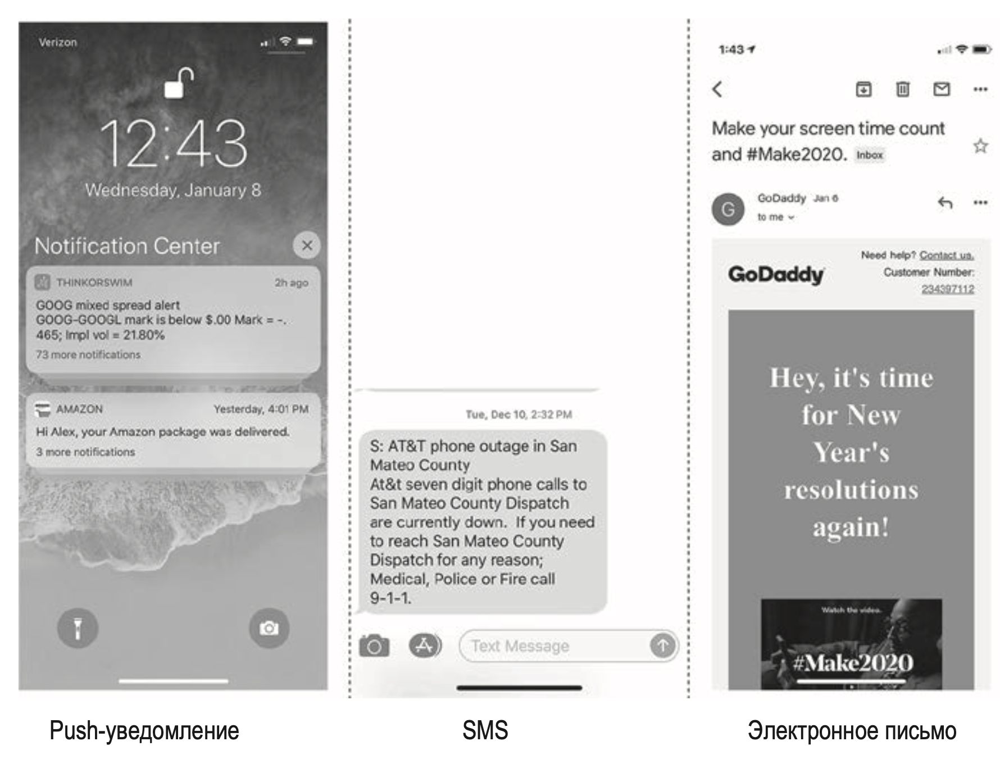
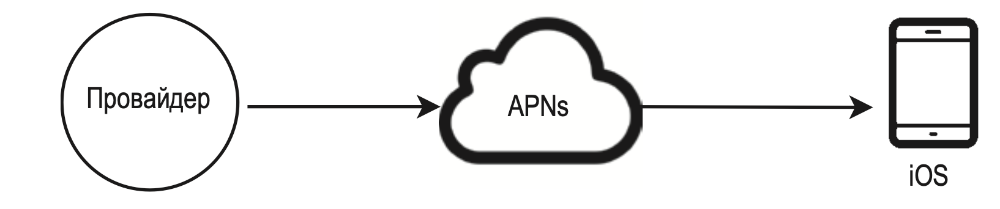
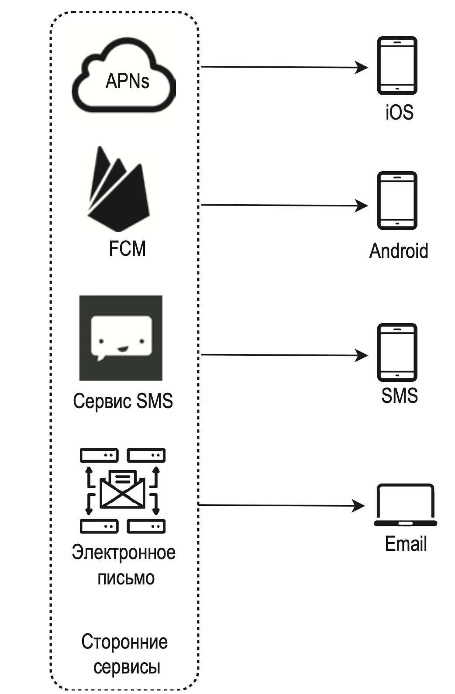
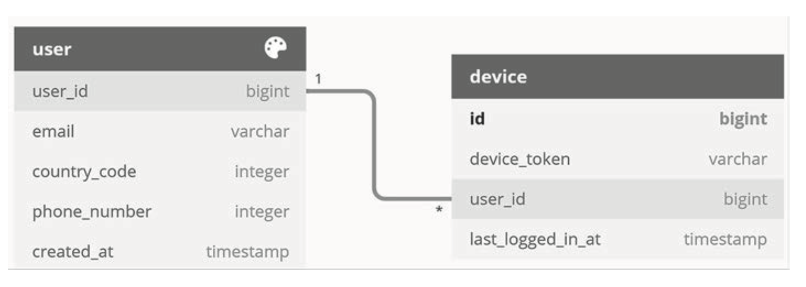
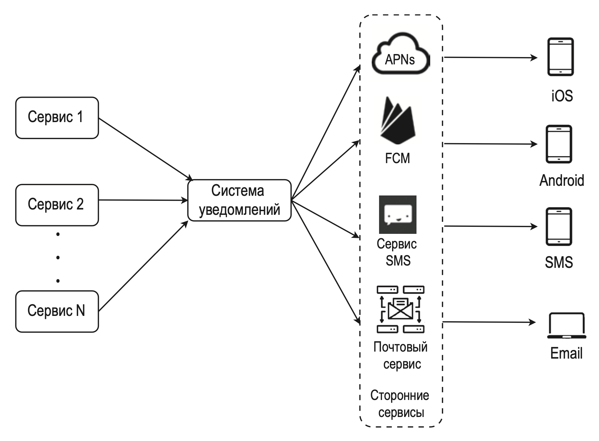
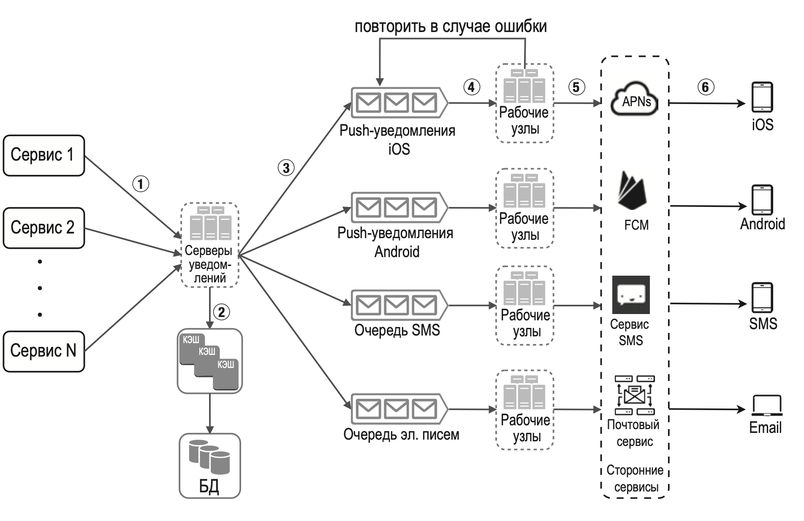
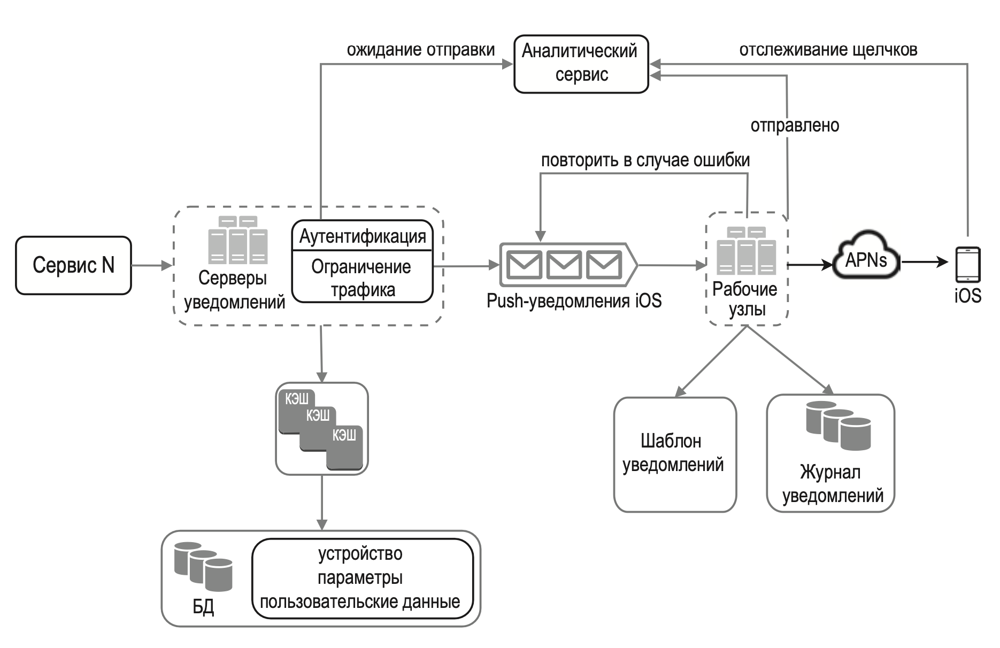

---
tags:
  - SystemDesign/Examples/Notifications
aliases:
  - Системный дизайн - Примеры - Система уведомлений
---
# Система уведомлений

Спроектировать систему уведомлений: мобильные push-уведомления, SMS и электронные письма. 



## ШАГ 1: ПОНЯТЬ ЗАДАЧУ И ОПРЕДЕЛИТЬ МАСШТАБ РЕШЕНИЯ


| Вопрос                                                         | Ответ                                                                                                                                                                                   |
| -------------------------------------------------------------- | --------------------------------------------------------------------------------------------------------------------------------------------------------------------------------------- |
| Какого рода уведомления поддерживает система?                  | Push-уведомления, SMS-сообщения и электронные письма                                                                                                                                    |
| Это система реального времени?                                 | Пусть это будет система мягкого реального времени. Мы хотим, чтобы пользователь получал уведомления как можно раньше. Но, если система сильно нагружена, допускаются небольшие задержки |
| Какие устройства поддерживаются?                               | Устройства iOS и Android, а также ноутбуки и ПК                                                                                                                                         |
| Что инициирует уведомления?                                    | Уведомления могут быть инициированы клиентскими приложениями или запланированы на стороне сервера                                                                                       |
| Есть ли у пользователей возможность отписаться от уведомлений? | Да, пользователи, решившие отписаться, больше не будут получать уведомления                                                                                                             |
| Сколько уведомлений отправляется ежедневно?                    | 10 миллионов мобильных push-уведомлений, 1 миллион SMS-сообщений и 5 миллионов электронных писем                                                                                        |

## ШАГ 2: ПРЕДЛОЖИТЬ ОБЩЕЕ РЕШЕНИЕ И ПОЛУЧИТЬ СОГЛАСИЕ

- разные типы уведомлений;
- процесс сбора контактной информации;
- процесс отправки/получения уведомлений.

### Разные типы уведомлений

#### Push-уведомления для iOS


Отправка push-уведомлений для iOS требует наличия трех основных компонентов:

- **Провайдер** - формирует и отправляет запрос сервису APN (Apple Push Notification). Для создания уведомления он использует следующие данные:
	- маркер устройства — уникальный идентификатор, который используется для отправки push-уведомлений;
	- полезные данные — словарь JSON с содержимым уведомления.

```json
{
	"aps":{
		"alert":{
			"title": "Game Request",
			"body":"Bob wants to play chess",
			"action-loc-key":"PLAY"
		},
	"badge":5
	}
}
```

- **APN** — удаленный сервис, предоставляемый компанией Apple для доставки push-уведомлений на устройства iOS.
- **Устройство iOS** — конечный клиент, который получает push-уведомления.

#### Push-уведомления для Android

Похожий механизм, но вместо APN обычно применяется сервис **FCM** (*Firebase Cloud Messaging*).

#### SMS-сообщения

Для рассылки SMS-сообщений обычно используются такие сторонние сервисы, как Twilio, Nexmo и многие другие. Остальное все так же.

#### Электронные письма

Есть возможность сконфигурировать собственные почтовые серверы, но можно использовать и сторонние коммерческие, которые будут быстрее и будут иметь дополнительную аналитику.



### Процесс сбора контактной информации

Для отправки уведомлений нам нужно собрать маркеры, телефонные номера или адреса электронной почты мобильных устройств. При установке нашего приложения или во время регистрации пользователь предоставляет контактную информацию, которую серверы API сохраняют в базе данных.



### Процесс отправки/получения уведомлений

#### Общая архитектура



- **Сервисы от 1 до N**. Это могут быть микросервисы, задания cron или распределенная система, которая инициирует отправку уведомлений с помощью событий.
- **Система уведомлений**. Это главный механизм отправки/получения уведомлений. Чтобы начать с чего-то простого, будем использовать один сервер, который предоставляет API-интерфейсы для сервисов от 1 до N и формирует содержимое уведомлений для сторонних сервисов.
- **Сторонние сервисы**. Сторонние сервисы отвечают за доставку уведомлений пользователям. При интеграции с ними нужно уделять внимание расширяемости. Благодаря расширяемости система становится гибкой и позволяет легко подключать и отключать сторонние сервисы.
- **iOS, Android, SMS, электронные письма**. Пользователи получают уведомления на свои устройства.

<u>Есть три проблемы</u>:

- Единая точка отказа из-за наличия лишь одного сервера.
- Плохая масштабируемость. Все, что касается push-уведомлений, происходит на одном сервере. 
- Узкое место производительности. На обработку и отправку уведомлений может уходить много ресурсов.

#### Улучшенная общая архитектура

- выносим базы данных и кэш за пределы сервера уведомлений;
- добавляем больше серверов уведомлений и настраиваем автоматическое горизонтальное масштабирование;
- добавляем очереди сообщений для разделения компонентов системы.



- **Сервисы от 1 до N** представляют разные сервисы, которые используют API серверов уведомлений.
- **Серверы уведомлений**. Они дают следующие возможности:
	- API для отправки уведомлений, доступные только внутри или для проверенных клиентов (чтобы предотвратить спам); 
	- базовая проверка адресов электронной почты, телефонных номеров и т. д.; 
	- извлечение из БД или информации, необходимой для формирования уведомления; 
	- запись уведомлений в очереди сообщений для параллельной обработки.
- **Кэш** — пользовательские данные, информация об устройстве и шаблоны уведомлений.
- **БД** хранит данные о пользователях, уведомлениях, настройках и пр.
- **Очереди сообщений** позволяют избавиться от зависимостей между компонентами и играют роль буферов, когда отправляется большой объем уведомлений. Каждому типу уведомлений назначается отдельная очередь, чтобы отказ одного стороннего сервиса не сказывался на отправке уведомлений других типов.
- **Рабочие узлы** — список серверов, которые достают события об уведомлениях из очереди сообщений и отправляют их соответствующим сторонним сервисам.
- **Сторонние сервисы**. Они уже обсуждались в описании исходной архитектуры.
- **iOS, Android, SMS, электронные письма**. Они уже обсуждались в описании исходной архитектуры.

## ШАГ 3: ПОДРОБНОЕ ПРОЕКТИРОВАНИЕ

Углубимся в следующие темы:

- Надежность.
- Дополнительные компоненты и функции: шаблон уведомлений, параметры уведомлений, ограничение трафика, механизм повторных вызовов, безопасность push-уведомлений, мониторинг ожидающих уведомлений и отслеживание событий.
- Обновленная архитектура.

### Надежность

#### Как предотвратить потерю данных?

> Одно из важнейших требований к системе уведомлений — она не должна терять данные.

Для удовлетворения этого требования система записывает уведомления в лог, который хранится в базе данных, и реализует механизм повторных вызовов.

#### Доходят ли уведомления до получателя строго в единственном экземпляре?

В большинстве случаев уведомление приходит ровно один раз, но из-за распределенной природы нашей системы порой случается дублирование. Чтобы это происходило реже, мы используем механизм устранения дубликатов и тщательно обрабатываем каждый неудачный случай.

### Дополнительные компоненты и функции

#### Шаблон уведомлений

Крупные системы ежедневно отправляют миллионы уведомлений, многие из которых имеют похожий формат. Чтобы не генерировать их все с нуля, мы используем шаблоны.

#### Параметры уведомлений

Дать пользователям возможность гибкого управления своими уведомлениями.

Прежде чем отправлять пользователю какие-либо уведомления, мы проверяем, желает ли он их получать.

#### Ограничение трафика (Rate Limit)

Чтобы не заваливать пользователя уведомлениями, мы можем ограничить их количество.

#### Механизм повторных вызовов

DEFER очереди

#### Безопасность push-уведомлений

В приложениях для iOS и Android защита API-интерфейсов push-уведомлений основана на appKey и appSecret

#### Мониторинг отложенных уведомлений

Без комментариев

#### Отслеживание событий

Процент открытия уведомлений, процент кликов и вовлеченность. Отслеживание событий реализует аналитический сервис, который обычно должен быть интегрирован в систему уведомлений.

### Обновленная архитектура

- Серверы уведомлений снабжены еще двумя важными функциями — аутентификацией и ограничением трафика.
- Мы также добавили механизм повторных вызовов для обработки ошибок при отправке уведомлений. Уведомления, которые не удается отправить, помещаются обратно в очередь сообщений, а рабочие узлы выполняют определенное количество повторных попыток.
- Шаблоны позволяют сделать процесс создания уведомлений согласованным и эффективным.
- Наконец, были добавлены механизмы мониторинга и отслеживания для проверки работоспособности системы и ее дальнейшего улучшения.



## Дополнительная информация

- You Cannot Have Exactly-Once Delivery: https://bravenewgeek.com/you-cannot-have-exactly-once-delivery/
- Security in Push Notifications: https://cloud.ibm.com/docs/services/mobilepush?topic=mobilepushnotification-security-in-push-notifications
- Key metrics forRabbitMQ: www.datadoghq.com/blog/rabbitmq-monitoring
