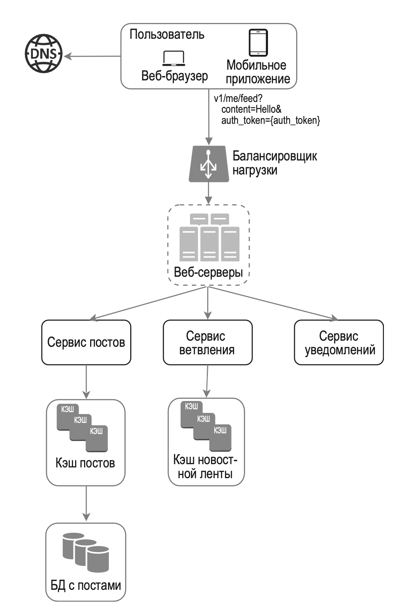
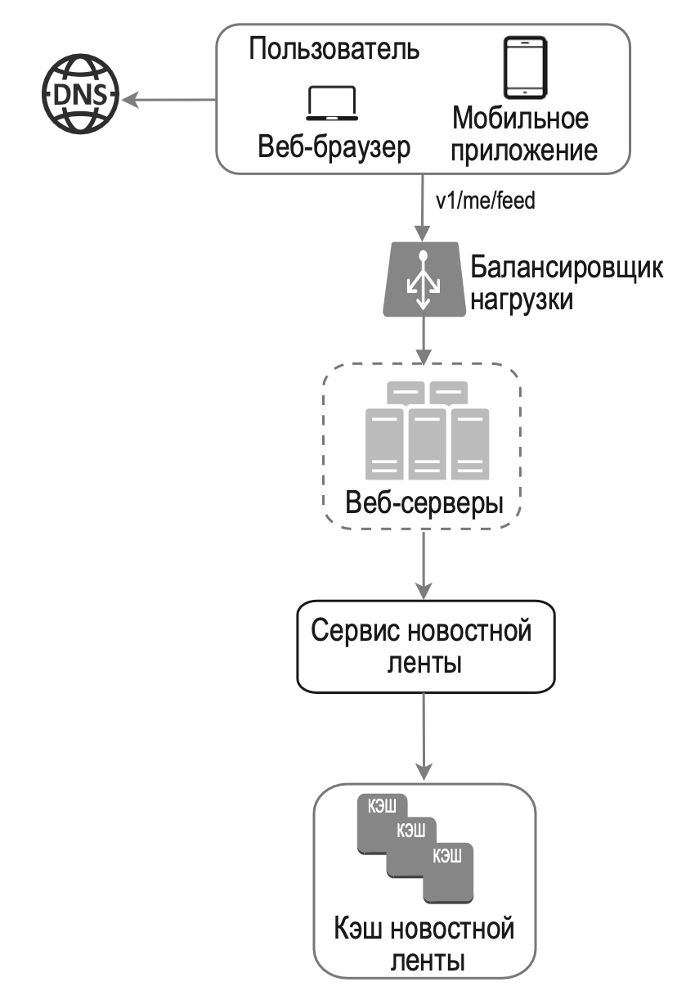
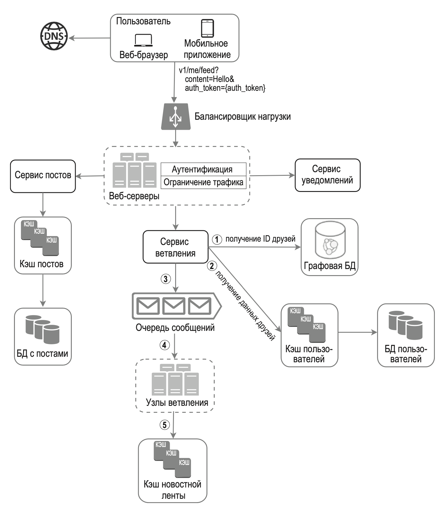
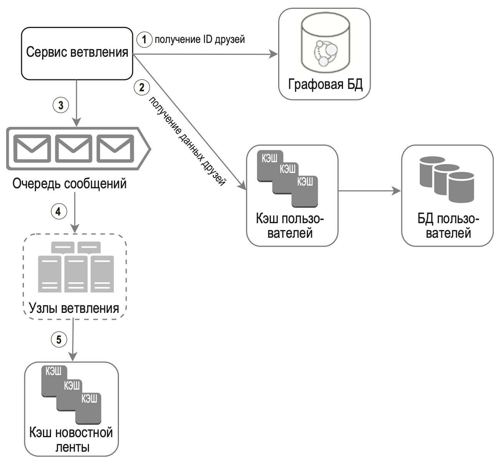
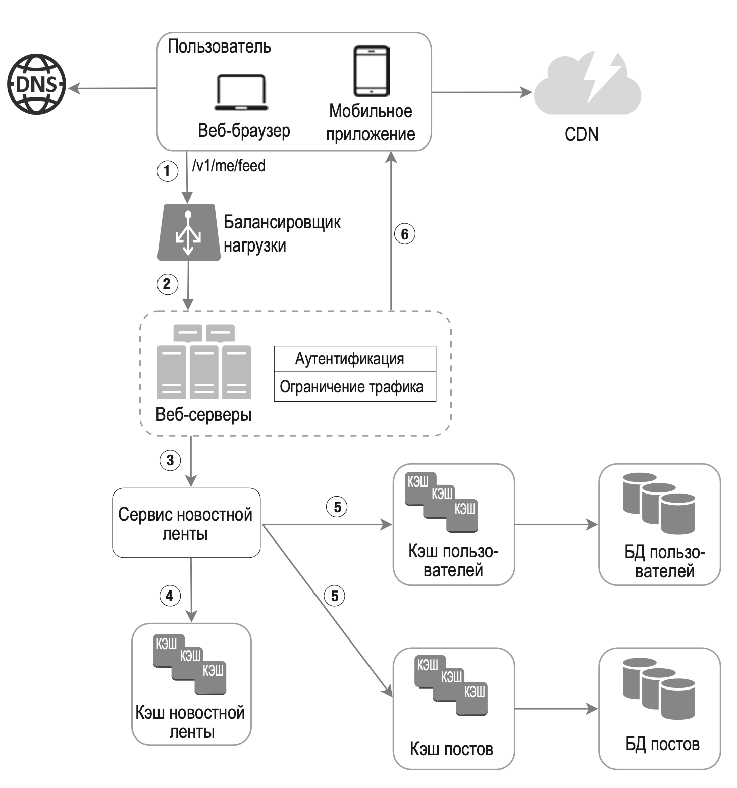
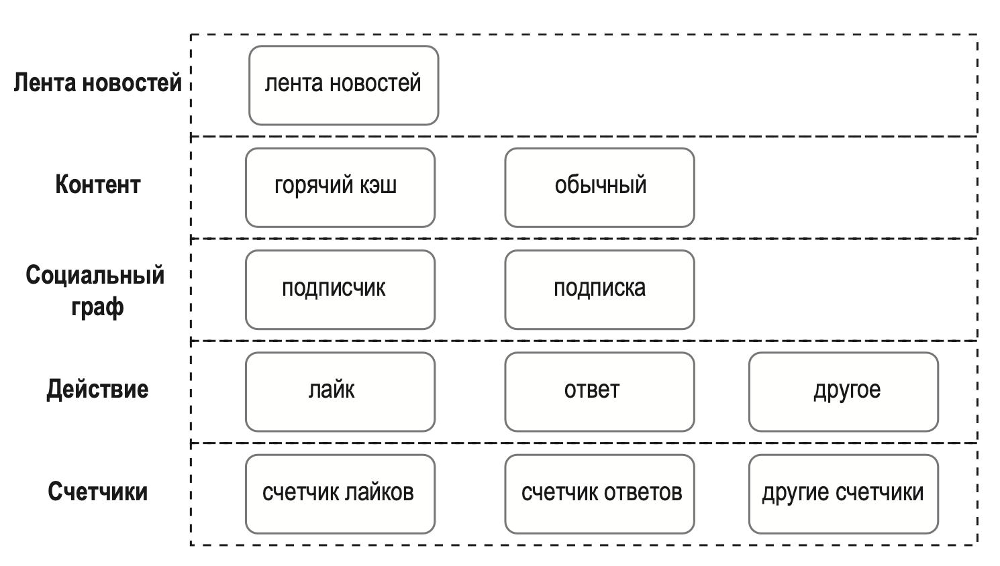

---
tags:
  - SystemDesign/Examples/NewsFeed
aliases:
  - Системный дизайн - Примеры - Лента новостей
---
# Лента новостей

> Лента новостей — это постоянно обновляемый список историй в центральной части вашей домашней страницы. Она включает обновления информации о состоянии, фотографии, видео, ссылки, активность приложений и лайки, приходящие от людей, страниц и групп, на которые вы подписаны

## ШАГ 1: ПОНЯТЬ ЗАДАЧУ И ОПРЕДЕЛИТЬ МАСШТАБ РЕШЕНИЯ


| Вопрос                                                                                                                                                               | Ответ                                                                                     |
| -------------------------------------------------------------------------------------------------------------------------------------------------------------------- | ----------------------------------------------------------------------------------------- |
| Это приложение должно быть мобильным, браузерным или и тем и другим?                                                                                                 | И тем и другим                                                                            |
| Какие его основные возможности?                                                                                                                                      | Пользователь может публиковать посты и просматривать ленту новостей с постами его друзей  |
| Лента новостей сортируется в обратном хронологическом порядке или по какому-то другому принципу? Например, статьи от близких друзей могут иметь повышенный приоритет | Чтобы не усложнять, предположим, что лента сортируется в обратном хронологическом порядке |
| Сколько друзей может быть у пользователя?                                                                                                                            | 5000                                                                                      |
| Какой объем трафика?                                                                                                                                                 | 10 миллионов DAU                                                                          |
| Может ли лента в дополнение к тексту содержать изображения и видео?                                                                                                  | Да, она может содержать медиафайлы, включая изображения и видео                           |

## ШАГ 2: ПРЕДЛОЖИТЬ ОБЩЕЕ РЕШЕНИЕ И ПОЛУЧИТЬ СОГЛАСИЕ

- Публикация постов. Когда пользователь публикует пост, соответствующие данные записываются в кэш и в базу данных. Затем пост появляется в ленте новостей друзей пользователя.
- Составление новостной ленты. Чтобы не усложнять, предположим, что лента формируется путем агрегации постов друзей в обратном хронологическом порядке.

### API ленты новостей

API ленты новостей — это основной механизм взаимодействия клиентов с серверами.

#### API для публикации постов

```curl
POST /v1/me/feed
```

Параметры:

- content: текст поста;
- auth_token: используется для аутентификации API-запросов.

#### API для получения ленты

```curl
GET /v1/me/feed
```

Параметры:

- auth_token: используется для аутентификации API-запросов.

### Публикация статей



- Пользователь может просматривать ленты новостей в браузере или в мобильном приложении. Чтобы опубликовать пост с текстом Hello, используется следующий API-вызов:

```curl
/v1/me/feed?content=Hello&auth_token={auth_token}
```

- Балансировщик нагрузки распределяет трафик между серверами.
- Веб-серверы перенаправляют трафик к разным внутренним сервисам.
- Сервис постов сохраняет статьи в базе данных и кэше.
- Сервис ветвления добавляет новый контент в новостные ленты друзей. Данные новостной ленты хранятся в кэше, чтобы их можно было быстро извлечь. 
- Сервис уведомлений. Сообщает друзьям о появлении нового контента и рассылает push-уведомления.

### Составление ленты новостей



- Пользователь отправляет запрос для получения своей ленты новостей. Запрос имеет вид /v1/me/feed.
- Балансировщик нагрузки направляет трафик к веб-серверам.
- Веб-серверы направляют запросы к серверу новостной ленты.
- Сервис новостной ленты извлекает ленту новостей из кэша.
- Кэш новостной ленты хранит идентификаторы статей, необходимые для составления ленты новостей.

## ШАГ 3: ПОДРОБНОЕ ПРОЕКТИРОВАНИЕ

### Подробно о публикации статей

#### Веб-серверы

- Помимо взаимодействия с клиентами, веб-серверы отвечают за аутентификацию и ограничение трафика.
- Публиковать посты разрешено только пользователям, которые предоставили при входе в систему действительное значение auth_token.
- Система ограничивает количество постов, которое можно публиковать за определенный промежуток времени.

#### Сервис ветвления

Сервис ветвления доставляет посты всем вашим друзьям. Он может быть основан на двух моделях: 
- ветвление при записи (пассивная модель)
- ветвление при чтении (активная модель).

**Ветвление при записи**. В рамках этого подхода лента новостей составляется во время записи. После публикации новый пост сразу же помещается в кэш друзей.



Преимущества:

- новостная лента генерируется в реальном времени и сразу становится доступной для друзей;
- получение новостной ленты происходит быстро, так как она составляется во время записи.

Недостатки:

- если у пользователя много друзей, получение их списка и генерация новостной ленты для каждого из них будет происходить медленно. Это называется проблемой горячих клавиш (проблема знаменитостей);
- если пользователь неактивен или редко входит в систему, составление его новостной ленты будет пустой тратой вычислительных ресурсов.

**Ветвление при чтении**. Лента новостей генерируется во время чтения. Последние посты загружаются, когда пользователь загружает домашнюю страницу.

Преимущества:

- ветвление при чтении лучше подходит для пользователей, которые не очень активны или редко входят в систему, так как при этом на них не тратятся лишние ресурсы;
- данные не заносятся в кэш каждого друга, поэтому при большом количестве друзей проблем не возникает.

Недостатки:

- загрузка новостной ленты происходит медленно, поскольку она не составляется заранее.


**Гибридный поход**, чтобы получить преимущества обеих моделей и избежать их недостатков. Нам крайне важно, чтобы ленту новостей можно было получить быстро, поэтому:

- для большинства пользователей преду­смотрена модель push. 
- Контент знаменитостей и пользователей с большим количеством друзей/подписчиков можно запрашивать по требованию, чтобы не перегружать систему. 
- Согласованное хеширование позволяет справляться с большим количеством друзей за счет более равномерного распределения запросов/данных.



1. Извлекаем идентификаторы друзей из графовой базы данных.
2. Получаем информацию о друзьях из кэша пользователей. Система фильтрует полученный список с учетом пользовательских настроек. Например, если вы решили «заглушить» одного из своих друзей, его посты не попадут в вашу ленту. Пост также может быть скрыт по той причине, что пользователь решил поделиться информацией лишь с определенным кругом друзей или скрыть его от других людей.
3. Отправляем список друзей и ID новой статьи в очередь сообщений.
4. Узлы ветвления достают данные из очереди сообщений и сохраняют содержимое ленты новостей в кэше. Новые посты добавляются в нее в момент создания. Если хранить в кэше данные о пользователях и содержимое постов, расход памяти сильно вырастет. Поэтому мы храним лишь идентификаторы. Чтобы ограничить расход памяти, мы устанавливаем лимит, который можно настраивать. Вероятность того, что пользователь будет прокручивать тысячи постов, невысока. Большинство людей интересуются самым новым контентом, поэтому доля промахов кэша остается низкой.
5. Сохраняем <post_id, user_id> в кэш ленты новостей.

### Подробно о получении ленты новостей


1. Пользователь отправляет запрос вида /v1/me/feed, чтобы получить свою ленту новостей.
2.  Балансировщик нагрузки распределяет запросы между вебсерверами.
3. Веб-серверы обращаются за новостной лентой к соответствующему сервису.
4. Сервис извлекает из кэша новостной ленты список с идентификаторами постов.
5. Лента новостей пользователя не ограничивается списком идентификаторов. Она содержит имена пользователей, аватары, текст постов, изображения и т. д. Таким образом, сервис новостной ленты извлекает полные данные о пользователях и постах из соответствующих кэшей, чтобы составить полноценную автоматизированную ленту новостей.
6. Полноценная лента новостей возвращается на клиент в формате JSON для дальнейшего отображения.

### Архитектура кэширования


- Лента новостей хранит идентификаторы постов.
- Контент хранит данные каждого поста. Популярный контент находится в горячем кэше.
- Социальный граф хранит данные об отношениях между пользователями.
- Действие хранит информацию о действиях пользователя по отношению к посту: лайкнул, оставил ответ или что-то другое.
- Счетчики включают счетчики лайков, ответов, подписчиков, тех, на кого пользователь подписан, и т. д.

## ШАГ 4: ПОДВЕДЕНИЕ ИТОГОВ

<u>Масштабирование базы данных</u>:

- вертикальное и горизонтальное масштабирование;
- SQL и NoSQL;
- репликация вида «ведущий–ведомый»;
- реплики для чтения;
- модели согласованности;
- шардинг базы данных.

<u>Несколько советов</u>:

- не храните состояние веб-уровня;
- кэшируйте данные как можно активнее;
- обеспечьте поддержку разных центров обработки данных;
- ослабьте связанность компонентов с помощью очередей сообщений;
- отслеживайте ключевые метрики, такие как QPS, в часы пик и латентность в момент, когда пользователи обновляют свои новостные ленты.

## Дополнительная информация

- How News Feed Works: https://www.facebook.com/help/327131014036297/
- Friend of Friend recommendations Neo4j and SQL Server: https://web.archive.org/web/20210116003626/http://geekswithblogs.net/brendonpage/archive/2015/10/26/friend-of-friend-recommendations-with-neo4j.aspx

