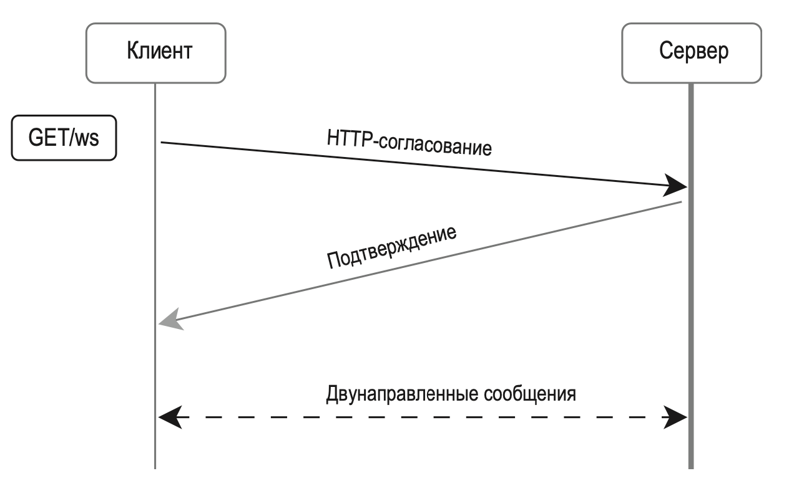
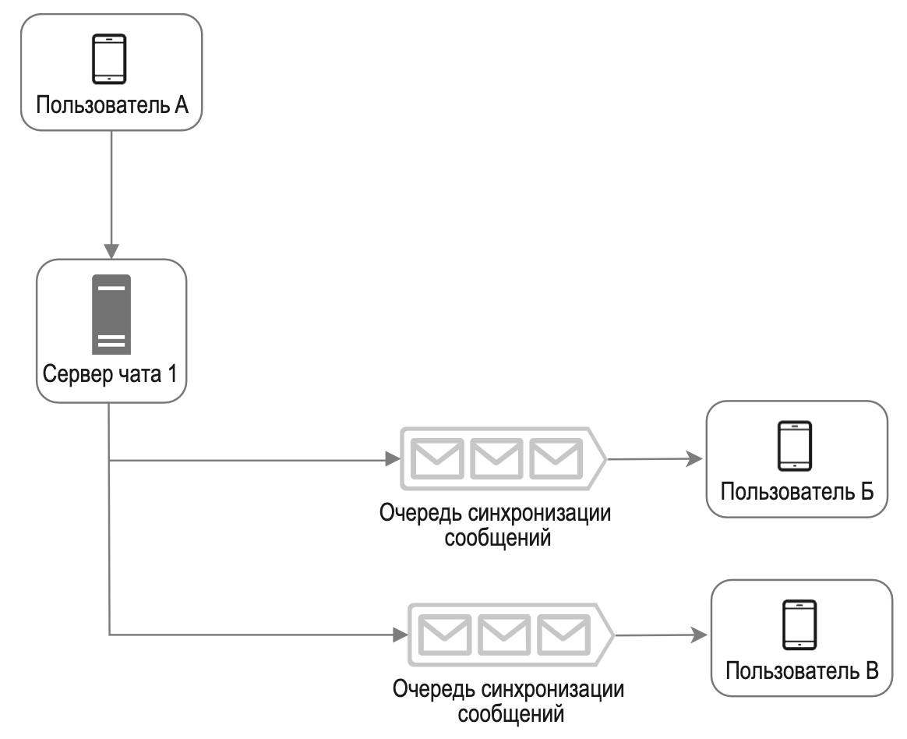

---
tags:
  - SystemDesign/Examples/ChatSystem
aliases:
  - Системный дизайн - Примеры - Система мгновенных сообщений
---
# Система мгновенного обмена сообщениями

## ШАГ 1: ПОНЯТЬ ЗАДАЧУ И ОПРЕДЕЛИТЬ МАСШТАБ РЕШЕНИЯ

Необходимо понять, на взаимодействии какого типа следует сосредоточиться: приватном (между двумя пользователями) или групповом.

| Вопрос                                                                          | Ответ                                                                                                    |
| ------------------------------------------------------------------------------- | -------------------------------------------------------------------------------------------------------- |
| Какого рода чат мы будем проектировать: приватный (один на один) или групповой? | Чат должен поддерживать оба вида взаимодействия                                                          |
| Это приложение должно быть мобильным, браузерным или и тем и другим?            | И тем и другим                                                                                           |
| Каков масштаб этого приложения? Стартап или огромная система?                   | Оно должно поддерживать 50 миллионов ежедневных активных пользователей (DAU)                             |
| Что касается группового чата, насколько большой может быть группа?              | Не больше 100 человек                                                                                    |
| Какими важными возможностями обладает система? Поддерживает ли она вложения?    | Приватный и групповой чат, индикатор присутствия в сети. Система поддерживает только текстовые сообщения |
| Ограничен ли размер сообщений?                                                  | Да, длина текста не должна превышать 100 000 символов                                                    |
| Требуется ли сквозное шифрование?                                               | Пока что нет, но мы это обсудим, если время позволит                                                     |
| Как долго должна храниться история переписки?                                   | Вечно                                                                                                    |

В итоге сосредоточимся на: 

- приватный чат с низкой латентностью доставки сообщений;
- небольшой групповой чат (не больше 100 человек);
- индикатор сетевого статуса;
- поддержка нескольких устройств;
- push-уведомления.
- Наша архитектура должна поддерживать 50 миллионов DAU.

## ШАГ 2: ПРЕДЛОЖИТЬ ОБЩЕЕ РЕШЕНИЕ И ПОЛУЧИТЬ СОГЛАСИЕ

Сервис чата должен поддерживать следующие функции:

- прием сообщений от других клиентов;
- поиск подходящего получателя для каждого сообщения и передача сообщений получателям;
- временное хранение сообщений на сервере, если их получатель не в сети.

Для сервиса чата ­ выбор протокола имеет значение.

Протокол HTTP хорошо работает на стороне сервера, и многие системы обмена сообщениями, такие как Facebook, изначально использовали именно его.

Однако на стороне получателя все немного сложнее. Поскольку в HTTP соединение инициирует клиент, отправить сообщение с сервера не так-то просто.

### HTTP-опрос

Клиент периодически спрашивает сервер о наличии новых сообщений. В большинстве случаев не несет в себе никакой полезной информации.

### Длинный HTTP-опрос

При длинном HTTP-опросе клиент оставляет соединение открытым, пока не появятся новые сообщения или пока не истечет время ожидания. Получив новые сообщения, клиент немедленно отправляет серверу еще один запрос, повторяя весь процесс заново. У длинного HTTP-опроса есть несколько недостатков.

- Отправитель и получатель могут быть подключены к разным серверам чата. HTTP-серверы обычно не хранят свое состояние. Если вы балансируете нагрузку путем циклического перебора, у сервера, принявшего сообщение, может не быть соединения с клиентом, которому это сообщение направлено.
- У сервера нет хорошего механизма для определения того, отключился ли клиент.
- Это неэффективный подход. Если пользователь не слишком активен, время ожидания будет периодически истекать и соединение будет устанавливаться заново.

### WebSocket

Это наиболее распространенное решение для передачи асинхронных обновлений от сервера к клиенту. 

Соединение по WebSocket инициируется клиентом. Оно является двунаправленным и постоянным. Все начинается с HTTP-соединения, которое можно «модернизировать» до WebSocket с помощью определенной процедуры согласования. По этому постоянному соединению сервер может отправлять обновления клиенту. Соединения по WebSocket обычно работают даже при наличии брандмауэра. Все благодаря тому, что они используют порты 80 или 443, принадлежащие протоколам HTTP/HTTPS.

### Общая архитектура

В системе может (и должно) использоваться и обычные HTTP запросы и WebSockets

#### Сервисы без сохранения состояния

Сервисы без сохранения состояния традиционно используются для взаимодействия с клиентами по принципу «запрос–ответ». На их основе реализованы такие функции, как вход в систему, регистрация, профили пользователей и т. д.

Сервисы без сохранения состояния находятся за балансировщиком нагрузки.

Основная задача этого компонента состоит в возвращении клиенту списка доменных имен, принадлежащих серверам чата, к которым можно подключиться.

#### Сервисы с сохранением состояния

Единственный сервис, который хранит свое состояние, — это чат. 

#### Интеграция со сторонними сервисами

Для такого приложения, как чат, самым важным сторонним сервисом являются push-уведомления.

#### Масштабируемость

Если предположить, что каждое пользовательское соединение занимает 10 Кб (это очень грубая оценка, которая сильно зависит от выбранного языка программирования), то для того, чтобы все они уместились на одном сервере, потребуется 10 Гб оперативной памяти.

- Серверы чата отвечают отправкой/получением сообщений. 
- Серверы присутствия следят за тем, находятся ли пользователи в сети.
- Серверы API занимаются всем остальным, включая вход в систему, регистрацию, редактирование профиля и т. д. 
- Серверы уведомлений отправляют push-уведомления.
- И наконец, хранилище типа «ключ–значение» используется для хранения истории переписки. Когда пользователь появляется в сети, он видит все предыдущие сообщения.

#### Хранилище

Очень важно определиться с тем, какая база данных нам лучше подходит: реляционная или NoSQL. Чтобы сделать обоснованный выбор, необходимо исследовать типы данных и модель чтения/записи.

В типичной системе мгновенного обмена сообщениями существует два вида данных. Первый вид, обобщенный, включает в себя профили пользователей, настройки и списки друзей. Такие данные хранятся в устойчивой и надежной реляционной БД. Для соответствия требованиям доступности и масштабируемости обычно применяются репликация и сегментирование.

Второй вид данных встречается только в системах мгновенного обмена сообщениями. Здесь важно понять модель чтения/записи.

- Такие системы обрабатывают огромные объемы данных.
- Активный доступ осуществляется только к недавним чатам.
- В большинстве случаев просматривается только самая свежая история сообщений, но пользователи могут обращаться к функциям, требующим произвольного доступа, таким как поиск, просмотр сообщений, в которых упоминается ваше имя, переход к определенным сообщениям и т. д. 
- В приватных чатах чтение и запись происходят примерно с одинаковой частотой.

Использовать хранилища типа «ключ–значение» по следующим причинам:

- хранилища типа «ключ–значение» легко поддаются горизонтальному масштабированию;
- хранилища типа «ключ–значение» имеют низкую латентность обращения к данным;
- реляционные БД плохо справляются с длинными последовательностями данных. С увеличением индекса замедляется произвольный доступ.
- хранилища типа «ключ–значение» применяются в других надежных системах мгновенного обмена сообщениями, проверенных временем.

### Модели данных

Самыми важными данными являются сообщения.

#### Таблица сообщений для приватного чата

#### Таблица сообщений для группового чата

#### ID-сообщения

Должно удовлетворять следующим двум требованиям:

- идентификаторы должны быть уникальными;
- идентификаторы должны поддерживать сортировку по времени, то есть у новых строк идентификаторы должны быть больше, чем у старых.

## ШАГ 3: ПОДРОБНОЕ ПРОЕКТИРОВАНИЕ

### Обнаружение сервисов

Основная задача механизма обнаружения сервисов — предложить клиенту лучший сервер чата с учетом таких критериев, как географическое местоположение, емкость сервера и т. д. Популярное решение — система с открытым исходным кодом Apache Zookeeper.

1. Пользователь A пытается войти в приложение.
2. Балансировщик нагрузки передает запрос входа в систему серверам API.
3. Когда внутренняя часть системы аутентифицирует пользователя, механизм обнаружения сервисов подберет для него наиболее подходящий сервер чата. В этом примере выбран сервер 2, и информация о нем возвращается обратно пользователю.
4. Пользователь A подключается к серверу чата 2 по WebSocket.

### Маршруты прохождения сообщений

#### Маршрут прохождения сообщений в приватном чате

#### Синхронизация сообщений между несколькими устройствами

Каждое устройство использует переменную под названием cur_max_message_id для отслеживания ID последнего сообщения. Сообщения считаются новыми, если они соответствуют следующим двум условиям:

- ID получателя совпадает с ID текущего аутентифицированного пользователя.
- ID сообщения в хранилище типа «ключ–значение» больше, чем cur_max_message_id.

#### Маршрут прохождения сообщений в небольшом групповом чате

Сначала сообщение пользователя A копируется в очередь синхронизации сообщений каждого участника группы.

Такая архитектура хорошо подходит для небольших групп, потому что:

- она упрощает процесс синхронизации, так как для получения новых сообщений каждый клиент должен проверять собственный почтовый ящик;
- в небольших группах хранение копии сообщения в почтовом ящике каждого получателя забирает мало ресурсов.

### Сетевой статус

Индикатор сетевого статуса — неотъемлемая часть многих приложений для мгновенного обмена сообщениями.

#### Вход пользователя в систему

После установления соединения на основе WebSocket между клиентом и сервисом реального времени сетевой статус пользователя A и временная метка last_active_at записываются в хранилище типа «ключ–значение».

#### Выход из системы

В хранилище типа «ключ–значение» сетевой статус меняется на offline.

#### Отключение пользователя от сети

Для решения этой проблемы мы воспользуемся механизмом пульсации. Время от времени клиент шлет серверам сетевого статуса события. Если в течение какого-то времени (скажем, x секунд) серверы получили событие пульсации, они считают, что пользователь находится в сети. В противном случае пользователь недоступен.

#### Распространение информации о сетевом статусе

Серверы сетевого статуса используют модель «издатель–подписчик», в которой между каждой парой друзей существует канал.

Но если мы имеем дело с крупными группами, на информирование каждого участника о сетевом статусе будет уходить много ресурсов и времени. Чтобы избавиться от этой проблемы, можно получать сетевой статус пользователя, только когда он заходит в группу или вручную обновляет список друзей.

## Дополнительные аспекты

- Приложение можно расширить для поддержки медиафайлов, таких как фотографии и видео. Медиафайлы имеют намного больший размер по сравнению с текстом. Можно обсудить такие вещи, как сжатие, облачное хранение и миниатюрные изображения.
- Сквозное шифрование. WhatsApp поддерживает сквозное шифрование сообщений. 
- Кэширование сообщений на стороне клиента — эффективный способ сокращения объема данных, передаваемых между клиентом и сервером.
- Сокращение времени загрузки. Компания Slack создала географически распределенную сеть для кэширования пользовательских данных, каналов и т. д.
- Обработка ошибок:
	- ошибки на сервере чата. У сервера чата могут быть сотни тысяч (или даже больше) постоянных сетевых соединений. Если он выйдет из строя, механизм обнаружения сервисов (Zookeeper) предоставит клиентам новый сервер чата, к которому они смогут подключаться;
	- механизм повторной отправки сообщений. В случае ошибки сообщения обычно записываются в очередь и затем отправляются повторно.

## Дополнительные материалы

- Messenger and WhatsApp process 60 billion messages a day: https://www.theverge.com/2016/4/12/11415198/facebook-messenger-whatsapp-number-messages-vs-sms-f8-2016
- Длинный хвост: https://ru.wikipedia.org/wiki/Длинный_хвост
- The Underlying Technology of Messages: https://www.facebook.com/notes/facebook-engineering/the-underlying-technology-of-messages/454991608919/
- How Discord Stores Billions of Messages: https://blog.discordapp.com/how-discord-stores-billions-of-messages-7fa6ec7ee4c7
- Announcing Snowflake: https://blog.twitter.com/engineering/en_us/a/2010/announcing-snowflake.html
- Apache ZooKeeper: https://zookeeper.apache.org/
- End-to-end encryption: https://faq.whatsapp.com/en/android/28030015/
- Flannel: An Application-Level Edge Cache to Make Slack Scale: https://slack.engineering/flannel-an-application-level-edge-cache-tomake-slack-scale-b8a6400e2f6b
