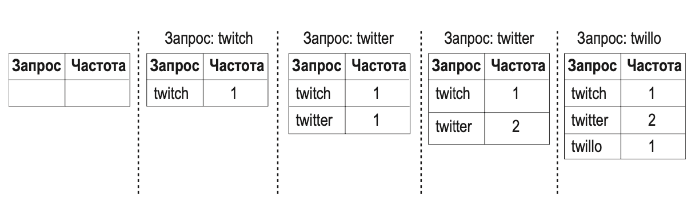
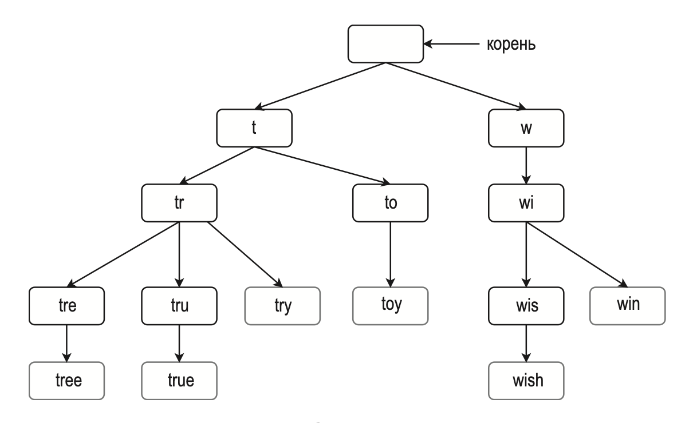
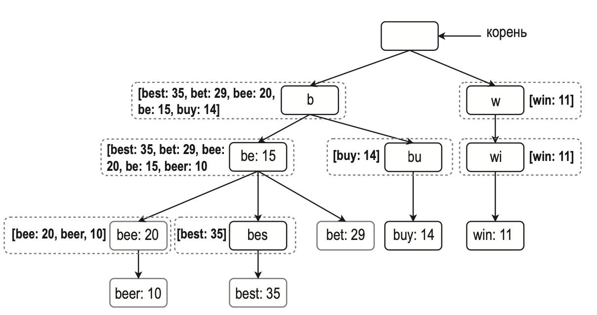
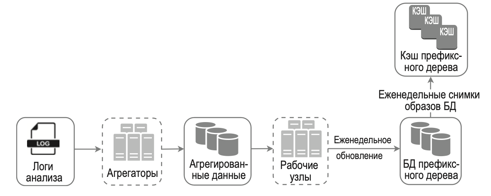
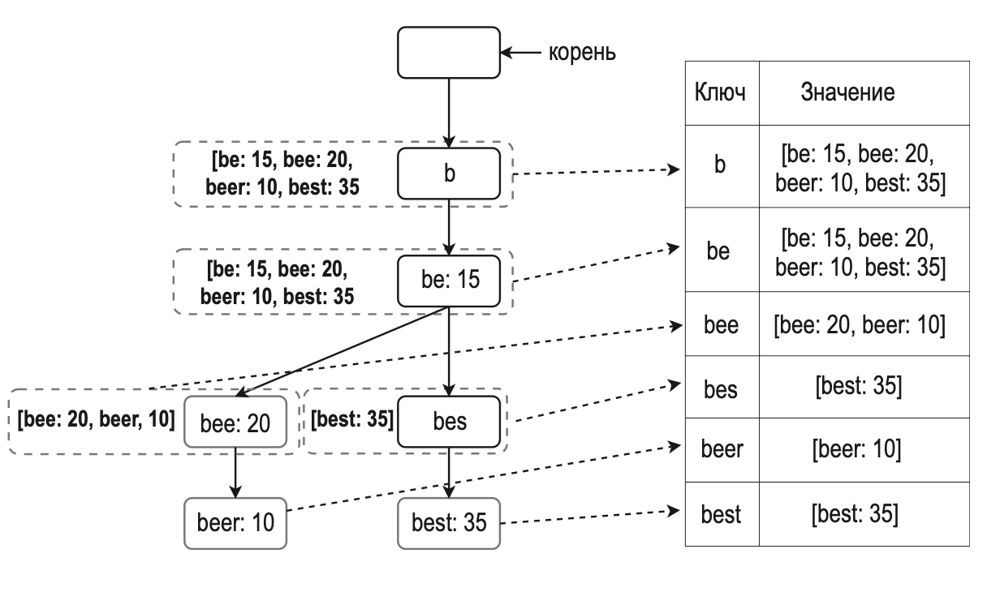
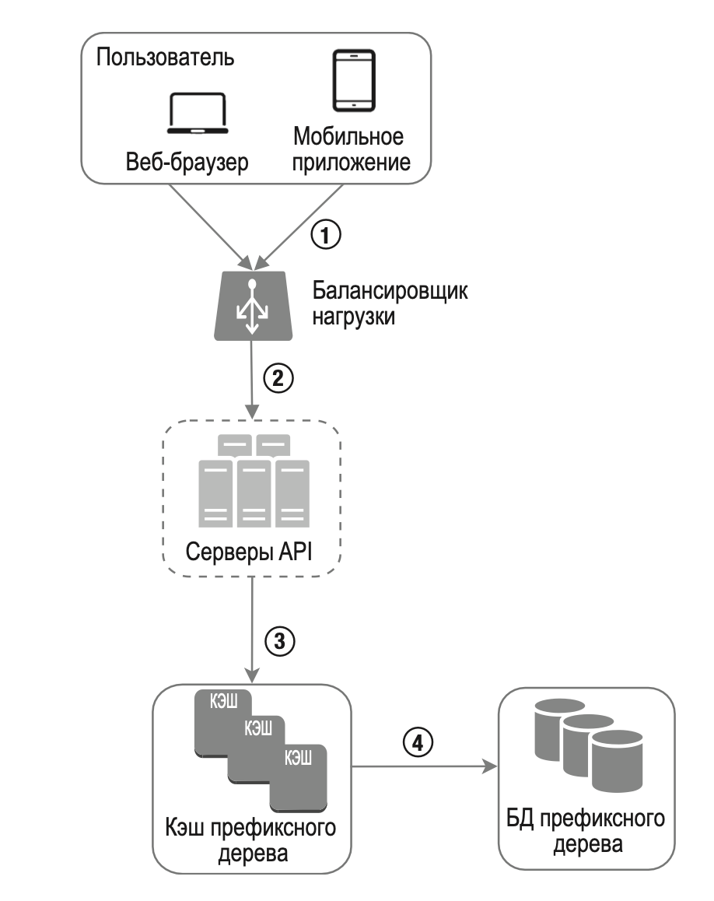
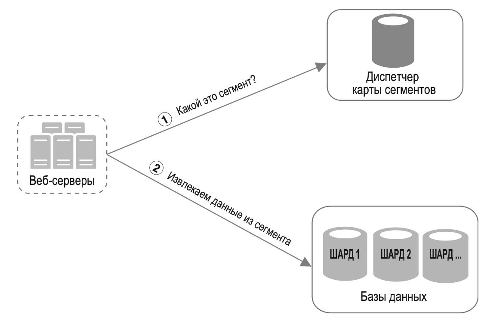

---
tags:
  - SystemDesign/Examples/SearchQueries
aliases:
  - Системный дизайн - Примеры - Автозаполнение поисковых запросов
---
# Автозаполнение поисковых запросов

Вариации названий: 

- Реализуйте алгоритм топ-k
- Сформируйте список из k самых популярных поисковых запросов

## ШАГ 1: ПОНЯТЬ ЗАДАЧУ И ОПРЕДЕЛИТЬ МАСШТАБ РЕШЕНИЯ

| Вопрос                                                                                | Ответ                                                                                               |
| ------------------------------------------------------------------------------------- | --------------------------------------------------------------------------------------------------- |
| Сопоставление поддерживается только в начале поискового запроса или также в середине? | Только в начале поискового запроса                                                                  |
| Сколько вариантов автозаполнения должна возвращать система?                           | 5                                                                                                   |
| Как система определяет, какие 5 вариантов нужно вернуть?                              | В зависимости от популярности, основанной на статистике частоты запросов                            |
| Поддерживает ли система проверку орфографии?                                          | Проверка орфографии и автозамена не поддерживаются                                                  |
| Поисковые запросы выполняются на русском языке?                                       | Да. Если в конце останется время, мы обсудим поддержку разных языков                                |
| Допускаются ли прописные буквы и специальные символы?                                 | Нет, мы исходим из того, что все поисковые запросы состоят из алфавитных символов в нижнем регистре |
| Сколько пользователей у этого продукта?                                               | 10 миллионов DAU                                                                                    |

### Требования

- Короткое время ответа. Варианты автозаполнения должны отображаться достаточно быстро по мере того, как пользователь вводит поисковый запрос.
- Актуальность. Варианты автозаполнения должны иметь отношение к поисковому запросу.
- Сортировка. Результаты, возвращаемые системой, должны быть упорядочены по популярности или с использованием других моделей ранжирования.
- Масштабирование. Система должна справляться с большим объемом трафика.
- Высокая доступность. Система должна оставаться доступной и отзывчивой, когда какая-то ее часть выходит из строя, показывает плохую производительность или испытывает неожиданные проблемы с сетью.

### Приблизительные оценки

- Ожидается 10 миллионов активных пользователей в день (DAU).
- В среднем пользователь выполняет 10 поисковых запросов в день.
- Поисковая строка занимает 20 байтов:
	- предполагается использование кодировки ASCII. Каждый символ занимает 1 байт;
	- предполагается, что запрос состоит из 4 слов, в среднем по 5 символов в каждом;
	- получается 4 × 5 = 20 байтов в каждом запросе.
- При вводе в поле поиска каждого символа клиент обращается к серверу за вариантами автозаполнения.
- ~24 000 запросов в секунду (QPS) = 10 000 000 пользователей * 10 запросов / день * 20 символов / 24 часа / 3600 секунд.
- Пиковый показатель QPS = QPS * 2 = ~48 000.
- Предполагается, что ежедневно 20 % запросов являются новыми. 10 миллионов * 10 запросов / день / 20 байт на запрос * 20 % = 0,4 Гб. Это означает, что каждый день в хранилище записывается 0,4 Гб новых данных.

## ШАГ 2: ПРЕДЛОЖИТЬ ОБЩЕЕ РЕШЕНИЕ И ПОЛУЧИТЬ СОГЛАСИЕ

Общая архитектура системы состоит из двух сервисов.

- Сервис сбора данных. Собирает пользовательские поисковые запросы и накапливает их в режиме реального времени.
- Сервис запросов. Возвращает 5 самых популярных строк для заданного поискового запроса или его начальной части.

### Сервис сбора данных

Допустим, у нас есть частотная таблица, содержащая строки и частоту, с которой их ищут:

### Сервис запросов

По мере набора поискового запроса на базе запроса LIKE в БД из таблицы частотности мы берем первые пять похожих. Но это работает только в небольших нагрузках, на больших нагрузках БД становится узким местом. 

## ШАГ 3: ПОДРОБНОЕ ПРОЕКТИРОВАНИЕ

- префиксное дерево;
- сервис сбора данных;
- сервис запросов;
- масштабирование хранилища;
- операции с префиксным деревом.

### Префиксное дерево

Для решения этой задачи обязательно нужно понимать, как работает простое префиксное дерево, хотя этот аспект больше относится к cтруктурам данных, чем к проектированию ИТ-систем.

Префиксное дерево — это иерархическая структура данных, которая подходит для компактного хранения строк. Ее английское название, trie, происходит от слова retrieval («извлечение, поиск»); это говорит о том, что она предназначена для операций извлечения строк. Основные свойства префиксного дерева:

- префиксное дерево является иерархической структурой данных;
- корень представляет пустую строку;
- каждый узел хранит символы и имеет 26 дочерних узлов, по одному для каждой буквы английского алфавита. Для экономии места мы не показываем пустые ветви;
- каждый узел дерева представляет отдельное слово или префиксную строку.

Для поддержки сортировки узлы должны содержать информацию о частоте.

Определимся с обозначениями:

- p — длина префикса;
- n — общее количество узлов в префиксном дереве;
- c — количество потомков у заданного узла.

Этапы получения k самых популярных поисковых запросов:

1. Найти префикс. Временная сложность: O(p).
2. Пройтись по дереву, начиная с префиксного узла, чтобы получить все подходящие узлы-потомки. Потомок подходит, если он может сформировать нужную строку запроса. Временная сложность: O(c).
3. Отсортировать узлы-потомки и получить первые k. Временная сложность: O(clogc).

Временная сложность этого алгоритма равна общему времени, потраченному на каждый этап, описанный выше: $O (p) + O (c) + O (clogc)$.

Этот алгоритм довольно простой, но при этом слишком медленный, так как в худшем случае для получения k верхних результатов придется пройти по всему префиксному дереву. Есть два варианта оптимизации:

1) ограничить максимальную длину префикса;
2) кэшировать самые популярные поисковые запросы в каждом узле.

#### Ограничение максимальной длины префикса

Пользователи редко вводят длинные поисковые запросы. Поэтому можно легко предположить, что p — это небольшое целое число (скажем, 50). Если ограничить длину префикса, временную сложность его поиска можно сократить с O (p) до O (небольшая константа), например O (1).

#### Кэширование самых популярных поисковых запросов в каждом узле

Чтобы не выполнять обход всего дерева, мы сохраняем k наиболее часто используемых запросов в каждом узле.

Но этот подход требует много места для хранения популярных запросов в каждом узле. Короткое время ответа крайне важно и вполне оправдывает выделение дополнительного места.

Давайте проанализируем временную сложность алгоритма после применения этих двух оптимизаций:

1. Поиск префиксного узла. Временная сложность: O(1).
2. Возвращение k верхних результатов. Поскольку популярные запросы кэшируются, временная сложность этого этапа составляет O(1).

### Сервис сбора данных

В предыдущем варианте архитектуры данные обновлялись в реальном времени по мере ввода поискового запроса. Этот подход непрактичен по двум причинам.

- Пользователи могут вводить миллиарды запросов в день. Обновление дерева при каждом вводе существенно замедляет сервис запросов.

- После того как префиксное дерево сформировано, изменение самых популярных вариантов автозаполнения может быть незначительным. Следовательно, префиксное дерево не нужно часто обновлять.

Информация, с помощью которой формируется префиксное дерево, обычно берется из сервисов анализа или логирования.

**Логи анализа.** Необработанная информация о поисковых запросах. Содержимое логов не индексируется и может только дополняться.

**Агрегаторы**. Логи анализа обычно очень большие, и их содержимое не соответствует нужному формату. Чтобы наша система могла легко обрабатывать эти данные, их необходимо агрегировать. Способ агрегации данных зависит от ситуации.

Мы исходим из того, что префиксное дерево формируется заново каждую неделю. Поэтому и аггрегация также.

#### Агрегированные данные

**Рабочие узлы**. Это группа серверов, которые выполняют асинхронные задания с регулярной периодичностью. Они формируют префиксное дерево и сохраняют его в соответствующую БД.

**Кэш префиксного дерева**. Это распределенная система кэширования, которая хранит префиксное дерево в памяти для быстрого чтения. Она делает снимок БД на еженедельной основе.

**БД префиксного дерева**. Это постоянное хранилище одного из двух типов:

1. Документное хранилище. Поскольку новое префиксное дерево генерируется еженедельно, мы можем периодически сохранять его снимок в сериализованном виде. Для сериализованных данных хорошо подходят такие документные хранилища, как MongoDB.
2. Хранилище типа «ключ–значение». Префиксное дерево можно представить в виде хеш-таблицы, если руководствоваться следующей логикой: 
	- каждый префикс в дереве соответствует ключу в хеш-таблице;
	- данные в каждом узле дерева соответствуют значению в хеш-таблице.

### Сервис запросов

В нашей общей архитектуре сервис запросов извлекает пять самых популярных результатов непосредственно из базы данных. Такой подход неэффективен.

1. Поисковый запрос передается балансировщику нагрузки.
2. Балансировщик нагрузки перенаправляет запрос серверам API.
3. Серверы API достают содержимое префиксного дерева из кэша и генерируют варианты автозаполнения для клиента. 
4. Если данных нет в кэше, мы их дополнительно кэшируем.

Сервис запросов должен работать молниеносно. Мы предлагаем следующие оптимизации:

- AJAX-запросы. (ассинхронные запросы без перезагрузки)
- Кэширование на уровне браузера. Во многих приложениях варианты автозаполнения меняются не очень часто. В связи с этим их можно хранить в кэше браузера и впоследствии доставать оттуда напрямую.
- Выборка данных. В крупномасштабных системах логирование каждого поискового запроса требует много вычислительных ресурсов и места. Поэтому важно выбрать те данные, которые будут сохранены. Например, наша система может записывать в лог лишь 1 из N запросов.

### Операции с префиксным деревом

#### Создание

Префиксное дерево создается рабочими узлами на основе агрегированных данных. Источником данных выступает лог или БД с результатами анализа.

#### Обновление

- Способ 1: обновлять дерево еженедельно. Дерево, созданное заново, заменяет собой старое.
- Способ 2: обновлять узлы дерева напрямую. Мы стараемся избегать этой операции ввиду ее низкой скорости. Но если префиксное дерево небольшое, это приемлемое решение.

#### Удаление

Мы обязаны удалять варианты автозаполнения, которые разжигают ненависть, пропагандируют насилие, носят откровенно сексуальный характер или представляют опасность. Мы добавили слой фильтрации перед кэшем префиксного дерева, чтобы отсеивать нежелательные результаты. Это позволяет фильтровать запросы на основе разных гибких правил. Данные удаляются непосредственно из БД асинхронным образом, чтобы во время следующего цикла обновления для генерации префиксного дерева использовалась подходящая информация.

### Масштабирование хранилища

Поскольку наша система поддерживает только английский язык, для сегментирования проще всего использовать первые символы.
Если следовать этой логике, запросы можно распределить по 26 серверам, так как английский алфавит состоит из 26 букв.

Чтобы минимизировать несбалансированность данных, нужно проанализировать, как они обычно распределяются, и применить более элегантную логику шардинга: 

## Что еще?

### Как бы вы расширили свою архитектуру для поддержки других языков?

Для поддержки запросов на языках, отличных от английского, мы записываем в узлы префиксного дерева символы Unicode.

### Что, если список самых популярных запросов зависит от страны?

В этом случае мы можем генерировать разные префиксные деревья для разных стран.

### Как реализовать обновление популярных поисковых запросов в реальном времени?

- уменьшите рабочий набор данных с помощью шардинга;
- измените модель ранжирования так, чтобы недавним поисковым запросам назначался больший вес;
- данные могут поступать в виде потоков, поэтому они могут не быть доступны целиком и сразу. Потоковые данные генерируются непрерывно. Для обработки потоков нужен другой набор систем: Apache Hadoop MapReduce, Apache Spark Streaming, Apache Storm , Apache Kafka и т. д.

## Дополнительная информация

- The Life of a Typeahead Query: https://www.facebook.com/notes/facebook-engineering/the-life-of-a-typeahead-query/389105248919/
- How We Built Prefixy: A Scalable Prefix Search Service for Powering Autocomplete: https://medium.com/@prefixyteam/how-we-built-prefixy-a-scalable-prefix-search-service-for-powering-autocomplete-c20f98e2eff1
- Prefix Hash Tree An Indexing Data Structure over Distributed Hash Tables: https://people.eecs.berkeley.edu/~sylvia/papers/pht.pdf
- Apache Hadoop: https://hadoop.apache.org/
- Spark Streaming: https://spark.apache.org/streaming/
- Apache Storm: https://storm.apache.org/
- Apache Kafka: https://kafka.apache.org/documentation/
