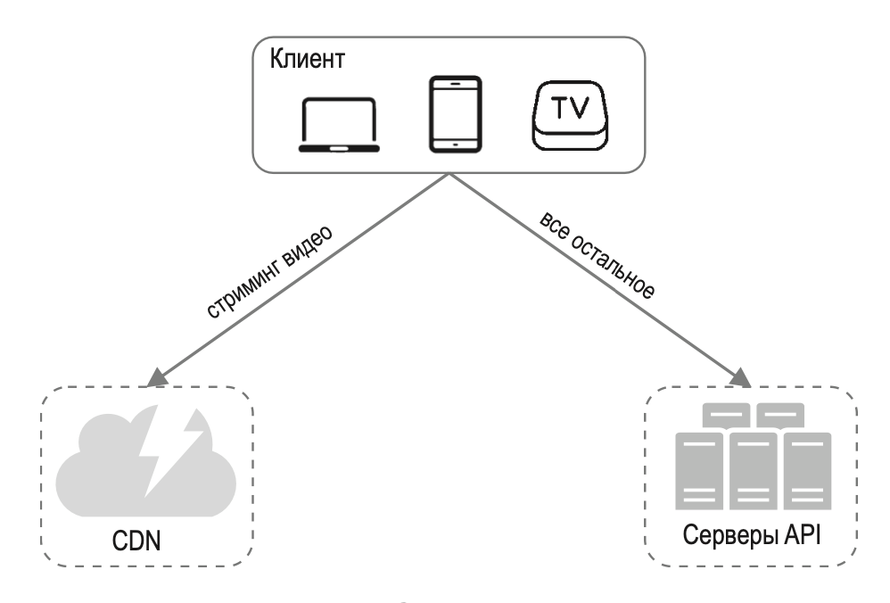
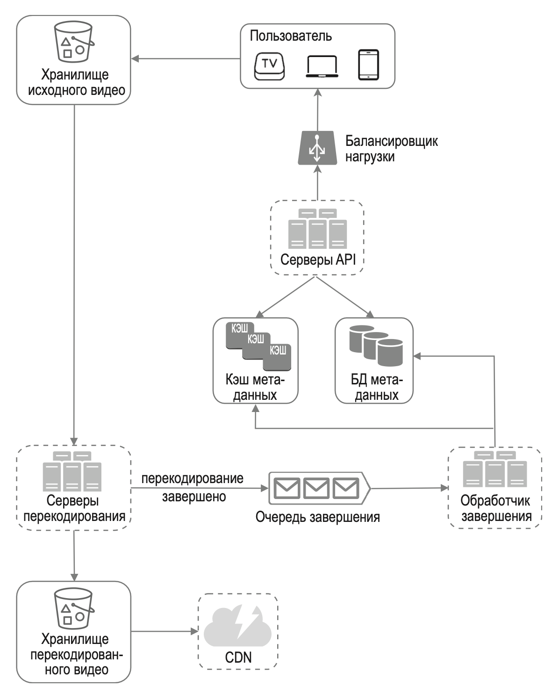
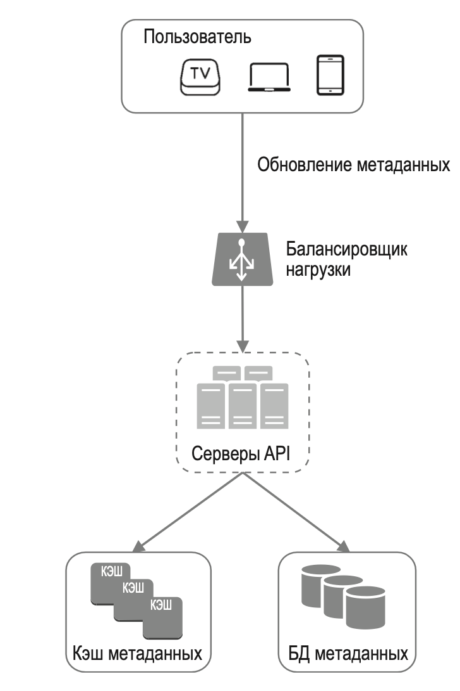
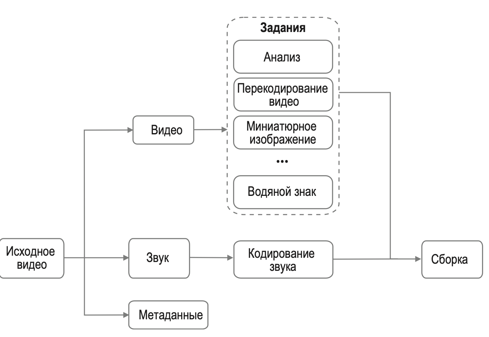
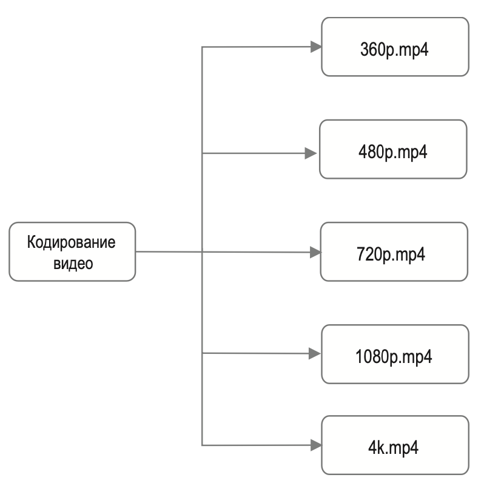
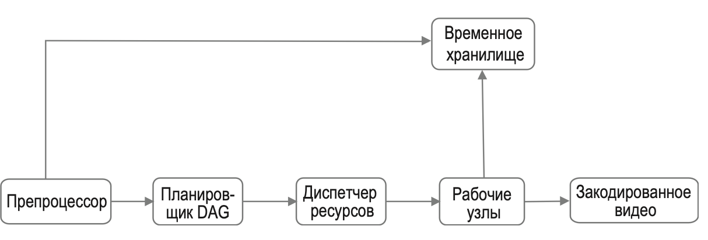
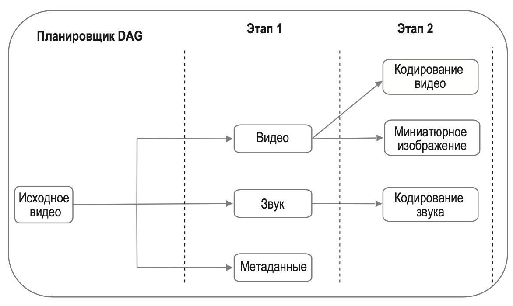
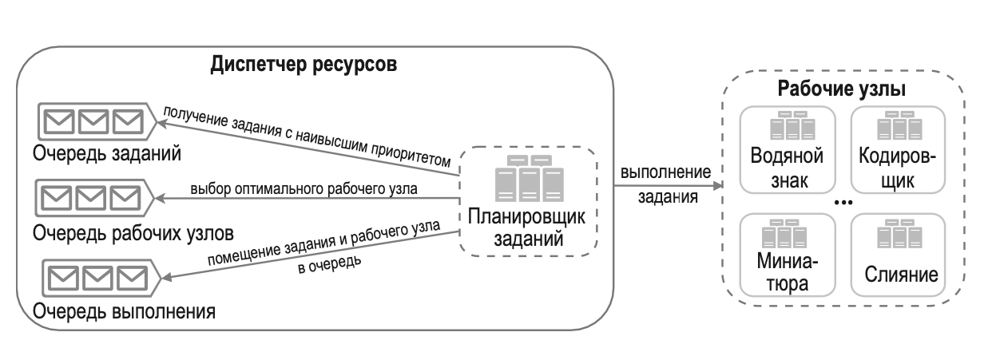
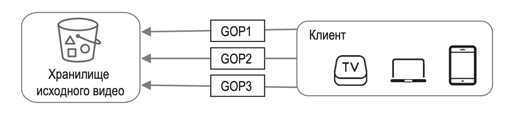
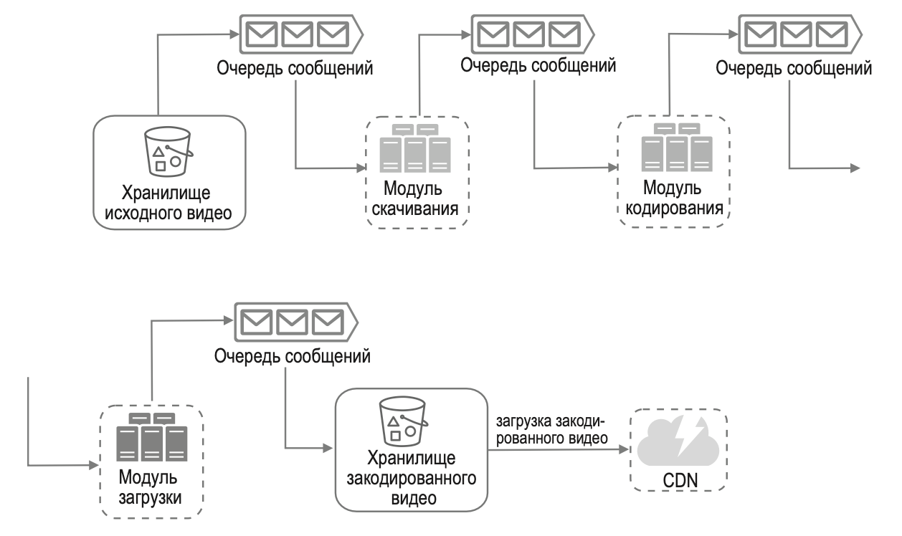

---
tags:
  - SystemDesign/Examples/Youtube
aliases:
  - Системный дизайн - Примеры - Youtube
---
# Youtube

## ШАГ 1: ПОНЯТЬ ЗАДАЧУ И ОПРЕДЕЛИТЬ МАСШТАБ РЕШЕНИЯ

Помимо просмотра видео YouTube поддерживает много других функций. Под видео можно оставить комментарий, им можно поделиться с друзьями или поставить ему лайк; вы также можете сохранить его в список воспроизведения, подписаться на канал и т. д.

| Вопрос                                                                                                              | Ответ                                                                                                                                                                    |
| ------------------------------------------------------------------------------------------------------------------- | ------------------------------------------------------------------------------------------------------------------------------------------------------------------------ |
| Какие возможности самые важные?                                                                                     | Возможность загружать и просматривать видео                                                                                                                              |
| Какие клиенты должны поддерживаться?                                                                                | Мобильные приложения, веб-браузеры и Smart TV                                                                                                                            |
| Сколько у нас ежедневных активных пользователей?                                                                    | 5 миллионов                                                                                                                                                              |
| Сколько времени в среднем уходит на использование этого продукта в день?                                            | 30 минут                                                                                                                                                                 |
| Нужно ли нам поддерживать пользователей из других стран?                                                            | Да, существенная часть аудитории находится за рубежом                                                                                                                    |
| Какие разрешения видео должны поддерживаться?                                                                       | Система совместима с большинством разрешений и видеоформатов                                                                                                             |
| Требуется ли шифрование?                                                                                            | Да                                                                                                                                                                       |
| Есть ли какие-либо требования к размеру видео?                                                                      | Наша платформа нацелена на видео небольшого и среднего размера. Максимальный размер видеофайла составляет 1 Гб                                                           |
| Можем ли мы пользоваться существующей облачной инфраструктурой, которую предоставляют Amazon, Google или Microsoft? | Это очень хороший вопрос. Для большинства компаний создание всего с нуля было бы нереалистичным. Рекомендуется задействовать некоторые из существующих облачных сервисов |

Сосредоточимся на проектировании сервиса стримингового видео со следующими возможностями:

- быстрая загрузка видеофайлов;
- бесперебойное вещание;
- возможность изменять качество видео;
- недорогая инфраструктура;
- высокие доступность, масштабируемость и надежность;
- поддерживаемые клиенты: мобильные приложения, веб-браузер и Smart TV.

### Приблизительные оценки

Следующие оценки основаны на множестве предположений:

- Предположим, что у продукта 5 миллионов активных пользователей в день (DAU).
- Пользователи ежедневно просматривают по 5 видеороликов. 
- 10 % пользователей загружают по 1 ролику в день.
- Пусть средний размер видео составляет 300 Мб.
- Общий объем данных, которые нужно сохранять ежедневно: 5 миллионов * 10 % * 300 Мб = 150 Тб.
- Стоимость CDN:
	- когда облачная сеть CDN раздает видео, вы платите за трафик, исходящий из CDN;
	- для оценки расходов возьмем CDN CloudFront от Amazon. Предположим, что весь трафик раздается из одной страны. Средняя цена за гигабайт составляет 0,02 доллара. Для простоты будем учитывать только стоимость видеовещания;
	- 5 миллионов * 5 видео * 0,3 Гб * 0,02 доллара = 150 000 долларов в день.

Раздача видео из CDN будет стоить довольно дорого.

## ШАГ 2: ПРЕДЛОЖИТЬ ОБЩЕЕ РЕШЕНИЕ И ПОЛУЧИТЬ СОГЛАСИЕ

Вместо того, чтобы разрабатывать все с нуля мы задействуем CDN и хранилище больших двоичных объектов (binary large objects, BLOBs). Причины таковы:

- Выбрать подходящие технологии за отведенный период времени важнее, чем объяснить, как они работают. Подробное обсуждение того, как это хранилище устроено, было бы излишним.
- Разработка масштабируемого хранилища BLOB-объектов или CDN чрезвычайно сложная и дорогая. Даже такие крупные компании, как Netflix или Facebook, не разрабатывают все сами. Netflix использует облачные сервисы Amazon, а Facebook применяет CDN от Akamai.

### Процесс загрузки видео

- Пользователь.
- Балансировщик нагрузки.
- Серверы API. Все пользовательские запросы, за исключением потоковой передачи видео, проходят через серверы API.
- БД метаданных. Метаданные видеофайлов хранятся в отдельной разделяемой БД. Она реплицируется, чтобы отвечать требованиям к производительности и высокой доступности.
- Кэш метаданных. Для улучшения производительности метаданные видеофайлов и пользовательских объектов кэшируются.
- Хранилище исходного видео. Оригинальные видеофайлы размещаются в системе хранения BLOB-объектов.
- Серверы перекодирования. Перекодирование видео — это процесс преобразования видеофайла из одного формата в другой с целью предоставления оптимальных видеопотоков для разных устройств и типов сетевых соединений.
- Хранилище перекодированного видео. Это хранилище BLOB-объектов для перекодированных видеофайлов.
- CDN. Видеофайлы кэшируются в CDN. Когда вы нажимаете кнопку «Смотреть», CDN возвращает видеопоток.
- Очередь завершения. Это очередь сообщений, хранящая информацию о завершении перекодирования видео.
- Обработчик завершения. Этот компонент состоит из списка рабочих узлов, которые извлекают события из очереди завершения и обновляют кэш и БД с метаданными.

#### Процедура А: загрузка видео

1. Видеофайлы загружаются в хранилище исходного видео.
2. Серверы перекодирования извлекают видеофайлы из хранилища исходного видео и начинают их перекодировать.
3. По завершении перекодирования следующие два задания выполняются параллельно:
	3а. Перекодированные видеофайлы записываются в хранилище перекодированного видео.
	3б. События о завершении перекодирования записываются в очередь завершения.
	3a.1. Перекодированное видео передается в CDN.
	3б.1. Обработчик завершения содержит группу рабочих узлов, которые непрерывно достают события из очереди.
	3б.1.a. и 3б.1.б. По окончании перекодирования видео обработчик завершения обновляет БД и кэш метаданных.
4. Серверы API сообщают клиенту о том, что видео успешно загружено и готово для стриминга.

#### Процедура Б: обновление метаданных

Пока файл загружается в хранилище исходного видео, клиент отправляет запрос на обновление его метаданных. Этот запрос содержит такие сведения, как название видеофайла, его размер, формат и т. д. Серверы API обновляют кэш и БД метаданных.

### Стриминг видео

Существуют такие популярные протоколы:

- MPEG–DASH. MPEG расшифровывается как Moving Picture Experts Group, а DASH — как Dynamic Adaptive Streaming over HTTP
- Apple HLS. HLS расшифровывается как HTTP Live Streaming
- Microsoft Smooth Streaming.
- Adobe HTTP Dynamic Streaming (HDS).

Вам не нужно досконально разбираться в этих протоколах или даже помнить их названия, так как это низкоуровневые детали, требующие знания определенной предметной области. Но важно понимать, что разные стриминговые протоколы поддерживают разные форматы кодирования видео и доступны в разных видеоплеерах.

Видеопоток поступает напрямую из CDN. Его доставляет ближайший к вам пограничный сервер. Благодаря этому латентность получается очень низкой.

## ШАГ 3: ПОДРОБНОЕ ПРОЕКТИРОВАНИЕ

### Перекодирование видео

Если вы хотите, чтобы видео как следует воспроизводилось на других устройствах, его битрейт и формат должны быть совместимы.

Перекодирование видео имеет большое значение по следующим причинам.

- Необработанное видео имеет большой размер.
- Многие устройства и браузеры поддерживают только определенные форматы видео.
- Чтобы обеспечить высокое качество и плавность воспроизведения, выбор разрешения видео следует делать с учетом скорости сетевого соединения пользователя.
- Качество сетевого соединения может меняться, особенно на мобильных устройствах. Чтобы обеспечить непрерывное воспроизведение видео, следует автоматически или вручную переключаться на поток с подходящим битрейтом в зависимости от пропускной способности сети.

### Модель направленного ациклического графа

На перекодирование видео уходит много ресурсов и времени. 

Для поддержки разных процедур обработки и обеспечения высокой степени распараллеливания необходимо добавить некий слой абстракции и позволить разработчикам клиентов самим выбирать, какие задания должны выполняться.

Система потокового вещания видео в Facebook использует модель программирования на основе направленного ациклического графа (directed acyclic graph, DAG), которая разбивает задания на этапы с возможностью последовательного или параллельного выполнения.

- Анализ. Следует убедиться в том, что видео не повреждено и имеет хорошее качество.
- Кодирование видео. Это делается для поддержки разных разрешений, кодеков, битрейтов и пр.
- Миниатюрное изображение. Миниатюры могут быть загружены пользователем или автоматически сгенерированы системой.
- Водяной знак. Изображение, наносимое поверх видео и содержащее информацию, которая его идентифицирует.

### Архитектура перекодирования видео

#### Препроцессор

На препроцессор возложено четыре обязанности:

1. Разделение видео. Видеопоток делится на части или более мелкие группы кадров (Group of Pictures, GOP). GOP — это группа или блок кадров, размещенных в определенном порядке. Каждый блок является независимо воспроизводимой единицей, обычно длиной в несколько секунд.
2. Некоторые старые мобильные устройства и браузеры могут не поддерживать разделение видео на части. Специально для них препроцессор делит видеофайл на GOP. 
3. Генерация DAG. Препроцессор генерирует DAG на основе конфигурационных файлов, предоставленных разработчиками клиента.
4. Кэширование данных. Препроцессор служит кэшем для сегментированных видеофайлов. Для повышения надежности он записывает GOP и метаданные во временное хранилище. Если кодирование завершится неудачно, система сможет воспользоваться сохраненными данными для повторного выполнения операций.

#### Планировщик DAG

Планировщик DAG делит задания в графе на этапы и записывает их в очередь заданий, принадлежащую диспетчеру ресурсов.

#### Диспетчер ресурсов

- Очередь заданий. Это приоритетная очередь заданий, которые нужно выполнить.
- Очередь рабочих узлов. Это приоритетная очередь, содержащая информацию о загруженности рабочих узлов.
- Очередь выполнения. Содержит информацию о заданиях, выполняющихся в настоящий момент, и рабочих узлах, которые их выполняют.
- Планировщик заданий. Он выбирает оптимальный рабочий узел и поручает ему выполнить подходящее задание.

Диспетчер ресурсов работает следующим образом:

- получает задание с наивысшим приоритетом из соответствующей очереди;
- выбирает из очереди оптимальный рабочий узел для выполнения полученного задания;
- поручает выбранному рабочему узлу выполнить задание;
- связывает между собой информацию о задании и рабочем узле и записывает ее в очередь выполнения;
- удаляет задание из очереди выполнения, как только оно завершилось.

#### Рабочие узлы

Рабочие узлы выполняют задания, перечисленные в DAG

#### Временное хранилище

Здесь используется несколько систем хранения данных. Выбор той или иной системы зависит от таких факторов, как тип, размер и время жизни данных, частота доступа к ним и т. д. Например, метаданные часто нужны рабочим узлам и обычно имеют небольшой размер, поэтому их целесообразно кэшировать в памяти. Видео- и аудиоданные за­писываются в хранилище BLOB-объектов. После завершения обработки видео соответствующие данные удаляются из временного хранилища.

#### Закодированное видео

Закодированное видео является конечным результатом процесса кодирования.

### Оптимизация системы

Теперь мы оптимизируем некоторые аспекты системы, включая ее скорость, безопасность и стоимость обслуживания.

#### Оптимизация скорости: распараллеливание загрузки видео

Загружать видео как единое целое неэффективно. Мы можем разделить его на мелкие блоки, выровненные по GOP. Это сделает процесс загрузки быстрым и позволит его возобновить, если что-то пойдет не так. Разделение видеофайла на GOP можно выполнить на стороне клиента

#### Оптимизация скорости: размещение центров загрузки поблизости от пользователя

Загрузку также можно ускорить за счет нескольких центров обработки данных, разбросанных по всему миру

#### Оптимизация скорости: повсеместное распараллеливание

Еще один способ оптимизации состоит в разработке слабосвязанной системы с высокой степенью параллелизма.

Для ослабления связанности системы мы добавили очереди сообщений

- Когда очереди сообщений не было, модулю кодирования приходилось ждать возвращения вывода от модуля скачивания.
- После добавления очереди сообщений модулю кодирования больше не нужно ждать, пока модуль скачивания вернет вывод. Если в очереди сообщения находятся события, модуль кодирования может выполнить соответствующие задания параллельно.

#### Оптимизация безопасности: предварительно подписанный URL-адрес загрузки

Чтобы гарантировать, что видео загружается туда, куда нужно, и теми, кому это позволено, мы вводим понятие предварительно подписанного URL-адреса

Обновленный процесс загрузки выглядит так:

1. Клиент отправляет HTTP-запрос серверам API, чтобы получить предварительно подписанный URL-адрес, который дает доступ к соответствующему объекту. Термин «предварительно подписанный URL-адрес» встречается при загрузке файлов в Amazon S3.
2. Серверы API возвращают предварительно подписанный URL-адрес.
3. Получив ответ, клиент загружает видео с его помощью.

#### Оптимизация безопасности: защита видеороликов

- Технические средства защиты авторских прав (digital rights management, DRM).
- Шифрование AES. Вы можете зашифровать видео и настроить политику авторизации. Зашифрованные видео будут расшифровываться во время воспроизведения. Это гарантирует, что их будут просматривать только авторизованные пользователи.
- Водяные знаки.

#### Оптимизация стоимости обслуживания

Как показывают наши приблизительные оценки, CDN стоит дорого, особенно если данных много.

Видеопотоки в YouTube распределяются по принципу «длинного хвоста». Это означает, что большое количество просмотров приходится на горстку популярных видеороликов, тогда как многие другие видео просматриваются редко или вообще никогда не просматриваются. Исходя из этого наблюдения, можно внести несколько оптимизаций:

1. Только самые популярные видеоролики раздаются из CDN, а все остальные доступны на серверах хранения видеофайлов большой емкости 
2. Если контент не очень популярный, нам, возможно, не придется хранить множество его закодированных версий. Короткие видео-ролики могут кодироваться по требованию.
3. Некоторые видео пользуются популярностью только в определенных регионах. Их не нужно распространять за пределами этих регионов.
4. Можно создать собственную сеть CDN, как это сделала компания Netflix, и наладить партнерство с интернет-провайдерами.

### Обработка ошибок

В крупномасштабных системах ошибки неизбежны. Чтобы обеспечить высокий уровень отказоустойчивости, ошибки должны обрабатываться контролируемым образом и работа после них должна быстро возобновляться. Есть два вида ошибок.

- Некритические. В таких случаях обычно делается несколько повторных попыток выполнить операцию. Если проблема продолжает возникать и системе не удается ее исправить, клиенту возвращается код соответствующей ошибки.
- Критические. В таких случаях система останавливает задание, относящееся к этому видео, и возвращает клиенту код соответствующей ошибки.

## Дополнительные аспекты

- Масштабирование уровня API. Поскольку серверы API не хранят свое состояние, их легко масштабировать горизонтально.
- Масштабирование базы данных. Можно упомянуть о репликации и сегментировании базы данных.
- Прямая трансляция. Это процесс записи и трансляции видео в реальном времени. Изначально наша система не рассчитана на такое вещание, но эта функция имеет некоторые сходства со стримингом обычного видео: оба процесса требуют загрузки, кодирования и потоковой передачи. Есть и заметные отличия:
	- у прямой трансляции повышенные требования к латентности
	- у прямой трансляции не настолько высокие требования к параллельной обработке, поскольку небольшие блоки данных и так обрабатываются в реальном времени;
	- прямая трансляция требует другого подхода к обработке ошибок. Любой механизм, обрабатывающий ошибки слишком долго, не подходит.
- Запрет доступа к видео.

## Дополнительные материалы

- Двоичные большие объекты: https://ru.wikipedia.org/wiki/BLOB
- Here’s What You Need to Know About Streaming Protocols: https://www.dacast.com/blog/streaming-protocols/
- SVE: Distributed Video Processing at Facebook Scale: https://www.cs.princeton.edu/~wlloyd/papers/sve-sosp17.pdf
- Делегат доступа с общей подписью доступа: https://docs.microsoft.com/ru-ru/rest/api/storageservices/delegate-access-with-shared-access-signature
- YouTube scalability talk by early YouTube employee: https://www.youtube.com/watch?v=w5WVu624fY8
- Understanding the characteristics of internet short video sharing: A youtube-based measurement study. https://arxiv.org/pdf/0707.3670.pdf
- Content Popularity for Open Connect: https://netflixtechblog.com/content-popularity-for-open-connect-b86d56f613b
