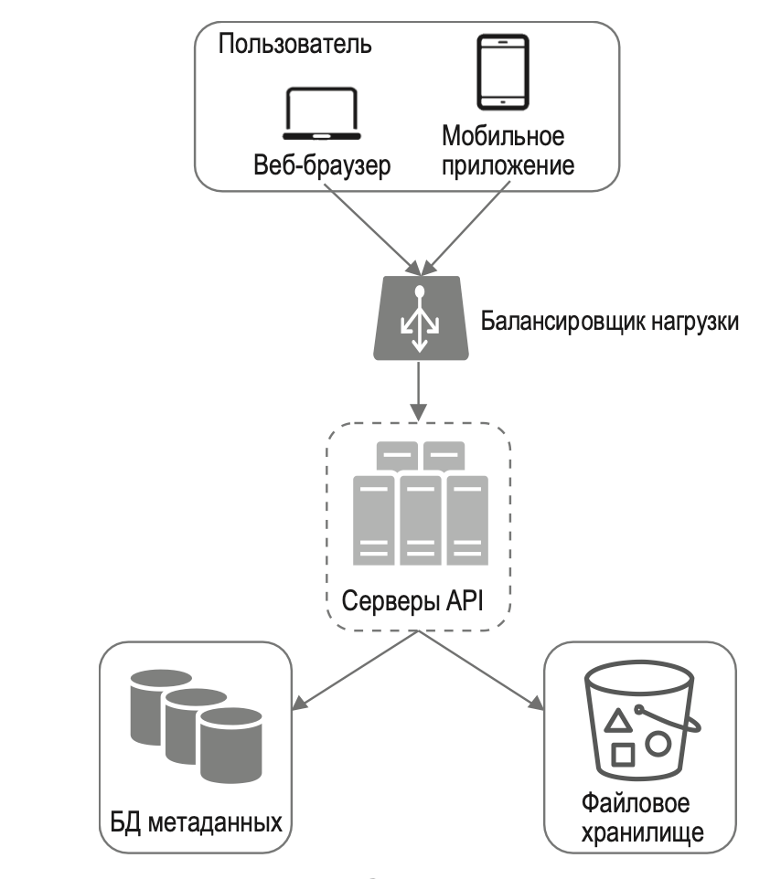
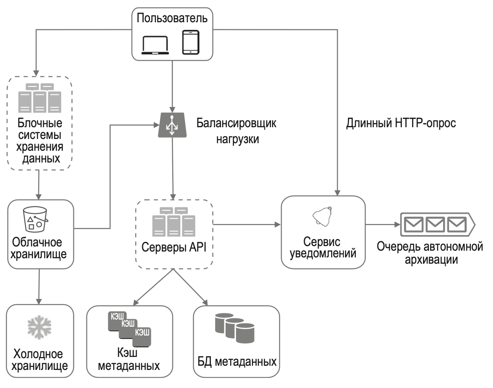
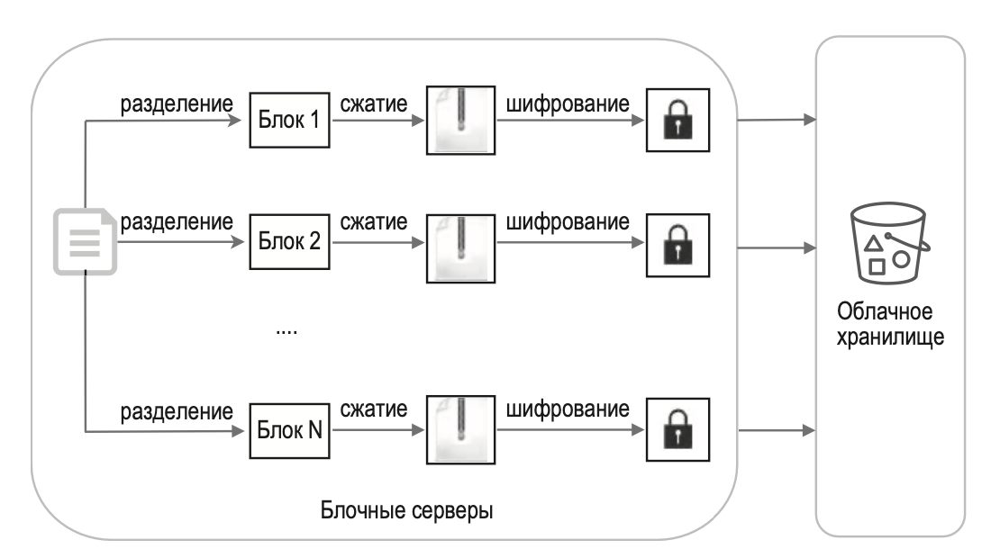
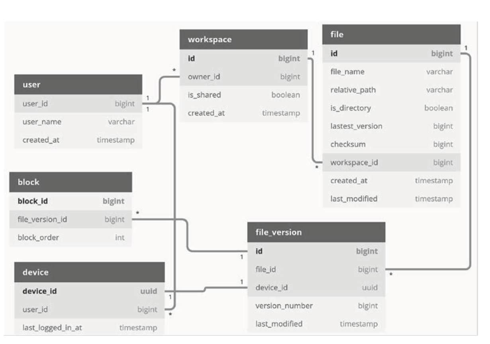

---
tags:
  - SystemDesign/Examples/GoogleDrive
aliases:
  - Системный дизайн - Примеры - Google Drive
---
# Google Drive

Google Drive — это файловое хранилище и сервис синхронизации, который позволяет хранить документы, фотографии, видео и другие файлы в облаке. Доступ к своим файлам можно осуществлять с любого компьютера, смартфона и планшета. Вы можете легко делиться этими файлами с друзьями, членами семьи и коллегами.

## ШАГ 1: ПОНЯТЬ ЗАДАЧУ И ОПРЕДЕЛИТЬ МАСШТАБ РЕШЕНИЯ

| Вопрос                                                               | Ответ                                                            |
| -------------------------------------------------------------------- | ---------------------------------------------------------------- |
| Какие функции самые важные?                                          | Загрузка, скачивание и синхронизация файлов, а также уведомления |
| Это приложение должно быть мобильным, браузерным или и тем и другим? | И тем и другим                                                   |
| Какие форматы файлов поддерживаются?                                 | Любые типы файлов                                                |
| Должны ли файлы шифроваться?                                         | Да, файлы в хранилище должны быть зашифрованы                    |
| Ограничен ли размер файлов?                                          | Да, размер файла не должен превышать 10 Гб                       |
| Сколько пользователей у этого продукта?                              | 10 миллионов DAU                                                 |

Сосредоточимся на следующих возможностях:

- Добавление файлов.
- Скачивание файлов.
- Синхронизация файлов между разными устройствами.
- Просмотр истории изменений файлов.
- Обмен файлами с друзьями, семьей и коллегами.
- Отправка уведомлений при редактировании и удалении файлов, а также в случае, если кто-то поделился с вами своими файлами.

Необходимо как следует понять нефункцио­нальные характеристики системы.

- Надежность.
- Быстрая синхронизация.
- Потребление трафика.
- Масштабируемость.
- Высокая доступность.

### Приблизительные оценки

- Предположим, что система имеет 50 миллионов зарегистрированных пользователей и 10 миллионов DAU.
- Каждый пользователь получает 10 Гб свободного места.
- Допустим, пользователи загружают в среднем по 2 файла в день.
- Средний размер файла составляет 500 Кб.
- Чтение и запись имеют равное соотношение.
- Общий размер выделенного пространства: 50 миллионов * 10 Гб = 500 петабайтов.
- QPS для API загрузки: 10 миллионов * 2 загрузки / 24 часа / 3600 секунд = ~240.
- Пиковый показатель QPS: QPS * 2 = 480.

## ШАГ 2: ПРЕДЛОЖИТЬ ОБЩЕЕ РЕШЕНИЕ И ПОЛУЧИТЬ СОГЛАСИЕ

Изначально наша конфигурация будет состоять из одного сервера и иметь такой вид:

- веб-сервер для загрузки и скачивания файлов;
- БД для хранения таких метаданных, как информация о пользователях, аутентификации, файлы и т. д.;
- система хранения файлов. Мы выделим для нее 1 Тб.

### API

#### Загрузка файлов в Google Drive

Поддерживаются два типа загрузки:

- простая загрузка. Предназначена для маленьких файлов;
- возобновляемая загрузка. Используется для больших файлов, когда существует высокий риск разрыва сетевого соединения.

Процесс возобновления загрузки состоит из следующих трех шагов:

- отправить начальный запрос для получения возобновляемого URL-адреса;
- загрузить данные и отследить состояние загрузки;
- возобновить загрузки в случае прерывания.

#### Скачивание файла из Google Drive

Параметры:

- path: путь к скачиваемому файлу.

#### Получение истории изменений файла

Параметры:

- path: путь к файлу, историю изменений которого вы хотите получить;
- limit: максимальное количество версий файла, которые нужно вернуть.

> Все API используют HTTPS и требуют аутентификации пользователя.

### Отказываемся от архитектуры с одним сервером

Начало заканчиваться место на диске. После изучения возможностей (шардинг откидываем, так как есть большие сложности в настройки и обеспечении доступности) - выбираем Amazon S3 (или аналог) - поддерживает репликации, резервные копии и т.д.

Кроме файлового хранилища, еще: 

- Балансировщик нагрузки. Добавление балансировщика нагрузки позволяет равномерно распределить сетевой трафик.
- Веб-серверы. Благодаря наличию балансировщика нагрузки веб-серверы можно легко добавлять/удалять в зависимости от нагрузки.
- БД метаданных. Чтобы избавиться от единой точки отказа, базу данных можно вынести за пределы сервера.
- Хранилище файлов. Для хранения файлов используется Amazon S3.

### Конфликты синхронизации

Это происходит, когда два пользователя одновременно изменяют один и тот же файл или папку.

Вот наша стратегия: побеждает та версия, которая обрабатывается первой, а обработка другой завершается конфликтом.

Как разрешить этот конфликт? Наша система предлагает пользователю 2 обе версии файла: его локальную копию и последнюю версию, взятую с сервера.

### Общая архитектура

- **Пользователь**. Взаимодействует с системой с помощью браузера или мобильного приложения.
- **Блочные системы хранения данных**. Загружают блоки данных в облачное хранилище. Блочное хранилище — это технология хранения файлов в облачных окружениях. Файл может быть разделен на несколько блоков, каждый из которых имеет уникальный хеш и хранится в нашей БД метаданных. Каждый блок обрабатывается как независимый объект и записывается в нашу систему хранения (S3). Чтобы восстановить файл, блоки соединяются в определенном порядке.
- **Облачное хранилище**. Файл делится на блоки меньшего размера, которые записываются в облачное хранилище.
- **Холодное хранилище**. Компьютерная система, предназначенная для хранения неактивных данных.
- **Балансировщик нагрузки.** 
- **Серверы API**. Отвечают почти за все, кроме процесса загрузки. Их используют для аутентификации пользователей, управления пользовательскими профилями, обновления метаданных файлов и т. д.
- **БД метаданных**. Хранит метаданные пользователей, файлов, блоков, версий и т. д.
- **Кэш метаданных**. Некоторые метаданные кэшируются для быстрого доступа.
- **Сервис уведомлений**. Система типа «издатель–подписчик», которая передает данные клиентам при возникновении определенных событий.
- **Очередь автономной архивации**. Если клиент находится вне сети и не может получить последние изменения, соответствующая информация попадает в очередь автономной архивации.

## ШАГ 3: ПОДРОБНОЕ ПРОЕКТИРОВАНИЕ

### Блочные системы хранения данных

Если большой файл, который регулярно изменяется, передавать целиком при каждом обновлении, на это будет уходить много трафика. Предлагаем две оптимизации.

- Синхронизация изменений. При редактировании файла синхронизируются только измененные блоки. Для этого используется алгоритм синхронизации.
- Сжатие. Сжатие блоков может существенно уменьшить размер данных. Например, gzip и bzip2 используются для сжатия текстовых файлов. Для сжатия изображений и видеофайлов требуются другие алгоритмы.

В нашей системе блочные системы хранения данных берут на себя основную работу по загрузке файлов.

### Требование строгой согласованности

Наша система должна поддерживать строгую согласованность по умолчанию. Нельзя допустить, чтобы один файл одновременно выглядел по-разному на разных клиентах. Система должна обеспечивать строгую согласованность уровней кэша и БД метаданных.

Ради строгой согласованности мы должны сделать следующее:

- позаботиться о согласованности реплик и ведущего узла;
- аннулировать кэш при записи в базу данных, чтобы закэшированные значения совпадали с теми, которые находятся в БД.

Реляционные базы данных обладают свойствами ACID (Atomicity, Consistency, Isolation, Durability — «атомарность, согласованность, изолированность, прочность»).

### БД метаданных

- **user**. Таблица user содержит основную информацию о пользователе, включая его имя, адрес электронной почты, аватар и т. д.
- **device**. Таблица device хранит сведения об устройстве. Поле push_id используется для отправки и получения мобильных push-уведомлений. 
- **namespace**. Это пространство имен — корневая директория пользователя.
- **file**. Таблица file содержит все, что относится к последней версии файла.
- **file_version**. Хранит историю изменений файла. Имеющиеся строки доступны только для чтения.
- **block**. Хранит все, что связано с блоком файла. Файл любой версии можно воссоздать путем объединения всех его блоков в правильном порядке.

### Процесс загрузки

- Добавить метаданные файла.

1. Клиент 1 отправляет запрос на добавление метаданных нового файла.
2. Система сохраняет метаданные нового файла в БД метаданных и присваивает загружаемому файлу состояние «ожидается».
3. Система оповещает сервис уведомлений о том, что файл будет загружен.
4. Сервис уведомлений оповещает заинтересованные клиенты (клиент 2) о том, что файл загружается.

- Загрузить файлы в облачное хранилище.

2.1. Клиент 1 загружает содержимое файла на блочные системы хранения данных.
2.2. Блочные системы хранения данных разбивают файл на блоки, которые затем сжимаются, шифруются и загружаются в облачное хранилище.
2.3. Как только файл загружен, облачное хранилище инициирует обратный вызов завершения загрузки. Запрос передается серверам API.
2.4. В БД метаданных состояние файла меняется на «загружено».
2.5. Система оповещает сервис уведомлений о том, что состояние файла поменялось на «загружено».
2.6. Сервис уведомлений оповещает заинтересованные клиенты (клиент 2) о том, что файл полностью загружен.

### Процесс скачивания

Процесс скачивания инициируется при добавлении или редактировании файла на другом устройстве.

Узнав об изменении файла, клиент сначала запрашивает его метаданные у серверов API, а затем загружает соответствующие блоки, чтобы восстановить его содержимое.

### Сервис уведомлений

Чтобы поддерживать файлы в согласованном состоянии и уменьшить число конфликтов, любое изменение, вносимое локально, должно быть доступно другим клиентам. Сервис уведомлений создан именно с этой целью. Его основная задача состоит в передаче данных клиентам в ответ на определенные события.

- Длинный HTTP-опрос.
- WebSocket.

Выберем длинный HTTP-опрос по двум причинам.

- Взаимодействие с сервисом уведомлений не двунаправленное. Сервер отправляет клиенту информацию о файле, но обратно ничего не возвращается.
- WebSocket подходит для двунаправленного взаимодействия в реальном времени, как в случае с чатом.

### Экономия места в хранилище

Чтобы реализовать историю изменений файлов и сделать систему надежной, мы храним разные версии одного и того же файла в нескольких центрах обработки данных.

- Дедупликация блоков данных. Устранение лишних блоков на уровне учетной записи позволяет легко сэкономить место. Два блока являются идентичными, если у них одинаковое значение хеша.
- Внедрение интеллектуальной стратегии резервного копирования. Здесь можно применить два подхода:
	- установить лимит. Мы можем ограничить количество хранимых версий. При достижении лимита самая старая версия заменяется новой;
	- хранение только важных версий. Некоторые файлы могут активно редактироваться. Найти оптимальное значение можно методом проб и ошибок.
- Перемещать редко используемые данные в холодное хранилище.

### Обработка сбоев

В крупномасштабных системах случаются сбои, и, чтобы с ними справляться, необходимо внедрить подходящие стратегии проектирования.

- Отказ балансировщика нагрузки. Если балансировщик нагрузки выходит из строя, активируется его резервный экземпляр, который подхватывает трафик. Балансировщики нагрузки обычно следят друг за другом с помощью механизма пульсации, периодически обмениваясь сигналами.
- Отказ блочного сервера. Если блочный сервер выходит из строя, другие серверы подхватывают незаконченные или ожидающие задания.
- Отказ облачного хранилища. Бакеты S3 реплицируются по нескольку раз в разных регионах. Если файл недоступен в одном регионе, его можно извлечь из другого.
- Отказ сервера API. Этот сервис не хранит свое состояние, поэтому в случае поломки одного сервера API балансировщик нагрузки перенаправит трафик к другим серверам.
- Отказ кэша метаданных. Серверы, кэширующие метаданные, реплицируются по нескольку раз. Если один узел выходит из строя, можно обращаться за данными к другим.
- Отказ БД метаданных:
	- отказ ведущего узла. Если выходит из строя ведущий узел, его место занимает один из ведомых
	- отказ ведомого узла. Если выходит из строя ведомый узел, вы можете направить операции чтения другому ведомому узлу
- Отказ сервиса уведомлений. Каждый пользователь, находящийся в сети, поддерживает длинные HTTP-соединения с сервером уведомлений. Следовательно, к каждому такому серверу подключено много пользователей. Переподключение всех клиентов, которые потеряли связь, проходит довольно медленно.
- Отказ очереди автономной архивации. Очереди реплицируются по нескольку раз. Если одна очередь выйдет из строя, ее потребителям, возможно, придется подписаться на другую.

## Альтернативные решения

Файлы из клиента можно загружать напрямую в облачное хранилище, минуя блочные системы хранения данных.

Минусы:

- Во-первых, одну и ту же логику разбиения на блоки, сжатия и шифрования нужно реализовать на разных платформах (iOS, Android, веб). Это чревато ошибками
- Во-вторых, поскольку клиент подвержен взлому и манипуляциям, реализация логики шифрования на его стороне была бы не самым оптимальным вариантом.

## Дополнительные материалы

- Upload file data: https://developers.google.com/drive/api/v2/manage-uploads
- Differential Synchronization https://neil.fraser.name/writing/sync/
- Презентация на YouTube о синхронизации изменений: https://www.youtube.com/watch?v=S2Hp_1jqpY8
- How We’ve Scaled Dropbox: https://youtu.be/PE4gwstWhmc
- Tridgell, A., & Mackerras, P. (1996). The rsync algorithm.
- Libsync https://github.com/librsync/librsync
- 