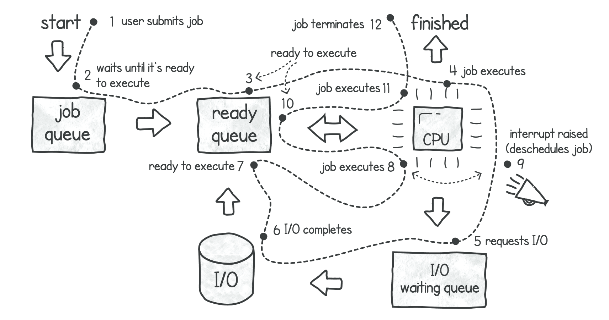
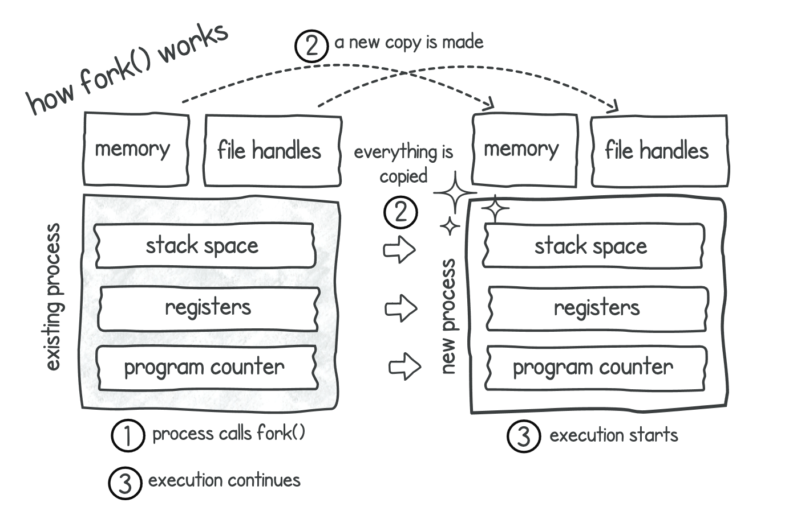
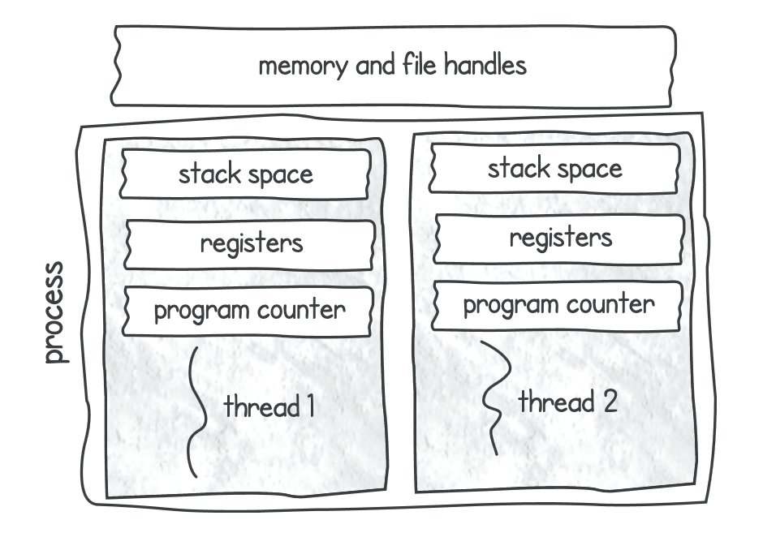

---
tags:
  - OS/Concurrency
---
# Выполнение задачи на уровне ОС

1. Пользователь отправляет задание на поиск по строке на выполнение.
2. Операционная система помещает это задание в очередь заданий. Задание попадает в эту очередь в тех случаях, когда оно еще не готово к выполнению.
3. Как только наш текстовый поиск переходит в состояние готовности к выполнению, он перемещается в очередь готовности.
4. В какой-то момент, когда центральный процессор свободен, операционная система выбирает задание из очереди готовности и начинает выполнять его на центральном процессоре. На данном этапе процессор выполняет инструкции, содержащиеся в задании.
5. Как только наше задание текстового поиска запрашивает инструкцию для чтения из файла, программа операционная система удаляет задание из центрального процессора и помещает его в режим ожидания I/O. Здесь он ожидает, пока запрошенная операция ввода-вывода не вернет данные. Если в очереди готовности есть другое задание, операционная система примет его и выполнит на центральном процессоре, тем самым не давая процессору простаивать.
6. Устройство выполнит операцию ввода-вывода (считав несколько байт из текстового файла).
7. После завершения операции ввода-вывода задание возвращается в очередь готовности. Теперь оно ожидает, пока операционная система примет его, чтобы продолжить выполнение. Причина такого периода ожидания заключается в том, что центральный процессор может быть занят выполнением других заданий.
8. В какой-то момент центральный процессор снова становится свободным, и операционная система запускает задание текстового поиска и продолжает выполнять его инструкции на центральном процессоре. Типичными инструкциями в этом случае были бы попытки найти соответствие в загруженном тексте из файла.
9. В этот момент система может вызвать прерывание во время выполнения задания. Прерывание - это механизм, используемый для остановки текущего выполнения и уведомления системы о конкретном событии. Аппаратное обеспечение, называемое контроллером прерываний, обрабатывает все прерывания, поступающие от нескольких устройств. Затем этот контроллер уведомляет центральный процессор об остановке текущего задания и запуске другой задачи. Как правило, для выполнения этой задачи требуется вызов драйвера устройства или планировщика операционной системы. Это прерывание может быть вызвано по многим причинам, таким как: 
	   - Устройство ввода-вывода завершает операцию, такую как чтение файла или сети, или даже нажатие клавиши на клавиатуре. 
	   - Другая программа запрашивает программное прерывание. 
	   - Происходит тиканье аппаратных часов (или таймера), прерывающее текущее выполнение. 
	Это гарантирует, что другие задания в очереди готовности также получат возможность для выполнения. 
10. Операционная система приостановит выполнение текущего задания и вернет его в очередь готовности. Операционная система также выберет другой элемент из очереди готовности. Поставит в очередь и выполнит его на центральном процессоре. Задача алгоритма планирования операционной системы состоит в том, чтобы определите, какое задание из очереди готовности выбрать для выполнения.
11. В какой-то момент наше задание снова принимается планировщиком операционной системы, и его выполнение возобновляется в центральном процессоре. Шаги с 4 по 10 обычно повторяются несколько раз в процессе выполнения, в зависимости от размера текстового файла и количества других заданий, запущенных в системе.
12. Наш текстовый поиск завершает программу (завершает поиск) и завершается автоматически.

> Шаги 9 и 10 являются примером переключения контекста, которое происходит всякий раз, когда система прерывает выполнение задания и операционная система переходит к планированию следующего.

При каждом переключении контекста возникают небольшие накладные расходы — операционной системе необходимо сохранить текущую состояние задания, чтобы позже можно было продолжить его с того места, где оно было прервано. Операционной системе также необходимо загрузить состояние следующего задания, которое должно быть выполнено. Это состояние называется блоком контекста процесса (PCB). Это структура данных, используемая для хранения всех сведений о задании, таких как программный счетчик, регистры процессора и информация о памяти.

# Абстрагирование конкурентности с помощью процессов и потоков (threads)

**Процесс** - это программа, запущенная в системе. 
**Поток** - это дополнительная конструкция, которая выполняется внутри контекста процесса и дает нам более эффективную и легковесную возможность реализовать конкурентность. Каждая программа стартует как минимум с одним потоком. 

Каждый процесс имеет свои собственные ресурсы (память), изолированные от других процессов. И коммуникация между процессами минимальна, так как нет общей памяти. Для коммуникации между процессами используются ресурсы ОС: файлы, БД, pipes, сокеты. Создание процесса дорого и относительно медленно. 

## Потоки

Создание потока намного (на два порядка) быстрее создания процесса. По своей сути потоки -это просто другой контекст выполнения одного и того же процесса. Потоки используют память, выделенную процессу (одну на всех).

Но легковесность потоков имеет свою цену. Так как память для потоков общая - появляется проблемы синхронизации работы нескольких потоков над одним и тем же участком памяти.