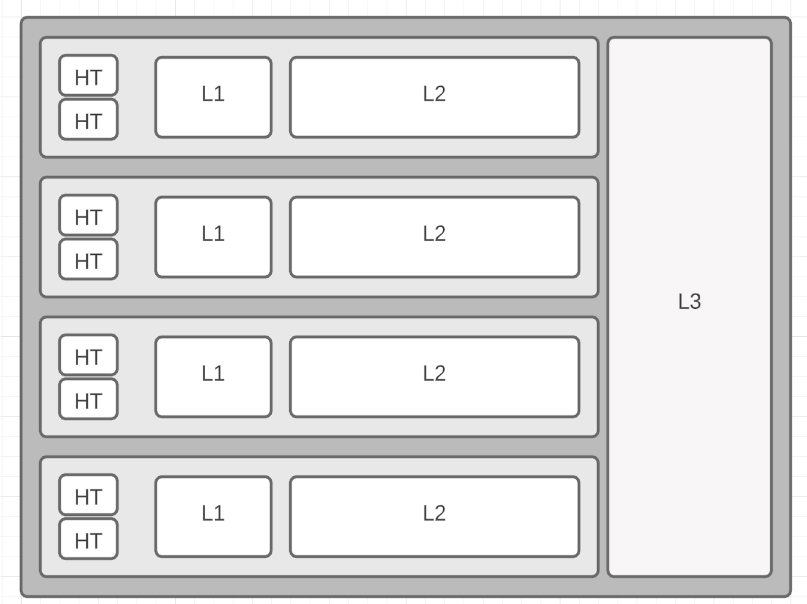

В каждом процессоре есть личный L1 & L2 кеш, и общий L3 кеш для хранения данных и инструкций.

Для каждого потока данные из L3 кеша или снаружи должны быть скопированы в Л1/Л2 кеш.

Для того, чтобы большая часть данных во время работы программы была в Л1/Л2 кеше процессора, нужно сделать так, чтобы данные совпадали с логикой предзагрузчика процессора. Процесс работает с 64 байтными "кеш-линиями".

Предиктору проще предсказать какие данные будут нужны в следующий момент, если они расположены в непрерывном блоке памяти. Самый лучший пример - это массив.

Связный список не так хорош, вернее даже плох по скорости доступа на уровне кеша процессора.
