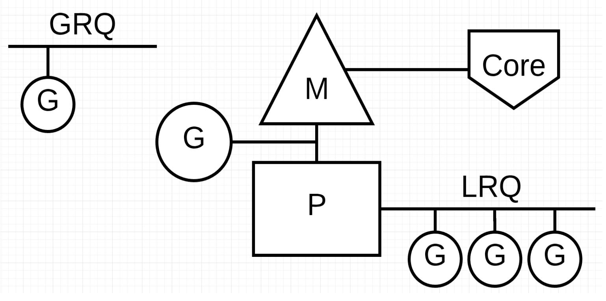
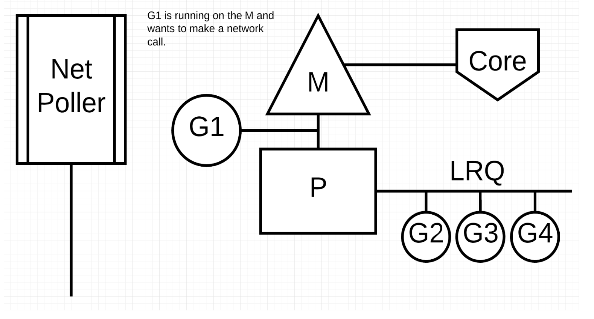
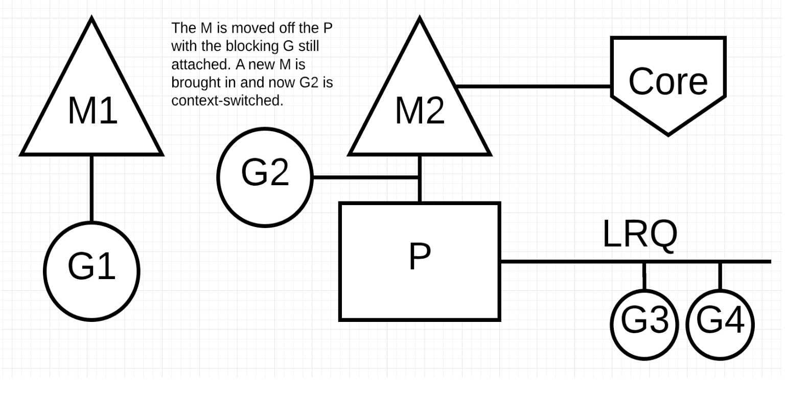
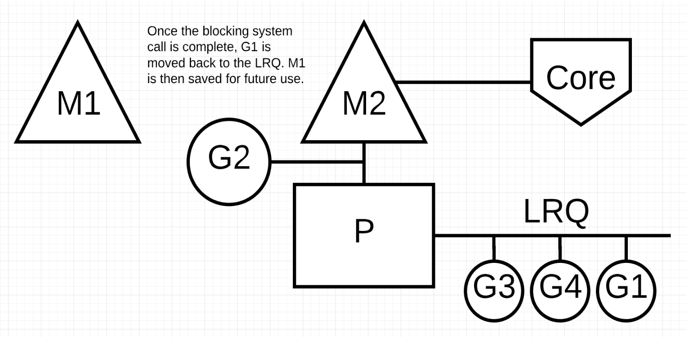
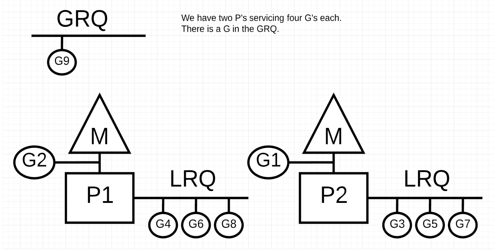
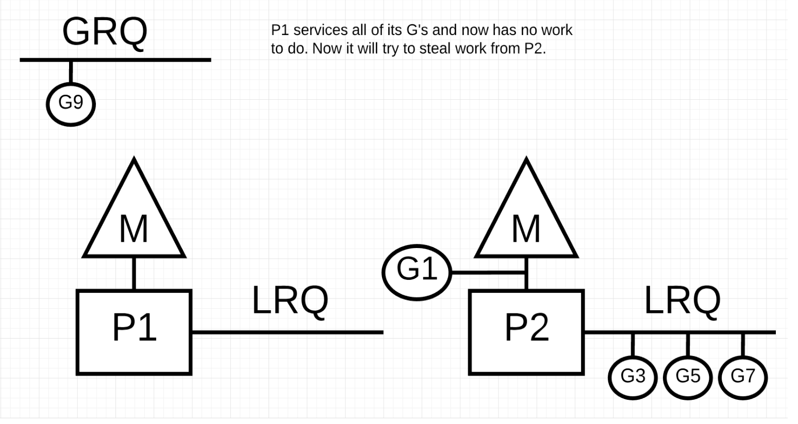
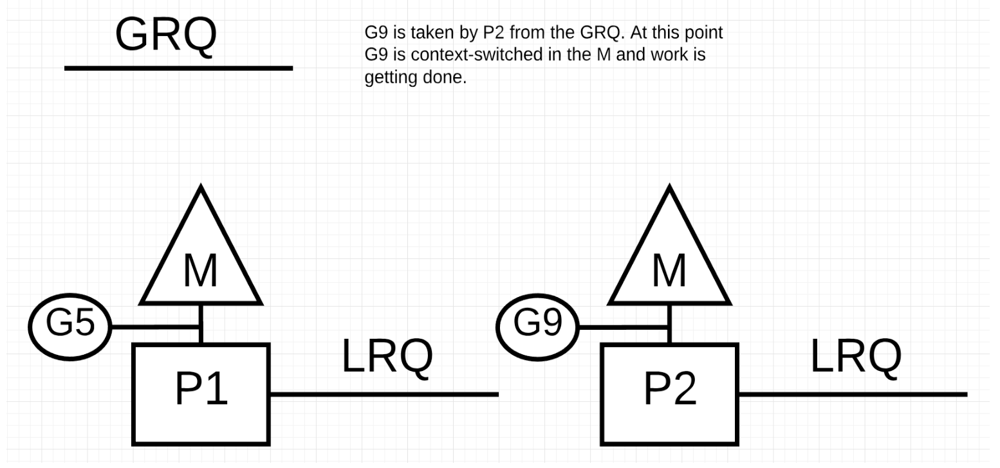

Когда стартует программа - для каждого ядра системы, доступных программе, создается "логический" процессор (Р). Если процессор имеет несколько хардварных потоков на каждое физическое ядро (Hyper Threading) - для каждого такого потока также будет создан логический процессор.

Для того, чтобы посмотреть сколько доступно ядер/потоков можно выполнить

```go
package main
import (
      "fmt"
"runtime" )
func main() {
    // GOMAXPROCS returns the number of logical
    // CPUs currently being used by the current process.
    fmt.Println(runtime.GOMAXPROCS(0))
}
```

Каждый такой л. процессор (Р) привязан к потоку ОС (М). За работу, планирование и очередь выполнения этого потока отвечает ОС.

## Планировщик и очереди

Горутины - это своего рода программные потоки (G).  
В планировщике ГО есть две очереди:

- **GRQ (Global Run Queue)** - Горутины, которые еще не были назначены конкретному лпроцессору
- **LRQ (Local Run Queue)** - управляет Горутинами, назначенными на выполнение на конкретном лпроцессоре (Р). Эти горутины будут по очереди на потоке М, привязанном к лпроцессору Р



Го планировщик - часть рантайма Го и он встроен в нашу программу. И запускается он в пользовательском пространстве адресов. И работает поверх ядра.

Порядок запуска на выполнение горутин никак не регламентирован и для синхронизации нужно использовать средства Го. (мютексы, атомики)

## Состояния Горутины

Состояния Горутины такие же как у потоков ОС:

- Ожидание
- Готов к запуску
- Выполняется

## Переключение контекста

Есть несколько типов событий по которым планировщик может переключить контекст (а может и не переключить)

- Использование слова go (запуск новой горутины)
- GC (у него свой набор горутин, и им нужны ресурсы для запуска)
- Системные вызовы
- Синхронизация и Оркестрация

## Асинхронные системные вызовы

(network poller) (kqueue (MacOS), epoll (Linux) or iocp (Windows) within these respective OS’s)




## Синхронные системные вызовы

Они блокируют текущий системный поток (М). (запрос к ФС)


Отсоединяем текущий поток от лпроцессора (Р) с выполняющейся на нем горутиной и создаем новый (М2). Если М2 уже существует (у нас была ранее такая же потребность) - то переключение будет значительно быстрее.



по окончании работы G1 возвращается обратно в LRQ лпроцессора, поток же не "убиваем" - оставляем его на будущее.



## Work Stealing

Последняя вещь, которой нам хотелось бы, это когда ОС переключает контекст с потока ,привязанного к лпроцессору, чтобы он переходил в состояние Ожидания и процессор тоже перешел бы в состояние ожидания, даже если есть горутины в состоянии "Готовы к выполнению".



Что произойдет если на одном из лпроцессоров опустеет очередь выполнения?



в этот момент мы начинаем "красть" работу.

```go
runtime.schedule() {
    // only 1/61 of the time, check the global runnable queue for a G.
    // if not found, check the local queue.
    // if not found,
    //     try to steal from other Ps.
    //     if not, check the global runnable queue.
    //     if not found, poll network.
}
```

Го рантайм идет в соседний P2 и крадет у него ПОЛОВИНУ горутин, если они есть.


Если на обоих лпроцессорах закончились горутины (не могут красть друг у друга) - идем в GRQ



