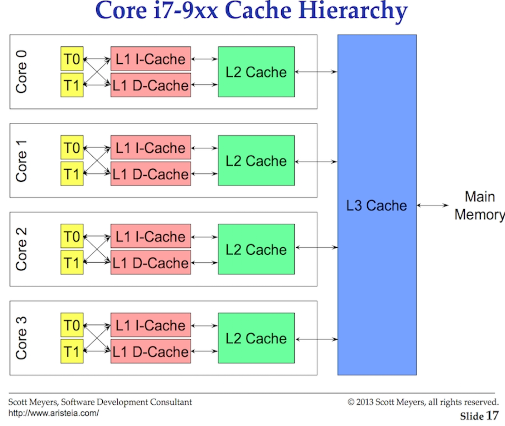

Каждая программа, которую мы запускаем - создает процесс. И каждому процессы на старте выдается отдельный поток. Все эти потоки работают независимо друг от друга. Каждый поток (тред) работает либо конкурентно с другими потоками (в порядке очереди) либо параллельно (на разных ядрах процессора). У каждого потока есть свои личный "стейт" для безопасного и независимого выполнения.

Задача планировщика ОС обеспечить, чтобы не было "спящих" (idle) ядер пока есть хоть один готовый к выполнению поток. И также он создает видимость одновременного выполнения. Он запускает потоки на основании приоритета. Но он также должен следить, чтобы потоки с низким приоритетом все же получили время на выполнение с адекватной задержкой.

## Состояние потока

- Ожидание, поток чего то ждет (отлика от чтения записи диска, сетевой работы, локи на мютексах или атомиках. Это одна из основных "проблем" вызывающие увеличение latency программы
- Готовый к запуску, поток готов выполнится, и ждет своей очереди.
- Выполняющийся, поток в процессоре и его инструкции выполняются

## Переключение контекста

На основных ОС (Линукс, Макось, Винда) - планировщики "опережающие". Т.е. невозможно предсказать какой поток будет выбран планировщиком для запуска. Это зависит от приоритета потока, от системных событий (получение данных по сети к примеру). И второе - вы не должны рассчитывать на какую-то особую последовательность выполнения потоков. Используйте методы синхронизации и оркестрации.

Физическое действие смены выполняемых потоков - называется "Переключение контекста". Текущий поток переводится в состояние "ожидающий выполнения" если он еще не закончил свои инструкции, либо в "Ожидание" - если ему нужно работать с вводом-выводом.

Переключение контекста довольно дорогая операция - нужно выгрузить память старого потока, загрузить инструкции нового. В среднем занимает 1000-1500 нс.

## Cache lines

Доступ к памяти имеет очень большую задержку, поэтому были придуманы процессорные кеши (до трех уровней, чем меньше уровень, тем меньше время доступа и меньше размер).

Обмен данными между процессором и основной памятью осуществляется с помощью cache lines. Это 64 байтный кусок памяти, которым обмениваются основная память и процессорный кеш. Каждое ядро имеют свою копию кеша, которая ему нужна. Именно поэтому изменение общих данных в многопоточной программе - это ночной кошмар по производительности. Если один из потоков что-то меняет в общих данных, то все остальные потоки на других ядрах имеющие эту же копию данных должны пометить ее "грязной" и перечитать заново. Что очень долго в понятиях процессорного времени. Это называется **cache-coherency problem**.

## Сценарии планирования (какие решения принимаются)

- Нужно переключить контекст основного потока? Если новый поток "шарит" ту же память, что уже в кеше - хорошо. А что если основной поток еще не закончил все свои инструкции?
- Должен ли поток ждать пока основной поток выполнится? задержка
- Должен ли поток ждать пока освободится другое ядро? А это значит что кеш нужно будет перечитать заново, затерев то, что было раньше от другого потока. Задержка. Но тогда основной поток сможет доработать.