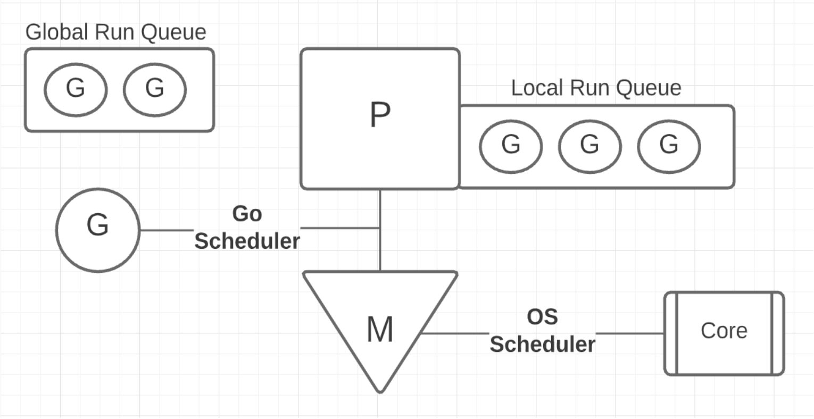

Перед запуском программы Го-рантайм запрашивает у ОС сколько тредов могут запускаться параллельно (это коррелирует с кол-вом ядер/процессоров доступных для программы). Для каждого "параллельного" потока (треда) рантайм создает _ОС тред_ (М) и прикрепляет его к структуре, которая представляет собой _логический процессор_ (Р) внутри программы. Р и М - представляют собой execution context для запуска Го программы.

Также основная горутина (main функция) G работает как абстрактный слой над ОС, которая берет управление выполнением на себя.

Немного про ОС шедулер. Он создает иллюзию одновременного исполнения нескольких действий (параллелизм), даже если это физически невозможно.

## Словарь:

- **Работа** - набор инструкцией, необходимые для выполнения программы
- **Тред** - путь исполнения работы. Отвечают за выполнение инструкций на физическом оборудовании
- **Состояния треда** - три штуки: запущен, готов к запуску, в ожидании. первый понятен. второй - ждет в очереди на выполнение. третий - ждем ответа от какого-то ресурса чтобы продолжить работу
- **Конкурентность** - это дословно "неопределенный, неупорядоченный порядок выполнения", но все эти "работы" будут выполнены.
- **Параллелизм** - это выполнение нескольких работ одновременно. (физически)
- **CPU Bound Work** - работа, не приводящая поток в статус "в ожидании" (на процессоре, без доступа к внешним ресурсам и ожидания ответа от них)
- **I/O Bound Work** - здесь прямо противоположное предыдущему
- **Синхронизация** - организация доступа из нескольких горутин к одному ресурсу (блоку памяти)
- **Оркестрация** - для организации взаимодействия между двумя и более горутинами