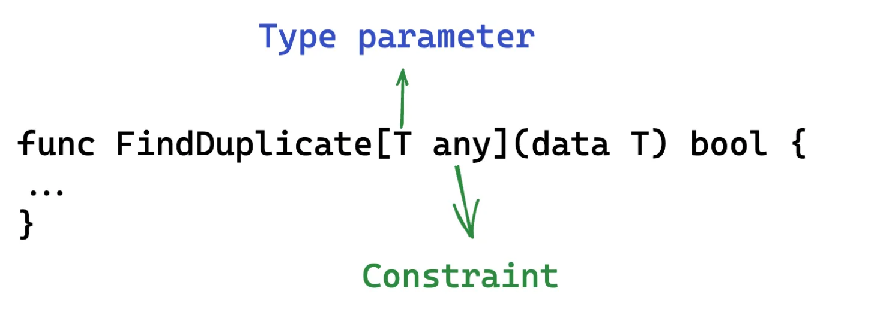
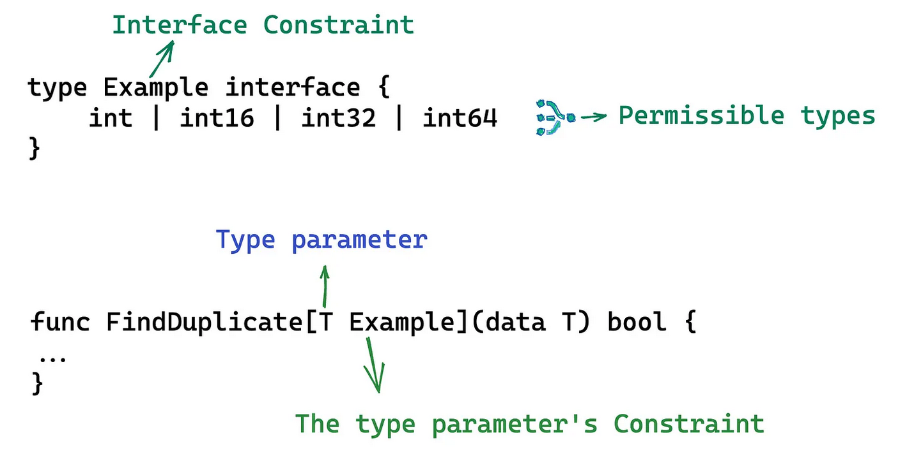
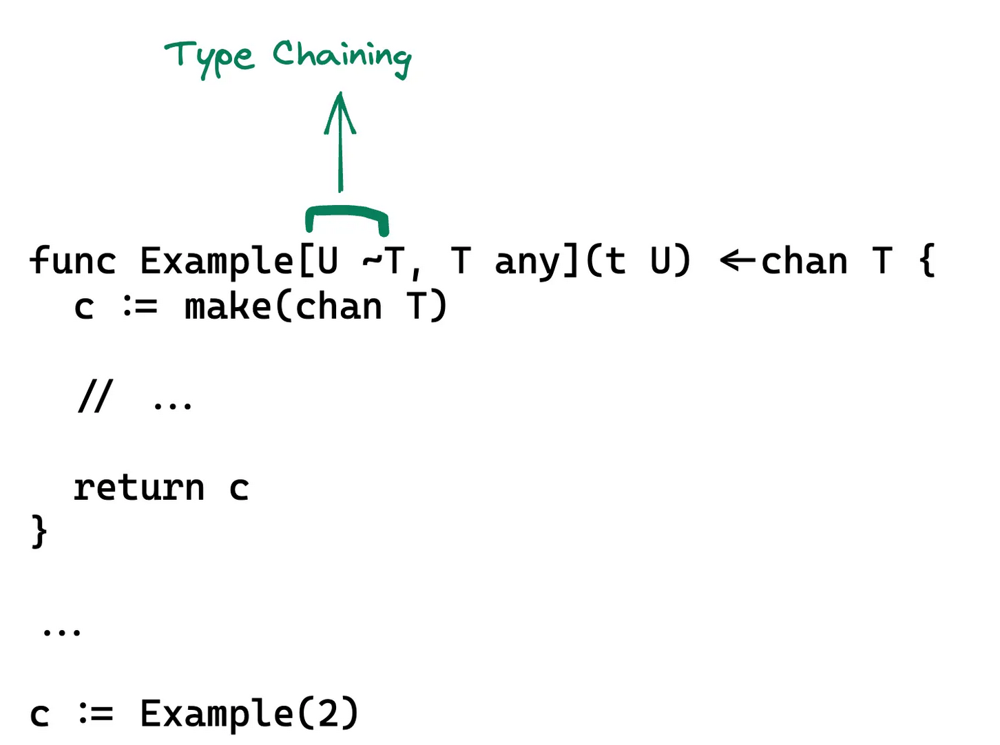

---
tags:
  - GoLang/DataTypes/Generics
---
# Параметры типа



```go
...
// map type with type parameter T and constraint comparable
type Filter[T comparable] map[T]bool
...

...
// Function FindDuplicate with type parameter T and constraint any
func FindDuplicate[T any](data T) bool {
// find duplicate code
}
...
```

Generic функции/структуры должны точно знать тип на этапе компиляции. Go строго типизированный язык, поэтому проверяет типы при компиляции. Constraint определяет интервал доступных типов, но во время компиляции будет выведен один, конкретный тип. Если тип не попадает в разрешенные - будет ошибка компиляции.

В большинстве случаев компилятор сам может вывести тип генерика. Но если он не смог - можно самому указать этот тип. 

```go
var a Filter[int]
```

# Constraints

> это интерфейс, который определяет допустимые универсальные типы.

>> Совет профессионала: избегайте использования каких-либо ограничений интерфейса, если в этом нет необходимости



Constraint полезно в следующих отношениях:

1. определяет набор разрешенных типов с помощью type parameter
2. отслеживает неправильное использование общих функций
3. улучшает читаемость кода
4. помогает в написании более удобного для обслуживания, повторного использования и тестирования кода

## Оператор тильда в constraints

Указывает, что подходят все типы, которые имеют нижележащий тип равный указанному

```go
func printValue[T ~int16](value T) {   
    fmt.Println(value)  
}
```

```go
package main

import "fmt"

type CustomType int16

func main() {
	var value CustomType
	value = 2
	printValue(value)
}

func printValue[T ~int16](value T) {
	fmt.Printf("Value %d", value)
}
```

Пример кастомного определения constraints через интерфейс:

```go
type Number interface {  
  int | float32 | float64  
  IsEven() bool   
}
```

## Предопределенные constraints

[golang.org/x/exp/constraints](http://golang.org/x/exp/constraints)

```go
...
type Signed interface {
	~int | ~int8 | ~int16 | ~int32 | ~int64
}

type Unsigned interface {
	~uint | ~uint8 | ~uint16 | ~uint32 | ~uint64 | ~uintptr
}

type Integer interface {
	Signed | Unsigned
}

type Float interface {
	~float32 | ~float64
}

type Ordered interface {
	Integer | Float | ~string
}
...
```

## Связывание типов constraints и вывод типа



## Множественные type parameters и constraints

```go
package main

import "fmt"

func main() {
	printValues(1, 2, 3, "c")
}

func printValues[A, B any, C comparable](a, a1 A, b B, c C) {
	fmt.Println(a, a1, b, c)
}
```

> Нужно быть внимательным. a и a1 имеют ограничение any, но после компиляции тип будет конкретный и одинаковый! Т. е. printValues(1, 2.1, 3, "c") нельзя (!)

