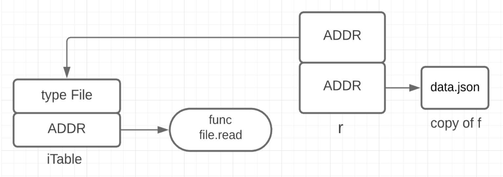

Важно понимать, что интерфейсы - это valueless типы. Они НЕ основаны на состоянии, а только на поведении.

```go
type reader interface {
      read(b []byte) (int, error)
}

var r reader
```

Объявление переменной r - плохая практика, оно бесполезно. Так как никаких данных за ним не скрыто. Нужно всегда работать с конкретными типами, а они уже реализуют, либо нет интерфейс. На уровне компилятора интерфейсы имеют "внутренний" тип, но мы не должны использовать такие конструкции.

## Правила передачи объекта как аргумента типа interface

- Если методы реализованы с помощью pointer-receiver мы можем передать только (!) как ссылку на объект в функцию, ждущую интерфейсный тип
- И обратно, если методы реализованы с помощью value-semantic мы можем передать только копию объекта

(компилятор будет ругаться)

Одна из причин такого ограничения - не все данные могут иметь адрес. Например если мы передадим литерал какого то типа, а на нем определен метод с pointer-receiver - то...

## Структура интерфейсного аргумента функции



Первое это указатель на функцию, которая удовлетворяет интерфейсу и второе - это сами данные, над которыми будет работать функция.

## Интерфейс как параметр, проверка на nil

Если аргумент функции типа интерфейса, то проверять его на nil не имеет большого смысла, если явно не передать nil в качестве значения. Если мы передаем указатель на объект типа, даже если он равен nil - структура интерфейса (ее внутреннее представление) НЕ будет равно nil и внутри функции мы можем словить панику на попытке вызвать метод на объекте который по сути равен nil (nil pointer exception)

```go
package main

import "fmt"

type reader interface {
	read() error
}

type myType struct {
	s string
}

func (m *myType) read() error {
	return nil
}

func someF(i reader) {
	fmt.Println(i == nil)
}

func main() {
	var m1 *myType

	fmt.Println(m1 == nil)

	// Здесь внутри проверка покажет что НЕ nil
	someF(m1)

	someF(nil)
}
```

## Разница между типов ресивера - значение vs указатель

При реализации интерфейса, если метод реализован с указателем на тип, то интерфейс в качестве "нижележащих" данных получает копию адреса, где находятся реальные данные. В противном случае он получает копию самих данных (структуру и т.д.)

Это влияет на сравнение двух переменных с одинаковым интерфейсом потом. Если ресивер - значение, то будут сравниваться данные, если указатель - то будут сравниваться адреса. Те если данные лежат по разным адресам, но одинаковы - то сравнение будет true, в случает если ресивер значение. Но если те же два переменные а ресивер указатель - то будет false.

```go
package main

import "fmt"

type errorString struct {
	s string
}

func (e errorString) Error() string { // Если поменять на указатель, сравнение не пройдет
	return e.s
}

func New(text string) error {
	return errorString{text} // если ресивер указатель, тут надо будет возвращать ссылку
}

var ErrBadRequest = New("Bad Request")

func main() {
	err := webCall()
	if err == ErrBadRequest {
		fmt.Println("Interface Values MATCH")
	} else {
		fmt.Println("Interface Values DOES NOT MATCH")
	}
}

func webCall() error {
	return New("Bad Request")
}
```

