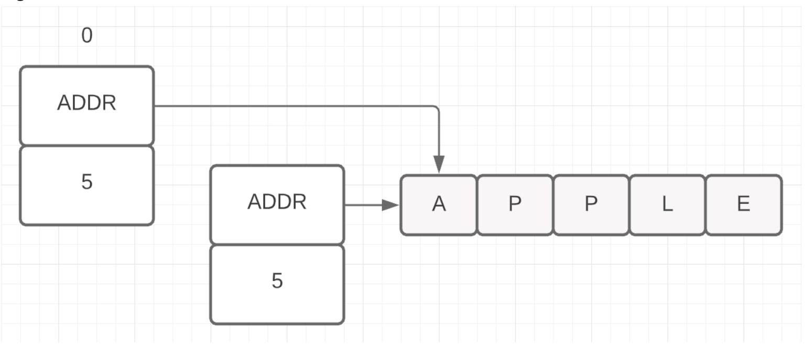

Строки - иммутабельны. Это структура из двух полей - указатель на массив, в котором хранятся символы и размер массива (длина строки).

При присвоении одной строки другой копируется именно эта структура. И после копирования по сути обе переменные указывают на один и тот же массив с данными строки.

Те стоимость копирования строк не (!) зависит от размера строки - это копирования двух "слов" - адреса и длины.